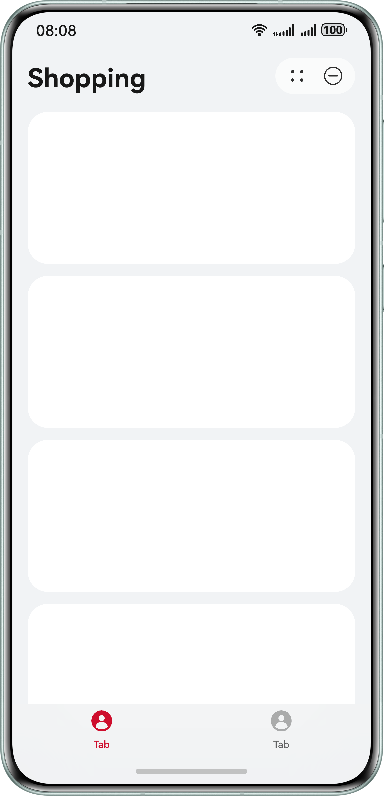
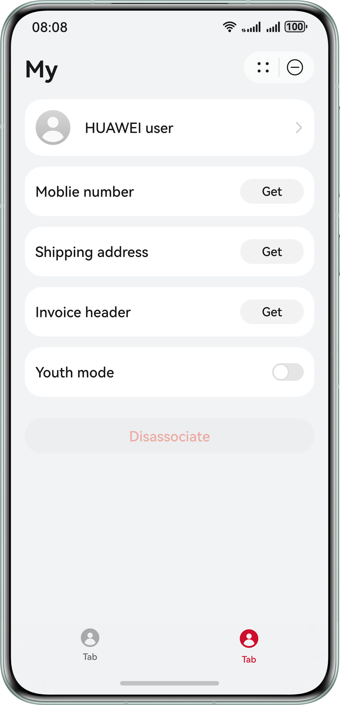
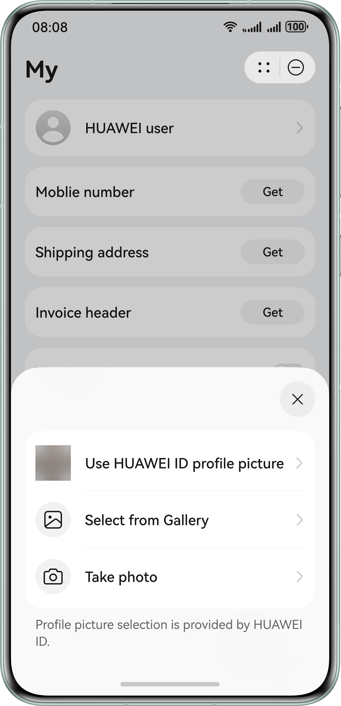
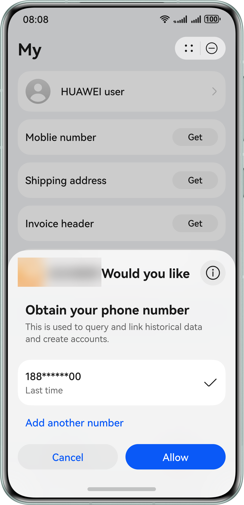
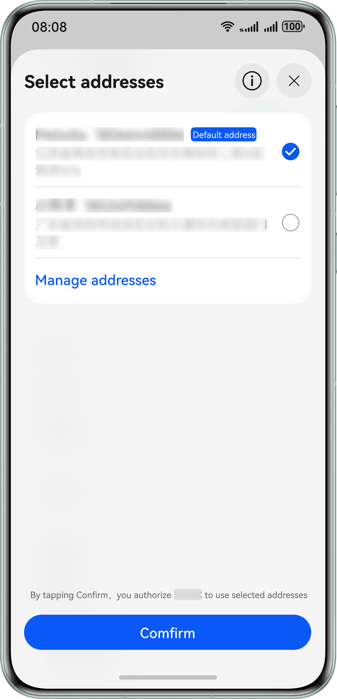
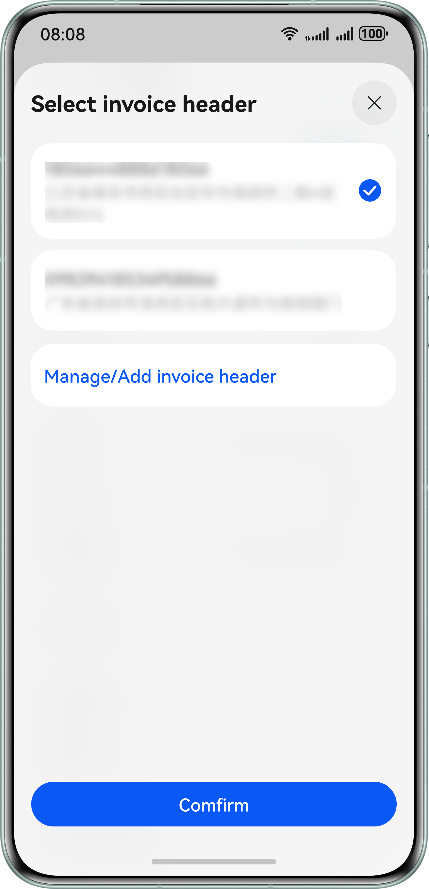
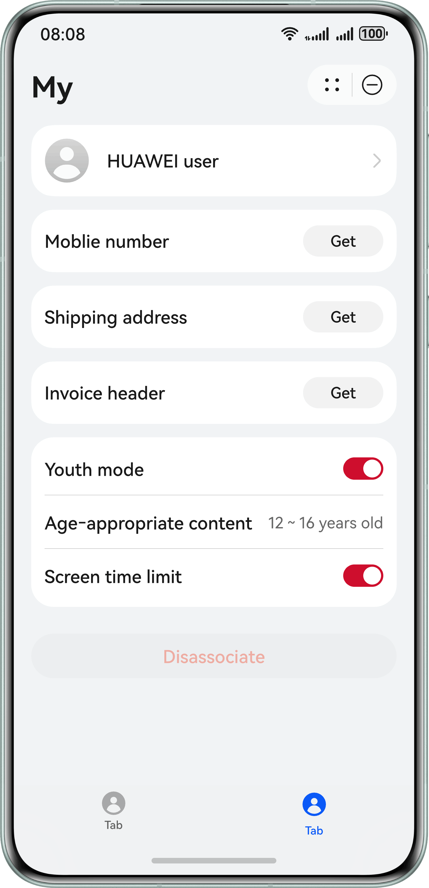
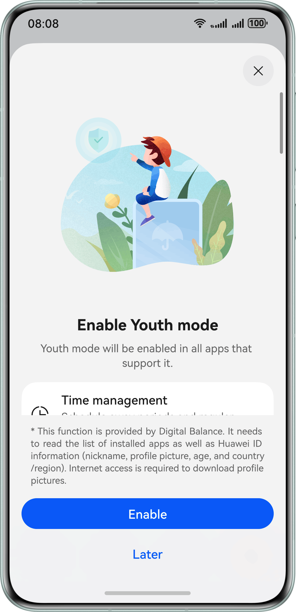

# Account Kit

## Overview

This sample project illustrates how to use the **authentication.AuthenticationController** API to implement silent sign-in, how to use the functions provided by the **FunctionalButton** component for obtaining the avatar, mobile number, shipping address, and invoice title, and how to enable or disable the youth mode.

This sample project simulates the following scenarios: using the sign-in API in an atomic service to implement silent sign-in, using the **FunctionalButton** component to obtain the avatar, mobile number, shipping address, and invoice title, calling the API for enabling or disabling the youth mode, subscribing to youth mode–related common events, and calling the API for verifying the parental control password.

The **@kit.AccountKit** API and **FunctionalButton** component of Account Kit are required.

## Effect Preview

|                                                       |                                                       |                                                       |
|:-----------------------------------------------------:|:-----------------------------------------------------:|:-----------------------------------------------------:|
|                  **Shopping screen**                  |     **Personal information screen without data**      |               **Obtaining the avatar**                |
|  |  |  |
|            **Obtaining the mobile number**            |          **Obtaining the shipping address**           |            **Obtaining the invoice title**            |
|  |  |  |
|       **Personal information screen with data**       |              **Enabling the youth mode**              |                                                       |
|  |  |                                                       |

## How to Configure and Use the Sample Project

### Configuring the Sample Project in DevEco Studio

1. Create a project and an atomic service, configure the signing information and fingerprint, set the client ID, and apply for account permission (phone and obtaining shipping address). For details, please refer to [Getting Started](https://developer.huawei.com/consumer/en/doc/harmonyos-guides/account-preparations) in the Account Kit Development Guide.
2. Replace the value of the bundleName property in the app.json5 file with the package name configured in [AppGallery Connect](https://developer.huawei.com/consumer/en/service/josp/agc/index.html).

## Using the Sample Project

1. Run the sample atomic service and choose to access the shopping or personal information screen from the navigation bar on the bottom.
2. After obtaining the scope of the API for obtaining the shipping address, tap the shipping address on the personal information screen to access the shipping address selection screen. The selected address will be displayed on the personal information screen.
3. When the atomic service is launching, it calls the **authentication.AuthenticationController** API for sign-in with HUAWEI ID.
4. After launching, the atomic service subscribes to the event of enabling or disabling the youth mode on the device. When receiving the event indicating that the youth mode is enabled or disabled, the atomic service will follow the youth mode status on the device.
5. Tapping the avatar on the personal information screen will show the semi-modal screen for selecting an avatar. The selected avatar will be displayed on the personal information screen.
6. After obtaining the **phone** scope, tapping the button for obtaining the mobile number on the personal information screen will show the mobile number verification and authorization screen. After a successful authorization, the mobile number 180******00 is displayed. (In this sample code, only the authorization code is obtained. Then, the atomic service sends the authorization code to its server, and the server calls the API of Account Kit to obtain an access token and further uses the access token to [obtain the mobile number](https://developer.huawei.com/consumer/en/doc/harmonyos-references/account-api-get-user-info-get-phone)). If the atomic service does not have the **phone** scope, an error message will be displayed.
7. Tapping the invoice title field on the personal information screen will show the screen for selecting an invoice title. The selected invoice title will be displayed on the personal information screen.
8. After launching, the atomic service subscribes to the events related to changes of the device's youth mode status:
   * When receiving the event of enabling the device's youth mode, the atomic service will check whether the flag for disabling the atomic service's youth mode separately (**userTurnOffFlag**) is **true** (**true** indicates that the user has manually disabled the atomic service's youth mode; **false** otherwise). If the flag is **true**, the atomic service's youth mode will be disabled; if the flag is **false**, the atomic service's youth mode will be enabled and the age group information will be obtained.
   * When receiving the event of disabling the device's youth mode, the atomic service's youth mode will be disabled and the flag for disabling the atomic service's youth mode separately is set to **false**.
9. When launching, the atomic service calls the **getMinorsProtectionInfoSync** API to query the device's youth mode status. If the device's youth mode is disabled, the flag for disabling the atomic service's youth mode separately will be set to **false**.
10. When the atomic service's youth mode is not enabled, tapping the youth mode switch will directly enable the atomic service's youth mode if the device's youth mode is already enabled; if the device's youth mode is not enabled, this tap operation will show a guide for the user to enable the device's youth mode.
11. When the atomic service's youth mode is enabled:
    * the age group information obtained from the device will be displayed.
    * the obtained age group will be displayed. The screen time limit switch is enabled by default. Once a user taps this switch, the relevant password will be verified. If the verification is successful, the user can turn on or off the screen time limit switch.
12. On the personal information screen, tapping the button for removing the association will clear the avatar, mobile number, shipping address, and invoice title selected beforehand.
13. When launching, the atomic service calls the **getMinorsProtectionInfoSync** API to query the device's youth mode status. If the device's youth mode is disabled, the flag for disabling the atomic service's youth mode separately will be set to **false**.
14. When the youth mode is enabled, USB debugging on the device will be disabled. You can re-enable this function by doing as follows: (1) Go to **Settings** > **System & updates** > **Developer options**; (2) Tap **USB debugging**; (3) Enter the parental control password as prompted. USB debugging will be enabled once the password verification is successful.

## Project Directory
```
├─entry/src/main/ets // Code area 
│ ├─common  
│ │ └─CommonEventUtil.ets    // Public class, including events related to listening to youth mode status changes.
│ │ └─ErrorCodeEntity.ets    // Error information that may appear during sign-in.
│ │ └─UserInfo.ets           // Data structure of user information.
│ │ └─Utils.ets              // Some public methods.
│ ├─components               // Directory for storing component files.
│ │ └─Address.ets            // Component for obtaining the shipping address.
│ │ └─Avatar.ets             // Component for obtaining the avatar.
│ │ └─InvoiceTitle.ets       // Component for obtaining the invoice title.
│ │ └─MinorsProtection.ets   // Component for enabling or disabling the youth mode.
│ │ └─Phone.ets              // Component for obtaining the mobile number.
│ ├─entryability
│ │ └─EntryAbility.ets       // Entry point class.
│ ├─pages                    // Directory for storing UI files.
│ │ └─Index.ets              // Main screen.
│ │ └─PersonalInfoPage.ets   // Personal information screen, which provides the function of obtaining the avatar, mobile number, shipping address, and invoice title, as well as enabling or disabling the youth mode.
│ │ └─ShoppingPage.ets       // Shopping screen.
└──entry/src/main/resources  // Directory for storing resource files.
```

## How to Implement

Open the atomic service and complete user sign-in with the current HUAWEI ID immediately. For details, please refer to **Index.ets**.
* Use **new authentication.HuaweiIDProvider().createLoginWithHuaweiIDRequest()** to create a silent sign-in request and simulate silent sign-in by using **PersistentStorage** together.

In this sample project, you will learn how to set the avatar, obtain the mobile number, obtain the shipping address, obtain the invoice title, and set the youth mode. For details, please refer to **PersonalInfoPage.ets**.
* Use the **FunctionalButton** component to obtain the avatar. For details, please refer to **Avatar.ets**.
* Use the **FunctionalButton** component to obtain the mobile number. For details, please refer to **Phone.ets**.
* Use the **FunctionalButton** component to obtain the shipping address. For details, please refer to **Address.ets**.
* Use the **FunctionalButton** component to obtain the invoice title. For details, please refer to **InvoiceTitle.ets**.

Set the youth mode status. For details, please refer to **MinorsProtection.ets**.
* Use **minorsProtection.leadToTurnOnMinorsMode** to guide users to enable the youth mode. The atomic service provides an entry for users to quickly enable the youth mode. For details, please refer to **MinorsProtection.ets**.
* Use **minorsProtection.verifyMinorsProtectionCredential** to verify the password for enabling the youth mode to prevent minors from changing the youth mode settings by themselves. For details, please refer to **MinorsProtection.ets**.

Call the common event function in the **onCreate** function of **EntryAbility.ets** to subscribe to youth mode–related common events. For details about how to register and call back related events, please refer to **CommonEventUtil.ets**.
* Use the **@ohos.commonEventManager** system capability to listen to the **COMMON_EVENT_MINORSMODE_ON** and **COMMON_EVENT_MINORSMODE_OFF** events. When the atomic service process is running, the atomic service can detect the change of the youth mode on the device in real time and change its own youth mode accordingly.

Define the data structure of **UserInfo**. For details, please refer to **UserInfo.ets**.

References
1. entry\src\main\ets\pages\Index.ets
2. entry\src\main\ets\pages\PersonalInfoPage.ets
3. entry\src\main\ets\components\Avatar.ets
4. entry\src\main\ets\components\Phone.ets
5. entry\src\main\ets\components\Address.ets
6. entry\src\main\ets\components\InvoiceTitle.ets
7. entry\src\main\ets\components\MinorsProtection.ets
8. entry\src\main\ets\common\CommonEventUtil.ets
9. entry\src\main\ets\common\UserInfo.ets
10. entry\src\main\ets\entryability\EntryAbility.ets

## Dependencies

The device where the sample atomic service runs must support Wi-Fi.

## Required Permissions
The network permission **ohos.permission.INTERNET** has been added to the **module.json5** file.

## Constraints

1. The sample atomic service is only supported on Huawei phones, and tablets with standard systems. The HUAWEI ID must be an adult account that is registered in the Chinese mainland.
2. The sample atomic service does not support large font mode or private space mode.
3. The HarmonyOS version must be HarmonyOS 5.0.5 Release or later.
4. The DevEco Studio version must be DevEco Studio 5.0.5 Release or later.
5. The HarmonyOS SDK version must be HarmonyOS 5.0.5 Release SDK or later.
