# Account Kit

## 介绍

本示例展示了使用 Account Kit 提供的登录、授权头像昵称、快速验证手机号、收货地址、发票抬头、未成年人模式的能力。

本示例模拟了在应用里，调用一键登录 Button 组件拉起符合华为规范的登录页面；调用登录接口实现静默登录；调用获取头像昵称接口获取头像昵称；调用快速验证手机号接口拉起手机号快速验证页面；调用收货地址接口获取收货地址；调用发票抬头接口获取发票抬头；调用未成年人模式接口开启未成年人模式；订阅未成年人模式公共事件；调用未成年人模式验密接口验证未成年人模式密码。

需要使用 Account Kit 接口 **@kit.AccountKit**。

## 效果预览
|                                                       |                                                       |                                                       |
|:-----------------------------------------------------:|:-----------------------------------------------------:|:-----------------------------------------------------:|
|                      **登录/注册页面**                      |                    **一键登录组件登录页面**                     |                    **一键登录组件弹窗页面**                     |
| 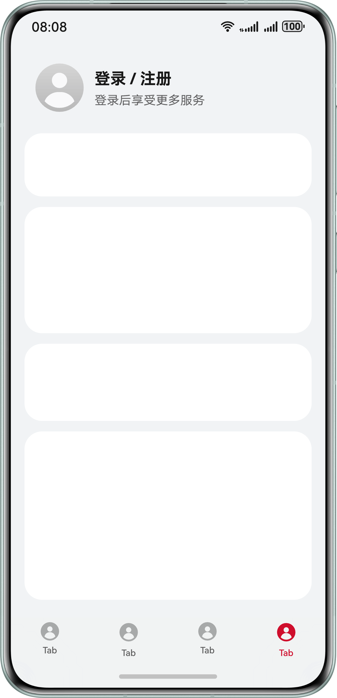  | 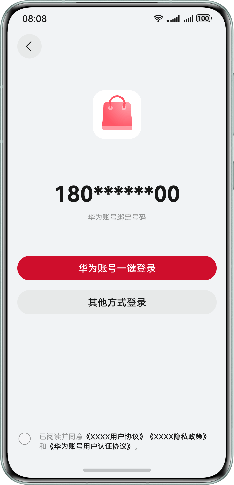  | 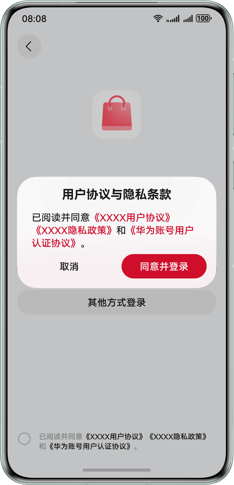  |
|                      **应用其他登录页**                      |                      **用户登录后首页**                      |                     **用户个人信息页面**                      |
| 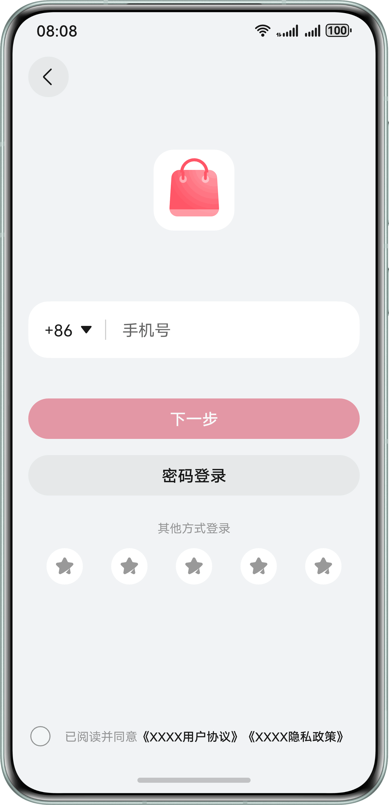  | 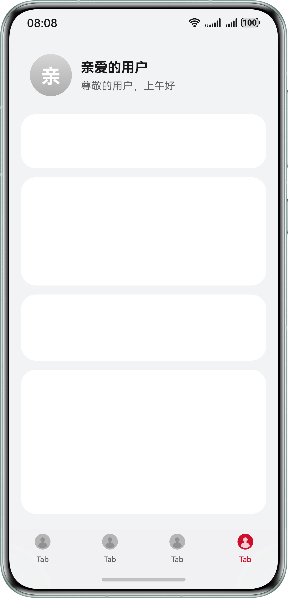  | 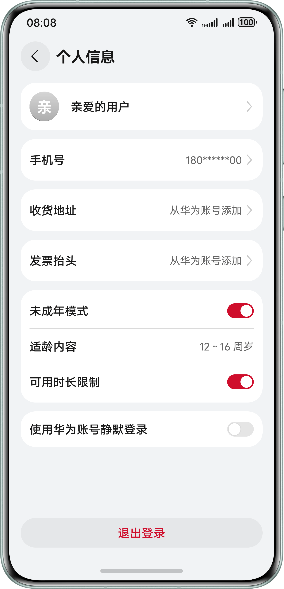  |
|                      **头像昵称授权页**                      |                    **获取快速验证手机号页面**                    |                     **获取收货地址页面**                      |
| 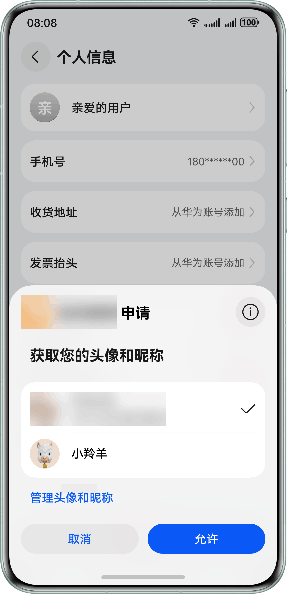  | 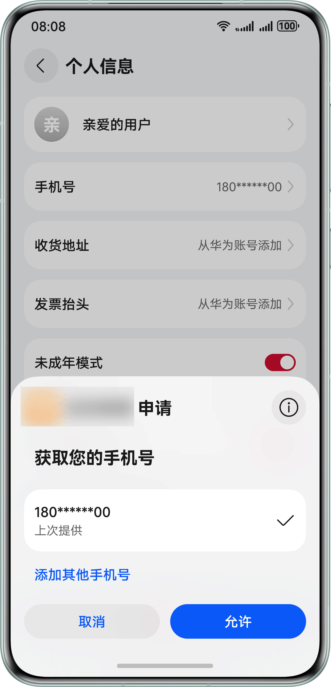  | 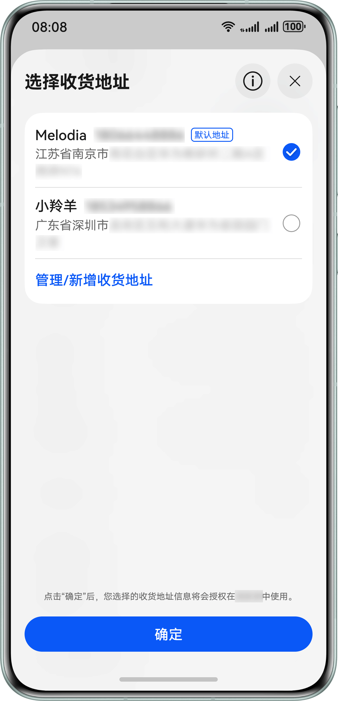  |
|                     **获取发票抬头页面**                      |                    **开启未成年人模式页面**                     |                                                       |
| 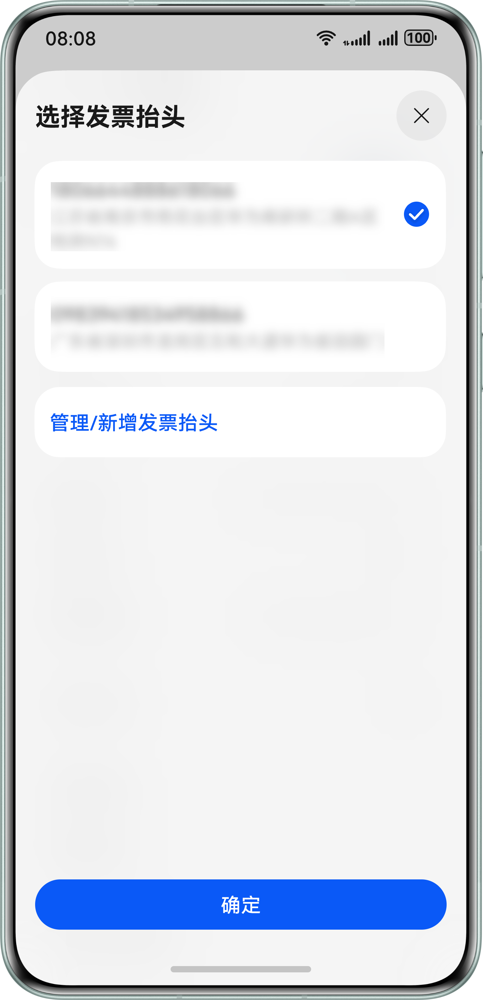 | 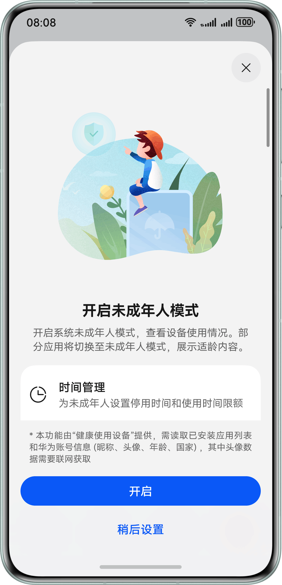 |                                                       |

## 本示例的配置与使用

### 在DevEco中配置本示例的步骤如下

1. 参考Account Kit开发指南的[开发准备](https://developer.huawei.com/consumer/cn/doc/harmonyos-guides/account-preparations)章节，创建项目和应用、申请账号权限（华为账号一键登录、获取您的手机号和获取收货地址）、配置签名和指纹、配置Client ID。
2. 使用[AppGallery Connect](https://developer.huawei.com/consumer/cn/service/josp/agc/index.html)配置的包名替换app.json5文件中的bundleName属性值。

### 本示例使用说明

1. 运行本示例，如系统已登录注册地为中国境内（不包含中国香港、中国澳门、中国台湾）且已绑定手机号的华为账号，应用在申请完“华为账号一键登录”权限后，点击“登录/注册”按钮，会拉起嵌有“华为账号一键登录”按钮的登录页面，否则拉起其他登录方式，其他登录方式仅为演示，实际并未登录成功，通过其他登录方式登录进入的个人信息页同一键登录后的个人信息页功能保持一致。
2. 登录成功后，在应用首页点击“亲爱的用户”会进入个人信息页面，如果头像昵称未授权，点击亲爱的用户或默认头像会拉起头像昵称授权页面，授权成功后会在个人信息页展示华为账号头像昵称。个人信息页面的头像、昵称仅用于展示，不可点击修改。
3. 申请 phone 权限后，在个人信息页点击手机号，会拉起手机号验证及授权页面，授权成功后展示匿名手机号或 180******00（本示例只获取 code，获取 code 后需要将 code 传给应用服务器，调用华为账号服务器接口换取 Access Token，然后再[获取用户手机号](https://developer.huawei.com/consumer/cn/doc/harmonyos-references/account-api-get-user-info-get-phone)），如未申请权限则点击无效。
4. 申请获取收货地址 API 权限后，在个人信息页点击收货地址拉起选择收货地址页面，用户选择对应的地址后展示收货地址信息。
5. 在个人信息页点击发票抬头拉起选择发票抬头页面，用户选择对应的抬头后展示发票抬头信息。
6. 当前应用启动后会订阅未成年人模式开启/关闭事件:
   * 当订阅到系统未成年人模式开启时，会再判断应用内未成年人模式单独关闭标记（userTurnOffFlag）是否为true（true表示用户主动关闭应用的未成年人模式），如果应用内单独关闭标记为true，则关闭应用内未成年人模式，如果应用内单独关闭标记为false（false表示用户未主动关闭应用的未成年人模式），则应用内未成年人模式开启，并获取适龄内容年龄段。
   * 当订阅到系统未成年人模式关闭时，会关闭应用内未成年人模式，并设置应用内未成年人模式单独关闭标记为false。
7. 应用启动时，会调用 getMinorsProtectionInfoSync 接口，查询系统未成年人模式的开启状态，当查询到系统未成年人模式已关闭时，设置应用内未成年人模式单独关闭标记为false。
8. 当应用内未成年人模式未开启时，点击未成年人模式开关，如当前系统未成年人模式状态为已开启，则应用直接开启自身未成年人模式，展示当前从系统获取的年龄段信息；如当前系统未成年人模式状态为未开启，则引导用户开启系统未成年人模式。
9. 当应用内未成年人模式开启时：
    * 可以点击可用时长限制开关，系统会校验健康使用设备密码，校验通过后，才可修改可用时长限制开关的状态。
    * 可以点击未成年人模式开关，系统会校验健康使用设备密码，校验通过后，应用的未成年人模式成功关闭，设置应用内未成年人模式单独关闭标记为true。
10. 在个人信息页，点击使用华为账号静默登录开关，会开启或关闭静默登录功能，开启静默登录后，不管用户是否退出登录应用，下次重新打开应用都会通过华为账号静默登录应用。
11. 在个人信息页面，点击退出登录按钮后，修改用户登录状态为未登录并返回首页。
12. 当未成年人模式开启时，当前设备的开发者调试模式会被禁用，开发者可以进入设置-系统-开发者选项，点击USB调试开关，会校验健康使用设备密码，校验成功后可解除开发者调试模式限制。

## 工程目录
```
├─entry/src/main/ets            // 代码区
│ ├─common                      // 公用代码
│ │ └─AvoidRepeatClick.ets      // 防止重复点击工具类
│ │ └─CommonEventUtil.ets       // 公共类，包含监听未成年人状态变化的事件
│ │ └─ErrorCodeEntity.ets       // 登录过程中可能遇到的错误码信息页面
│ │ └─UserInfo.ets              // 用户信息数据结构
│ │ └─Utils.ets                 // 公用的一些业务方法
│ ├─components                  // 存放组件文件目录
│ │ └─Address.ets               // 获取收货地址组件
│ │ └─AgreementDialog.ets       // 隐私协议弹窗组件
│ │ └─AvatarAndNickname.ets     // 获取头像、昵称组件
│ │ └─InvoiceTitle.ets          // 获取发票抬头组件
│ │ └─MinorsProtection.ets      // 开启、关闭未成年人模式组件
│ │ └─Phone.ets                 // 手机号授权组件
│ │ └─SilentlyLoginSwitch.ets   // 开启、关闭静默登录组件
│ │ └─UserAgreement.ets         // 用户协议组件
│ ├─entryability
│ │ └─EntryAbility.ets          // 程序入口类
│ ├─pages                       // 存放页面文件目录
│ │ └─HomePage.ets              // 主页面，作为Navigation跳转的容器
│ │ └─OtherLoginPage.ets        // 应用自定义的其他登录方式
│ │ └─PersonalInfoPage.ets      // 个人信息页，包含头像、昵称、默认手机号展示，同时包含快速验证手机号授权、获取收货地址、设置未成年人模式、获取发票抬头、使用华为账号静默登录场景
│ │ └─PrepareLoginPage.ets      // 首页内容，包括获取匿名手机号场景
│ │ └─ProtocolWebView.ets       // 华为账号用户认证协议页面
│ │ └─QuickLoginPage.ets        // 华为账号一键登录组件，包含组件调用
└──entry/src/main/resources     // 资源文件目录
```

## 具体实现

调用一键登录组件拉起符合华为规范的登录页面，参考QuickLoginPage.ets：
* 使用 loginComponentManager.PrivacyText 创建 QuickLoginPage 组件隐私文本对象 privacyText
* 使用 loginComponentManager.LoginWithHuaweiIDButtonController 构造 QuickLoginPage 组件的控制器对象 controller
* 创建一键登录组件对象将 privacyText、controller 等作为参数传入，拉起登录界面
* 使用 setAgreementStatus 方法设置用户是否同意协议，通过该状态判断是否需要拉起协议弹窗
* 使用 continueLogin 方法设置同意协议与登录一同完成，同意协议后直接触发登录的异步回调，用户无需再次点击登录按钮
* 通过 LoginWithHuaweiIDButton 组件内设置 param 中的 extraStyle 属性开启一键登录按钮的点击加载态

调用获取头像昵称授权接口拉起授权页面、调用快速验证手机号接口完成手机号快速验证与授权、调用收货地址接口获取收货地址信息、调用发票抬头接口获取发票抬头信息，参考 PersonalInfoPage.ets：
* 使用 authentication.HuaweiIDProvider().createAuthorizationWithHuaweiIDRequest() 创建授权请求，完成头像昵称参数设置
* 使用 authentication.AuthenticationController(getContext(this)) 创建 controller
* 调用 controller.executeRequest() 执行请求
* 使用 authentication.HuaweiIDProvider().createAuthorizationWithHuaweiIDRequest() 创建授权请求，完成快速验证手机号参数设置
* 使用 authentication.AuthenticationController(getContext(this)) 创建 controller
* 调用 controller.executeRequest() 执行请求
* 使用 shippingAddress.chooseAddress 获取 AddressInfo 对象
* 从 AddressInfo 对象中获取收货人姓名、电话、地址信息
* 使用 invoiceAssistant.selectInvoiceTitle 获取 InvoiceTitle 对象
* 从 InvoiceTitle 对象中获取发票抬头名称、税号等信息

调用未成年人模式相关接口设置未成年人模式，参考 MinorsProtection.ets：
* 使用 minorsProtection.leadToTurnOnMinorsMode 引导用户开启未成年人模式，应用内提供入口，帮助用户快速开启未成年人模式
* 使用 minorsProtection.leadToTurnOffMinorsMode 引导用户关闭未成年人模式，应用内提供入口，帮助用户快速关闭未成年人模式
* 使用 minorsProtection.verifyMinorsProtectionCredential 校验用户开启未成年人模式的密码，防止未成年人更改系统未成年人模式设置

使用 HomePage 作为 Navigation 容器进行页面承载，参考 HomePage.ets：
* 使用 new authentication.HuaweiIDProvider().createLoginWithHuaweiIDRequest() 创建静默登录请求，配合 PersistentStorage 模拟静默登录 

HomePage 作为应用首页调用未成年人模式接口，参考 HomePage.ets：

* 使用 PersistentStorage和AppStorage 存储和获取到当前应用是否开启未成年人模式的状态
* 调用 minorsProtection.getMinorsProtectionInfoSync() 函数，从 minorsProtection.MinorsProtectionInfo 对象中获取未成年人模式的开启状态，同时查询应用内未成年人模式单独关闭标记：
  * 当查询到系统的未成年人模式为开启，应用内未成年人模式单独关闭标记为已开启时，表明用户单独关闭过该应用的未成年人模式，则应用不应该开启未成年人模式。
  * 当查询到系统的未成年人模式为开启，应用内未成年人模式单独关闭标记为已关闭时，应用应正常开启未成年人模式。
  * 当查询到系统的未成年人模式为关闭时，应用也应关闭未成年人模式，同时清除应用内未成年人模式单独关闭标记。

在 CommonEventUtil 监听未成年状态变化，参考在CommonEventUtil.ets：
* 使用 @ohos.commonEventManager 系统能力监听 COMMON_EVENT_MINORSMODE_ON 和 COMMON_EVENT_MINORSMODE_OFF 事件，当应用进程存在时，应用可以实时感知到系统未成年人模式的变化，从而与系统联动改变自己的未成年人模式，并清除应用内未成年人模式单独关闭标记。

在 OtherLoginPage页面中自定义用户的其他登录方式：
* 比如手机号验证码、密码等

在 ProtocolWebView 页面中使用Web组件显示《华为账号用户认证协议》内容：
* 在 data.json 中获取网页链接，当前仅支持中英文

在 AgreementDialog 中实现用户隐私协议的弹窗组件
* 通过自定义 CustomDialogController 控制弹窗的显隐

在 ErrorCodeEntity 中定义通用的实体数据信息
* 比如通用错误码、通用常量等

在 UserInfo 中定义 UserInfo 的数据结构

在 EntryAbility 中订阅未成年人模式公共事件

在 AvoidRepeatClick 类中实现防止用户短时间内重复点击方法

参考
1. entry\src\main\ets\pages\QuickLoginPage.ets
2. entry\src\main\ets\pages\PersonalInfoPage.ets
3. entry\src\main\ets\common\CommonEventUtil.ets
4. entry\src\main\ets\pages\HomePage.ets
5. entry\src\main\ets\pages\OtherLoginPage.ets
6. entry\src\main\ets\pages\ProtocolWebView.ets
7. entry\src\main\ets\components\AgreementDialog.ets
8. entry\src\main\ets\common\ErrorCodeEntity.ets
9. entry\src\main\ets\common\UserInfo.ets
10. entry\src\main\ets\entryability\EntryAbility.ets
11. entry\src\main\ets\common\AvoidRepeatClick.ets
12. entry\src\main\ets\components\MinorsProtection.ets

## 相关权限

1. 本示例需要访问《华为账号用户认证协议》页面，已在 module.json5 文件中添加允许使用 Internet 网络权限"ohos.permission.INTERNET"。
2. 本示例在跳转网页前需要查询网络连接状态，已在 module.json5 文件中添加允许应用获取数据网络信息权限"ohos.permission.GET_NETWORK_INFO"。

## 依赖

依赖设备具备 WIFI 能力

## 约束与限制

1. 本示例仅支持标准系统上运行，支持设备：Phone、2in1、Tablet、TV，支持账号：已绑定手机号的中国境内（不包含中国香港、中国澳门、中国台湾）成人账号。
2. 本示例不支持大字体模式、隐私空间模式。
3. Harmony OS系统：HarmonyOS 5.0.5 Release 及以上，TV设备需要HarmonyOS 5.1.1 Release 及以上。
4. DevEco Studio 版本：DevEco Studio 5.0.5 Release 及以上，TV设备需要DevEco Studio 5.1.1 Release 及以上。
5. HarmonyOS SDK 版本：HarmonyOS 5.0.5 Release SDK 及以上，TV设备需要HarmonyOS 5.1.1 Release SDK 及以上。
