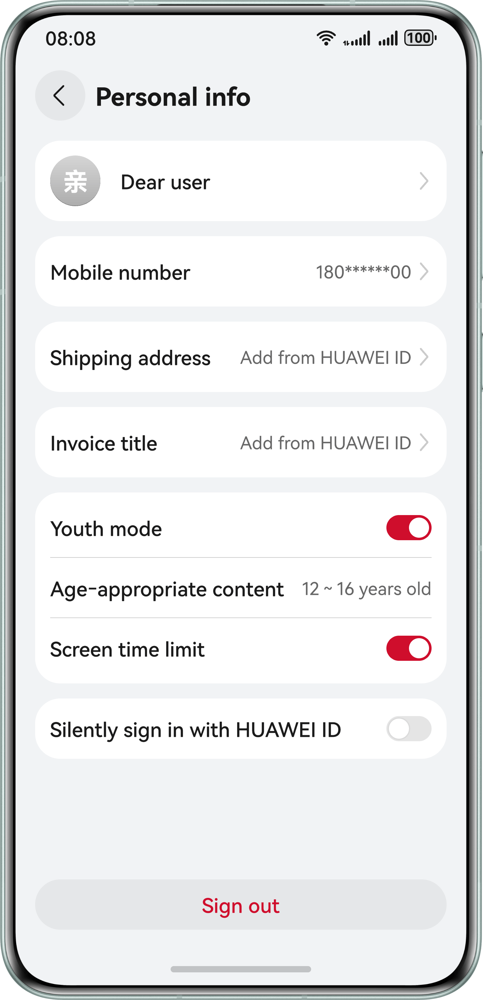

# Account Kit

## Overview

This sample project illustrates how to use the capabilities provided by Account Kit, including signing in, obtaining the avatar and nickname of a user, verifying the mobile number in a quick manner, obtaining the shipping address, obtaining the invoice title, and making youth mode-related configurations.

This sample project simulates the following scenarios in an app: calling the one-tap sign-in **Button** component to show the sign-in screen that complies with Huawei specifications, calling the sign-in API to complete silent sign-in, calling the API for obtaining the avatar and nickname, calling the API for verifying the mobile number in a quick manner, calling the API for obtaining the shipping address, calling the API for obtaining the invoice title, calling the API for enabling the youth mode, subscribing to youth mode–related common events, and calling the API for verifying the parental control password.

The API that you need to use is **@kit.AccountKit**.

## Effect Preview


|                                                        |                                                        |                                                        |
|:------------------------------------------------------:|:------------------------------------------------------:|:------------------------------------------------------:|
|               **Sign-in/Sign-up screen**               |          **One-tap HUAWEI ID sign-in screen**          |                 **Pop-up dialog box**                  |
|   |   |   |
|               **Other ways to sign in**                |           **Main screen after user sign-in**           |                **Personal info screen**                |
|   |   |   |
|      **Avatar and nickname authorization screen**      |      **Quick mobile number verification screen**       |           **Obtaining the shipping address**           |
|   |   |   |
|            **Obtaining the invoice title**             |     **Guiding the user to enable the youth mode**      |                                                        |
|  |  |                                                        |

## How to Configure and Use the Sample Project

### Configuring the Sample Project in DevEco Studio

1. Create a project and an app, apply for account permissions (quickLoginMobilePhone, phone and obtaining shipping address), configure the signing information and fingerprint, and set the client ID. For details, please refer to [Getting Started](https://developer.huawei.com/consumer/en/doc/harmonyos-guides/account-preparations) in the Account Kit Development Guide.
2. Replace the value of the bundleName property in the app.json5 file with the package name configured in [AppGallery Connect](https://developer.huawei.com/consumer/en/service/josp/agc/index.html).

### Using the Sample Project

1. Run the sample app, tap **Sign in/Sign up** and then choose to instantly sign in with the HUAWEI ID. If no HUAWEI ID has signed in on the device, the app will show other ways to sign in.
2. If the signed-in HUAWEI ID is registered in the Chinese mainland and has been bound to a mobile number, after the app has obtained the one-tap HUAWEI ID sign-in scope, tapping the **Sign in/Sign up** button will show the sign-in screen with the one-tap HUAWEI ID sign-in button. Otherwise, if the signed-in HUAWEI ID is not such an account described above or has not obtained the required scope, tapping the **Sign in/Sign up** button will show other ways to sign in. These ways are only for demonstration, and the sign-in is not actually successful. The **Personal info** screen keeps the same no matter whether you sign in through the one-tap HUAWEI ID sign-in button or through any other way.
3. After a successful sign-in, tapping **Dear user** on the main screen to access the **Personal info** screen. If the app has not obtained user authorization on the avatar and nickname, tapping **Dear user** will bring up the screen for obtaining user authorization on the avatar and nickname. After a successful authorization, the avatar and nickname associated with the HUAWEI ID will be displayed on the **Personal info** screen. The avatar and nickname on this screen are for display purposes only and cannot be changed.
4. After obtaining the **phone** scope, tapping the button for obtaining the mobile number on the **Personal info** screen will show the mobile number verification and authorization screen. After a successful authorization, the anonymous mobile number 180******00 is displayed. (In this sample code, only the authorization code is obtained. Then, the app sends the authorization code to its server, and the server calls the API of Account Kit to obtain an access token and further uses the access token to [obtain the mobile number](https://developer.huawei.com/consumer/en/doc/harmonyos-references/account-api-get-user-info-get-phone)). If the app does not have the **phone** scope, an error message will be displayed.
5. After obtaining the scope of the API for obtaining the shipping address, tap the shipping address on the **Personal info** screen to access the shipping address selection screen. The selected address will be displayed on the **Personal info** screen.
6. Tapping the **Invoice title** field on the **Personal info** screen will show the screen for selecting an invoice title. The selected invoice title will be displayed on the **Personal info** screen.
7. After launching, the app subscribes to the events related to changes of the device's youth mode status:
    * When receiving the event of enabling the device's youth mode, the app will check whether the flag for disabling the app's youth mode separately (**userTurnOffFlag**) is **true** (**true** indicates that the user has manually disabled the app's youth mode; **false** otherwise). If the flag is **true**, the app's youth mode will be disabled; if the flag is **false**, the app's youth mode will be enabled and the age group information will be obtained.
    * When receiving the event of disabling the device's youth mode, the app's youth mode will be disabled and the flag for disabling the app's youth mode separately is set to **false**.
8. When launching, the app calls the **getMinorsProtectionInfoSync** API to query the device's youth mode status. If the device's youth mode is disabled, the flag for disabling the app's youth mode separately will be set to **false**.
9. When the app's youth mode is not enabled, tapping the youth mode switch will directly enable the app's youth mode if the device's youth mode is already enabled; if the device's youth mode is not enabled, this tap operation will show a guide for the user to enable the device's youth mode.
10. When the app's youth mode is enabled:
    * the age group information obtained from the device will be displayed.
    * the obtained age group will be displayed. The screen time limit switch is enabled by default. Once a user taps this switch, the relevant password will be verified. If the verification is successful, the user can turn on or off the screen time limit switch.
11. On the **Personal info** screen, you can turn on or off the **Silently sign in with HUAWEI ID** function with a tap. If the function is enabled, the app will silently sign you in with the HUAWEI ID the next time it is opened, regardless of whether you have signed out.
12. On the **Personal info** screen, you can tap the sign-out button. Then, you will change to the not-signed-in status and go back to the main screen.
13. When the youth mode is enabled, USB debugging on the device will be disabled. You can re-enable this function by doing as follows: (1) Go to **Settings** > **System & updates** > **Developer options**; (2) Tap **USB debugging**; (3) Enter the parental control password as prompted. USB debugging will be enabled once the password verification is successful.

## Project Directory
```
├─entry/src/main/ets            // Code area.
│ ├─common                      // Common code.
│ │ └─AvoidRepeatClick.ets      // Utility class for preventing repeated taps.
│ │ └─CommonEventUtil.ets       // Public class, including events related to listening to youth mode status changes.
│ │ └─ErrorCodeEntity.ets       // Error information that may appear during sign-in.
│ │ └─UserInfo.ets              // Data structure of user information.
│ │ └─Utils.ets                 // Some public methods.
│ ├─components                  // Directory for storing component files.
│ │ └─Address.ets               // Component for obtaining the shipping address.
│ │ └─AgreementDialog.ets       // Privacy policy pop-up window component.
│ │ └─AvatarAndNickname.ets     // Component for obtaining the avatar and nickname.
│ │ └─InvoiceTitle.ets          // Component for obtaining the invoice title.
│ │ └─MinorsProtection.ets      // Component for enabling or disabling the youth mode.
│ │ └─Phone.ets                 // Mobile number authorization component.
│ │ └─SilentlyLoginSwitch.ets   // Component for enabling or disabling silent sign-in.
│ │ └─UserAgreement.ets         // User agreement component
│ ├─entryability
│ │ └─EntryAbility.ets          // Entry point class.
│ ├─pages                       // Directory for storing UI files.
│ │ └─HomePage.ets              // Main screen UI, which serves as the container for navigation jumps.
│ │ └─OtherLoginPage.ets        // Other ways to sign in, defined by the app itself.
│ │ └─PersonalInfoPage.ets      // Personal information screen, which displays the avatar, nickname, and default mobile number, and also provides the functions of quickly verifying the mobile number and asking user authorization, obtaining the shipping address, setting the youth mode, obtaining the invoice title, and enabling or disabling the function of silent sign-in with HUAWEI ID.
│ │ └─PrepareLoginPage.ets      // Main screen content, covering scenarios such as obtaining the anonymous mobile number.
│ │ └─ProtocolWebView.ets       // *HUAWEI ID User Authentication Agreement* page.
│ │ └─QuickLoginPage.ets        // One-tap HUAWEI ID sign-in component, including component calling.
└──entry/src/main/resources     // Directory for storing resource files.
```

## How to Implement

Call the one-tap HUAWEI ID sign-in component to show the sign-in screen that complies with Huawei specifications. For details, please refer to **QuickLoginPage.ets**.
* Use **loginComponentManager.PrivacyText** to create a **privacyText** object for the **QuickLoginPage** component.
* Use **loginComponentManager.LoginWithHuaweiIDButtonController** to construct a controller object for **QuickLoginPage**.
* Create a one-tap sign-in component object and pass necessary parameters including **privacyText** and **controller** to bring up the sign-in screen.
* Use the **setAgreementStatus** method to set the agreement status (accepted or not) and determine whether to display the agreement pop-up window based on the status.
* Use the **continueLogin** method to implement the function of accepting the agreements and signing in simultaneously. After the agreements are accepted, an asynchronous callback is triggered for completing sign-in. It is unnecessary to tap the sign-in button again.
* Set the **extraStyle** attribute in **param** in the **LoginWithHuaweiIDButton** component to enable the loading-after-a-tap status of the one-tap HUAWEI ID sign-in button.

Call the API for obtaining the avatar and nickname to show the authorization screen, call the quick mobile number verification API to verify and authorize the mobile number, call the API for obtaining the shipping address, and call the API for obtaining the invoice title. For details, please refer to **PersonalInfoPage.ets**.
* Use **authentication.HuaweiIDProvider().createAuthorizationWithHuaweiIDRequest()** to create an authorization request and set the avatar and nickname parameters.
* Use **authentication.AuthenticationController(getContext(this))** to create a controller.
* Call **controller.executeRequest()** to execute the request.
* Use **authentication.HuaweiIDProvider().createAuthorizationWithHuaweiIDRequest()** to create an authorization request and set parameters for quick mobile number verification.
* Use **authentication.AuthenticationController(getContext(this))** to create a controller.
* Call **controller.executeRequest()** to execute the request.
* Use **shippingAddress.chooseAddress** to obtain the **AddressInfo** object.
* Obtain the recipient name, mobile number, and address from the **AddressInfo** object.
* Use **invoiceAssistant.selectInvoiceTitle** to obtain the **InvoiceTitle** object.
* Obtain the invoice title name, tax number, and other information from the **InvoiceTitle** object.

Call the youth mode–related APIs to make desired configurations. For details, please refer to **MinorsProtection.ets**.
* Use **minorsProtection.leadToTurnOnMinorsMode** to guide users to enable the youth mode. The app provides an entry for users to quickly enable the youth mode.
* Use **minorsProtection.leadToTurnOffMinorsMode** to guide users to disable the youth mode. The app provides an entry for users to quickly disable the youth mode.
* Use **minorsProtection.verifyMinorsProtectionCredential** to verify the password for enabling the youth mode to prevent minors from changing the youth mode settings by themselves.

Use **HomePage** to serve as the container for navigation jumps. For details, please refer to **HomePage.ets**.
* Use **new authentication.HuaweiIDProvider().createLoginWithHuaweiIDRequest()** to create a silent sign-in request and simulate silent sign-in by using **PersistentStorage** together.

**HomePage** functions as the app's main screen to call the youth mode API. For details, please refer to **HomePage.ets**.

* Use **PersistentStorage** and **AppStorage** together to store and obtain the youth mode status in the app.
* Call the **minorsProtection.getMinorsProtectionInfoSync()** function to obtain the youth mode status from the **minorsProtection.MinorsProtectionInfo** object and query the flag for disabling the app's youth mode separately.
    * If the device's youth mode is enabled and the flag for disabling the app's youth mode separately is **true** (indicating that the user has manually disabled the app's youth mode), the app's youth mode will not be enabled.
    * If the device's youth mode is enabled and the flag for disabling the app's youth mode separately is **false** (indicating that the user has not manually disabled the app's youth mode), the app's youth mode will be enabled.
    * If the device's youth mode is disabled, the app's youth mode will be disabled and the flag for disabling the app's youth mode separately will be set to **false**.

Listen to youth mode status changes in **CommonEventUtil**. For details, please refer to **CommonEventUtil.ets**.
* Use the system capability **@ohos.commonEventManager** to listen to the **COMMON_EVENT_MINORSMODE_ON** and **COMMON_EVENT_MINORSMODE_OFF** events. When the app process is running, the app detects the change of the device's youth mode in real time, then follows the change accordingly, and sets the flag for disabling the app's youth mode separately.

Define other sign-in ways in **OtherLoginPage**.
* Other sign-in ways can be sign-in using mobile number & SMS verification code, password, and more.

Use the web component to show the *HUAWEI ID User Authentication Agreement* in **ProtocolWebView**.
* Obtain the web page link from **data.json**. Currently, only Chinese and English are supported.

Implement the **Privacy Policy** pop-up window component in **AgreementDialog**.
* Use **CustomDialogController** to determine whether a pop-up window is displayed or hidden.

Define common entity data in **ErrorCodeEntity**.
* Common entity data includes error codes, constants, and more.

Define the data structure of user information in **UserInfo**.

Subscribe to youth mode–related common events in **EntryAbility**.

Implement the method in the **AvoidRepeatClick** class to prevent users from repeated taps in a short period of time.

References
1. entry\src\main\ets\pages\QuickLoginPage.ets
2. entry\src\main\ets\pages\PersonalInfoPage.ets
3. entry\src\main\ets\common\CommonEventUtil.ets
4. entry\src\main\ets\pages\HomePage.ets
5. entry\src\main\ets\pages\OtherLoginPage.ets
6. entry\src\main\ets\pages\ProtocolWebView.ets
7. entry\src\main\ets\components\AgreementDialog.ets
8. entry\src\main\ets\common\ErrorCodeEntity.ets
9. entry\src\main\ets\common\UserInfo.ets
10. entry\src\main\ets\entryability\EntryAbility.ets
11. entry\src\main\ets\common\AvoidRepeatClick.ets
12. entry\src\main\ets\components\MinorsProtection.ets

## Required Permissions

1. The sample app needs to access the *HUAWEI ID User Authentication Agreement* page, so the network permission **ohos.permission.INTERNET** must be added to the **module.json5** file.
2. The sample app needs to check whether the device is connected to the network before redirecting to relevant web pages. The **ohos.permission.GET_NETWORK_INFO** permission for obtaining network information must be added to the **module.json5** file.

## Dependencies

The device where the sample app runs must support Wi-Fi.

## Constraints

1. The sample app is only supported on Huawei phones, 2-in-1 devices, tablets, and TVs with standard systems. The HUAWEI ID must be an adult account that is registered in the Chinese mainland.
2. The sample app does not support large font mode or private space mode.
3. The HarmonyOS version must be HarmonyOS 5.0.5 Release or later, while TVs need HarmonyOS 5.1.1 Release or later.
4. The DevEco Studio version must be DevEco Studio 5.0.5 Release or later, while TVs need DevEco Studio 5.1.1 Release or later.
5. The HarmonyOS SDK version must be HarmonyOS 5.0.5 Release SDK or later, while TVs need HarmonyOS 5.1.1 Release SDK or later.
