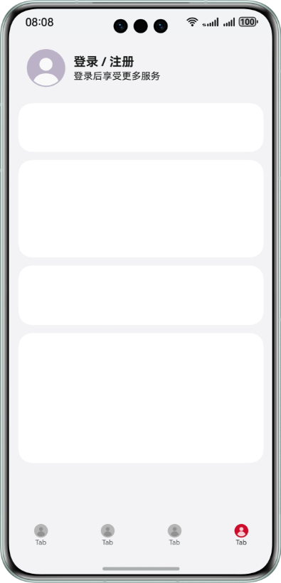
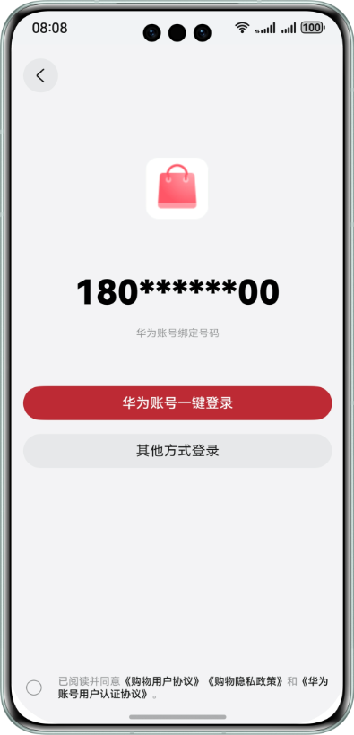
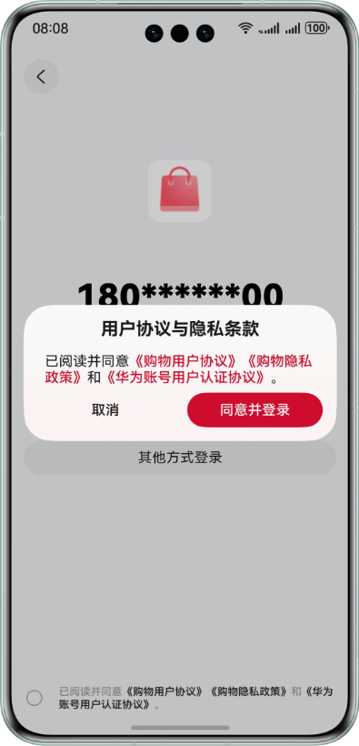

# Account Kit

## 介绍

本示例演示了基于 Flutter 使用 Account Kit 提供的华为账号一键登录 Button 组件登录流程。

本示例模拟了应用调用一键登录 Button 组件，拉起符合华为规范的登录页面。

需要使用 Account Kit 接口 **@kit.AccountKit**。

## 效果预览

|               **登录/注册页面**               |             **一键登录组件登录页面**              |
|:---------------------------------------:|:---------------------------------------:|
|  |  |

|             **一键登录组件弹窗页面**              |              **用户个人信息页面**               |
|:---------------------------------------:|:---------------------------------------:|
|  |  |


## 本示例的配置与使用

### Flutter 开发环境配置如下
1. 使用 git 下载 OpenHarmony 版 flutter: ``` git clone https://gitee.com/openharmony-sig/flutter_flutter.git ```。
2. 添加环境变量 ``` FLUTTER_ROOT= ${clone下来的项目代码} ```，在path中添加``` %FLUTTER_ROOT%\bin ```。
3. 安装 jdk17 并配置环境变量 ``` JAVA_HOME=${jdk的安装位置} ```，在path中添加 ``` %JAVA_HOME%\bin ```。
4. 添加环境变量 ``` FLUTTER_STORAGE_BASE_URL=https://storage.flutter-io.cn ``` 和 ``` PUB_HOSTED_URL=https://pub.flutter-io.cn ```。
5. 添加环境变量 ``` PUB_CACHE=D:/PUB(自定义路径，新建一个空文件夹即可) ```。
6. 在命令行执行 ``` flutter doctor -v ```，检查当前环境，按提示进行操作。
7. 详细的环境搭建请查看[OpenHarmony版Flutter环境搭建指导](https://gitee.com/openharmony-sig/flutter_samples/blob/master/ohos/docs/03_environment/%E9%B8%BF%E8%92%99%E7%89%88Flutter%E7%8E%AF%E5%A2%83%E6%90%AD%E5%BB%BA%E6%8C%87%E5%AF%BC.md)和[环境依赖](https://gitee.com/openharmony-sig/flutter_flutter#%E7%8E%AF%E5%A2%83%E4%BE%9D%E8%B5%96)。

### 在 DevEco 中配置本示例的步骤如下
1. 华为开发者联盟官网下载安装[DevEco Studio](https://developer.huawei.com/consumer/cn/deveco-studio/)(5.0.5 Release 及以上)。
2. 参考Account Kit开发指南的[开发准备](https://developer.huawei.com/consumer/cn/doc/harmonyos-guides/account-preparations)章节，创建项目和应用、申请账号权限（华为账号一键登录）、配置签名和指纹、配置Client ID。
3. 使用[AppGallery Connect](https://developer.huawei.com/consumer/cn/service/josp/agc/index.html)配置的包名替换ohos/AppScope/app.json5文件中的bundleName属性值。

### 编译运行本示例

1. 运行本示例前，请先查看[约束与限制](#约束与限制)，确保满足示例运行条件。
2. 连接设备，在项目根目录下使用 Terminal 执行 ``` flutter run ``` 编译并安装本示例的debug版本。
3. 在项目根目录下使用 Terminal 执行 ``` flutter build hap ``` 编译本示例 release 版本的 hap 包。待编译完成后, 连接设备, 执行 ``` hdc install .\ohos\entry\build\default\outputs\default\entry-default-signed.hap ``` 安装本示例 release 版本到设备上。

### 本示例使用说明

1. 登录符合条件的账号，运行本示例。应用在申请完“华为账号一键登录”权限后，点击首页的“登录/注册”按钮，会拉起嵌有“华为账号一键登录”按钮的登录页面。登录成功后跳转到个人信息页，展示用户信息（匿名手机号），点击退出按钮返回首页。
2. 点击首页的“登录/注册”按钮时，会先获取匿名手机号。如果未获取成功，则不会拉起嵌有“华为账号一键登录”按钮的登录页面，并且本示例中只声明对应错误码，未做相应处理，请开发者自行实现跳转其他登录页面的逻辑。
3. 点击“华为账号一键登录”按钮时，如果未勾选下方的同意协议多选框，则会拉起协议弹窗提示用户同意协议或取消登录。如点击同意并登录则完成华为账号一键登录，点击取消按钮则关闭弹窗。
4. 点击“华为账号一键登录”按钮时，如果系统账号已退出，则会报错[1001502001 用户未登录华为账号](https://developer.huawei.com/consumer/cn/doc/harmonyos-references/account-api-error-code#section539558125020)。本示例只声明对应错误码，未做相应处理，请开发者自行实现跳转其他登录页面的逻辑。业务可以通过[订阅华为账号的登录/登出事件](https://developer.huawei.com/consumer/cn/doc/harmonyos-guides/account-login-state)来提前识别系统账号是否已登出，避免该场景发生。
5. 应用一键登录页面展示后，若此时用户切换为另一个新的华为账号，此时应用需要重新获取匿名手机号刷新一键登录页面上显示的匿名手机号，若未获取到匿名手机号则切换为其他登录方式。请开发者自行实现该要求。
6. 开发者如果需要开启[代码混淆](https://developer.huawei.com/consumer/cn/doc/harmonyos-guides/source-obfuscation-guide)，quickLoginAnonymousPhone（匿名手机号）属性需要配置混淆白名单防止被release包混淆。在调用获取匿名手机号方法工程模块的混淆文件obfuscation-rules.txt中添加：
```
# 开发者开启属性混淆需要配置quickLoginAnonymousPhone属性白名单防止其被混淆
-enable-property-obfuscation
-keep-property-name
quickLoginAnonymousPhone
```

## 工程目录

```
├───images                                    // 项目使用到的图片资源
├───lib                                       // Flutter 工程代码实现目录
│   ├─login_ohos_view.dart                    // HarmonyOS 组件插入到 Flutter 工程的具体实现
│   ├─login_page.dart                         // 登录页面的 UX 实现
│   ├─main.dart                               // 首页的 UX 实现
│   ├─user_info.dart                          // 用户信息页面的 UX 实现
│   └─webview.dart                            // 隐私协议浏览页面的 UX 实现
├───ohos\entry\src\main\ets                   // HarmonyOS 实现代码目录
│   ├──common                                 // 公共代码
│   │   ├──ErrorCodeEntity.ets                // 错误码
│   │   └──Utils.ets                          // 工具方法
│   ├───components
│   │   ├──LoginView.ets                      // 一键登录组件的 Plugin 实现
│   │   ├──MainView.ets                       // 首页的 Plugin 实现
│   │   └──PrivacyView.ets                    // 协议富文本组件的 Plugin 实现
│   │   └──UserInfoView.ets                   // 用户信息页面的 Plugin 实现
│   ├───entryability
│   │   ├──EntryAbility.ets                   // 程序入口类
│   ├───pages
│   │   └──Index.ets                          // Plugin 承载页面
│───pubspec.yaml                              // Flutter 项目依赖管理
```

## 具体实现

1. 注册 LoginPlugin 插件：封装了一键登录组件 LoginWithHuaweiIDButton，用于提供给 Flutter 框架使用，参考 LoginView.ets
   * 创建一个组件 ButtonComponent，在组件中使用 loginComponentManager.LoginWithHuaweiIDButtonController 构造一键登录组件的控制器对象 controller，在build方法中使用 LoginWithHuaweiIDButton，将 controller 等作为参数传入
   * 新建 CustomView ，注册消息通道，用于 ohos 与 flutter 的数据通信。在 getView 方法中返回 ButtonComponent，调用后可以获取到一键登录按钮的UI信息，用于 flutter 端展示
   * 新建 CustomFactory 实现 create 方法，create 方法返回一个 CustomView 实例
   * 新建 LoginPlugin，在 onAttachedToEngine 方法中传入插件名和 CustomFactory 实例，完成插件注册

2.  添加 LoginPlugin 插件：在入口文件中调用 addPlugin 方法添加 LoginPlugin 的实例，参考 EntryAbility.ets

3. 嵌入 LoginPlugin 插件到 flutter 中： 实现消息通信和 UI 布局，请参考 login_ohos_view.dart
   * 新建一个 MethodChannel 实例，实现实例上的 setMethodCallHandler 和 sendMessageToOhosView 两个方法，这两个方法分别是获取 ohos 端发送的数据和发送数据到 ohos 端
   * 新建一个 OhosView 实例，构建参数 viewType 传入插件名，即可将 LoginPlugin 插件嵌入到flutter布局中
   * 新建一个 LoginOhosView 组件，在组件 build 方法中使用 OhosView 实例，拉起一键登录组件

参考：
1. Accountkit-Samplecode-Clientdemo-Flutter\ohos\entry\src\main\ets\components\LoginView.ets
2. Accountkit-Samplecode-Clientdemo-Flutter\ohos\entry\src\main\ets\entryability\EntryAbility.ets
3. Accountkit-Samplecode-Clientdemo-Flutter\lib\login_ohos_view.dart

## 相关权限

1. 本示例需要访问《华为账号用户认证协议》页面，已在 ohos/entry/src/main/module.json5 文件中添加允许使用 Internet 网络权限 "ohos.permission.INTERNET"。
2. 本示例在跳转网页前需要查询网络连接状态，已在 ohos/entry/src/main/module.json5 文件中添加允许应用获取数据网络信息权限 "ohos.permission.GET_NETWORK_INFO"。

## 依赖

依赖设备具备WIFI能力

## 约束与限制

1. 本示例仅支持标准系统上运行，仅支持设备：phone（竖屏），支持账号：已绑定手机号的中国境内（不包含中国香港、中国澳门、中国台湾）账号。
2. 运行本示例前，请确保已登录符合条件的华为账号。
3. 本示例暂不支持切换横屏、多语言、大字体模式、隐私空间模式、深色模式。
4. HarmonyOS 系统：HarmonyOS 5.0.5 Release 及以上。
5. DevEco Studio 版本：DevEco Studio 5.0.5 Release 及以上。
6. HarmonyOS SDK 版本：HarmonyOS 5.0.5 Release SDK 及以上。
7. DevEco Studio 及 SDK 对应配套关系可参考[所有HarmonyOS版本](https://developer.huawei.com/consumer/cn/doc/harmonyos-releases/overview-allversion)。