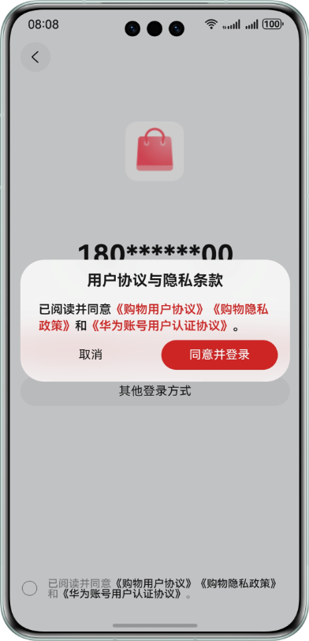

# Account Kit

## 介绍

本示例演示了基于H5使用 Account Kit 提供的华为账号一键登录 Button 组件登录流程。

本示例模拟了应用调用一键登录 Button 组件，拉起符合华为规范的登录页面。

需要使用 Account Kit 接口 **@kit.AccountKit**。

## 效果预览

|               **登录/注册页面**               |             **一键登录组件登录页面**              |
|:---------------------------------------:|:---------------------------------------:|
|  |  |

|             **一键登录组件弹窗页面**              |              **用户个人信息页面**               |    
|:---------------------------------------:|:---------------------------------------:|
|  |  |

## 本示例的配置与使用

### 在DevEco中配置本示例的步骤如下
1. 在华为开发者联盟官网下载安装[DevEco Studio](https://developer.huawei.com/consumer/cn/deveco-studio/)(5.0.5 Release 及以上)。
2. 参考Account Kit开发指南的[开发准备](https://developer.huawei.com/consumer/cn/doc/harmonyos-guides/account-preparations)章节，创建项目和应用、申请账号权限（华为账号一键登录）、配置签名和指纹、配置Client ID。
3. 使用[AppGallery Connect](https://developer.huawei.com/consumer/cn/service/josp/agc/index.html)配置的包名替换app.json5文件中的bundleName属性值。

### 本示例使用说明
1. 运行本示例前，请先查看[约束与限制](#约束与限制)，确保满足示例运行条件。
2. 登录符合条件的账号，运行本示例。应用在申请完“华为账号一键登录”权限后，点击首页的“登录/注册”按钮，会拉起嵌有“华为账号一键登录”按钮的登录页面。登录成功后跳转到个人信息页，展示用户信息（匿名手机号），点击退出按钮返回首页。
3. 点击首页的“登录/注册”按钮时，会先获取匿名手机号。如果未获取成功，则不会拉起嵌有“华为账号一键登录”按钮的登录页面，并且本示例中只声明对应错误码，未做相应处理，请开发者自行实现跳转其他登录页面的逻辑。
4. 点击“华为账号一键登录”按钮时，如果未勾选下方的同意协议多选框，则会拉起协议弹窗提示用户同意协议或取消登录。如点击“同意并登录”按钮则完成华为账号一键登录，点击“取消”按钮则关闭弹窗。
5. 点击“华为账号一键登录”按钮时，如果系统账号已退出，则会报错[1001502001 用户未登录华为账号](https://developer.huawei.com/consumer/cn/doc/harmonyos-references/account-api-error-code#section539558125020)。本示例只声明对应错误码，未做相应处理，请开发者自行实现跳转其他登录页面的逻辑。业务可以通过[订阅华为账号的登录/登出事件](https://developer.huawei.com/consumer/cn/doc/harmonyos-guides/account-login-state)来提前识别系统账号是否已登出，避免该场景发生。
6. 应用一键登录页面展示后，若此时用户切换为另一个新的华为账号，此时应用需要重新获取匿名手机号刷新一键登录页面上显示的匿名手机号，若未获取到匿名手机号则切换为其他登录方式。请开发者自行实现该要求。
7. 开发者如果需要开启[代码混淆](https://developer.huawei.com/consumer/cn/doc/harmonyos-guides/source-obfuscation-guide)，quickLoginAnonymousPhone（匿名手机号）属性需要配置混淆白名单防止release包被混淆。在调用获取匿名手机号方法工程模块的混淆文件obfuscation-rules.txt中添加：
```
# 开发者开启属性混淆需要配置quickLoginAnonymousPhone属性白名单防止其被混淆
-enable-property-obfuscation
-keep-property-name
quickLoginAnonymousPhone
```


## 工程目录

```
|─entry/src/main/ets                               // 代码区
└── common                                         // 公用代码
|   └─Constants.ets                                // 同层渲染组件标识配置
|   └─ErrorCodeEntity.ets                          // 错误码
|   └─Utils.ets                                    // 工具方法
└── components                                     // 存放组件文件目录
|   └─SameLayerRendering.ets                       // 同层渲染方法
|   └─loginButton.ets                              // 一键登录 Button
└── entryability                                   
|   └─EntryAbility.ets                             // 程序入口类
└── pages                                          // 存放页面文件目录
|   └─HomePage.ets                                 // 主页面，作为 Navigation 跳转的容器
|   └─LoginPage.ets                                // 华为账号一键登录页面
|   └─PersonalInfoPage.ets                         // 个人信息页
|   └─PrepareLoginPage.ets                         // 首页内容，包括获取匿名手机号场景
|   └─ProtocolWebView.ets                          // 华为账号用户认证协议浏览
└── entry/src/main/resources                       // 资源区
└── rawfile                                        // 存放 html、css、js、图片的目录
    └─css                                          // 存放 css 文件的目录
    | └─login.css                                  // 登录页面样式
    └─html                                         // 存放 html 文件的目录
    | └─login.html                                 // 登录页面 html
    └─img                                          // 存放 H5 页面使用到的图片
    └─js                                           // 存放 js 文件的目录
      └─login.js                                   // 登录页面业务逻辑
```

## 具体实现

1. 当前渲染H5页面依赖的是[ArkWeb能力](https://developer.huawei.com/consumer/cn/doc/harmonyos-guides/arkweb)
2. 将一键登录Button直接渲染到H5页面，依赖的[ArkWeb同层渲染](https://developer.huawei.com/consumer/cn/doc/harmonyos-guides/web-same-layer)
3. 应用侧（arkTs）与前端页面（H5）的数据交互请参考[建立应用侧与前端页面数据通道](https://developer.huawei.com/consumer/cn/doc/harmonyos-guides/web-app-page-data-channel)

参考：
1. Accountkit-Samplecode-Clientdemo-H5\entry\src\main\ets\components\LoginButton.ets
2. Accountkit-Samplecode-Clientdemo-H5\entry\src\main\ets\components\SameLayerRendering.ets
3. Accountkit-Samplecode-Clientdemo-H5\entry\src\main\ets\pages\LoginPage.ets

## 相关权限

1. 本示例需要访问《华为账号用户认证协议》页面，已在 module.json5 文件中添加允许使用 Internet 网络权限"ohos.permission.INTERNET"。
2. 本示例在跳转网页前需要查询网络连接状态，已在 module.json5 文件中添加允许应用获取数据网络信息权限"ohos.permission.GET_NETWORK_INFO"。

## 依赖
依赖设备具备WIFI能力

## 约束与限制

1. 本示例仅支持标准系统上运行，仅支持设备：phone（竖屏），支持账号：已绑定手机号的中国境内（不包含中国香港、中国澳门、中国台湾）账号。
2. 运行本示例前，请确保已登录符合条件的华为账号。
3. 本示例暂不支持切换横屏、多语言、大字体模式、隐私空间模式、深色模式。
4. HarmonyOS 系统：HarmonyOS 5.0.5 Release 及以上。
5. DevEco Studio 版本：DevEco Studio 5.0.5 Release 及以上。
6. HarmonyOS SDK 版本：HarmonyOS 5.0.5 Release SDK 及以上。
7. DevEco Studio 及 SDK 对应配套关系可参考[所有HarmonyOS版本](https://developer.huawei.com/consumer/cn/doc/harmonyos-releases/overview-allversion)。
