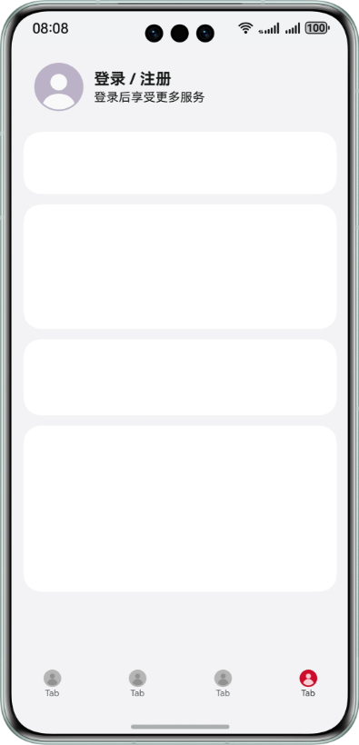
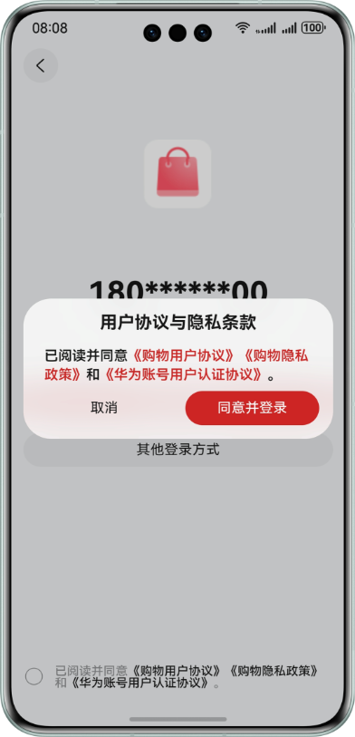
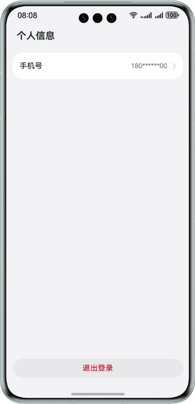

# Account Kit

## 介绍

本示例展示了基于React-Native（RN）使用 Account Kit 提供的华为账号一键登录 Button 组件登录流程。

本示例模拟了在应用里，调用一键登录 Button 组件拉起符合华为规范的登录页面。

需要使用 Account Kit 接口 **@kit.AccountKit**。

## 效果预览

|               **登录/注册页面**               |             **一键登录组件登录页面**              |
|:---------------------------------------:|:---------------------------------------:|
|  |  |

|             **一键登录组件弹窗页面**              |              **用户个人信息页面**               |
|:---------------------------------------:|:---------------------------------------:|
|  |  |

## 本示例的配置与使用

### 在WebStorm/DevEco中配置本示例的步骤如下

1. 在[WebStorm官方网站](https://www.jetbrains.com/webstorm/)下载WebStorm，用于打开和查看RN工程。
2. 在华为开发者联盟官网下载安装[DevEco Studio](https://developer.huawei.com/consumer/cn/deveco-studio/)(5.0.5 Release 及以上)。
3. 在AppGallery Connect[创建项目](https://developer.huawei.com/consumer/cn/doc/app/agc-help-create-project-0000002242804048)及[应用](https://developer.huawei.com/consumer/cn/doc/app/agc-help-create-app-0000002247955506)。
4. 在DevEco Studio中打开示例MyReact/harmony，将[AppGallery Connect](https://developer.huawei.com/consumer/cn/service/josp/agc/index.html)配置的应用包名配置到示例根目录下的MyReact/harmony/AppScope/app.json5中，替换bundleName属性值。
5. 在示例中使用[AppGallery Connect](https://developer.huawei.com/consumer/cn/service/josp/agc/index.html)配置的应用Client ID替换MyReact/harmony/entry/src/main/module.json5文件中的client_id属性值。
6. 参考Account Kit开发指南的[开发准备](https://developer.huawei.com/consumer/cn/doc/harmonyos-guides/account-preparations)章节，申请账号权限（华为账号一键登录）。
7. 请参考应用开发准备中的[配置签名信息](https://developer.huawei.com/consumer/cn/doc/harmonyos-guides/application-dev-overview#section42841246144813)及[添加公钥指纹](https://developer.huawei.com/consumer/cn/doc/harmonyos-guides/application-dev-overview#section1726913517284)章节，生成SHA256应用签名证书指纹并添加到[AppGallery Connect](https://developer.huawei.com/consumer/cn/service/josp/agc/index.html)对应的应用配置中，使用DevEco Studio打开在目录MyReact/harmony下的HarmonyOS工程中进行[证书签名配置](https://developer.huawei.com/consumer/cn/doc/harmonyos-guides/ide-signing)。

### 环境配置

1. 当前RN框架提供的 sampleCode 工程默认为 CAPI 版本，您需要配置环境变量 RNOH_C_API_ARCH = 1。在此电脑 > 属性 > 高级系统设置 > 高级 > 环境变量中，在系统变量及用户变量中点击新建，添加变量名为：RNOH_C_API_ARCH，变量值为 1
2. 为避免HarmonyOS工程同步构建失败，项目目录应避免过深的嵌套层级，例如将RN工程放置在推荐路径中：D:/RN
3. 在本示例的MyReact目录下执行`npm install`命令，安装所需RNOH依赖三方库；再执行`npm run dev`，启动开发环境并执行Codegen编译
4. 可检查MyReact/harmony/oh_modules/@rnoh/react-native-openharmony编译产物中是否包含文件夹generated（codegen编译产物）、src（RNOH框架依赖文件）。若没有，则需要在DevEco Studio中打开MyReact/harmony工程，点击"File" > "Sync and Refresh Project"，并在MyReact目录下执行`npm run codegen`，即完成环境配置。使用DevEco Studio中打开MyReact/harmony工程编译HarmonyOS工程HAP应用包即可
5. 请注意：debug环境编译的HAP应用包在运行时遇到异常，会弹出页面LogBox展示错误信息。若需要屏蔽该功能或进行调优性能，需配置release环境。具体步骤为：(1).回到MyReact目录下执行`npm install`（已执行可忽略）；(2).执行`npm run release`，关闭开发模式并启用代码压缩，减少打包文件体积，优化性能；(3).在DevEco Studio中打开MyReact/harmony工程，对构建模式进行设置：点击右上角的"Product"，选择"Build Mode"为release，之后点击应用。后续在进行编译及打包运行时，IDE就会使用release模式进行构建，编译性能更好、文件体积更小

### 本示例使用说明

1. 运行本示例前，请先查看[约束与限制](#约束与限制)，确保满足示例运行条件。
2. 运行本示例，登录符合条件的账号，应用在申请完“华为账号一键登录”权限后，点击首页的“登录/注册”按钮，会拉起嵌有“华为账号一键登录”按钮的登录页面。登录成功后跳转到个人信息页，展示用户信息（匿名手机号），点击退出按钮返回首页。
3. 点击首页的“登录/注册”按钮时，会先获取匿名化的华为账号绑定手机号。如果未获取成功，则不会拉起嵌有“华为账号一键登录”按钮的登录页面。并且本示例中只声明对应错误码，未做相应处理，请开发者自行实现跳转其他登录页面的逻辑。
4. 点击“华为账号一键登录”按钮时，如果未勾选下方同意协议复选框，则会拉起协议弹窗提示用户同意协议或取消登录。如点击“同意并登录”则完成华为账号一键登录，点击取消按钮则关闭弹窗。
5. 点击“华为账号一键登录”按钮时，如果系统账号已退出，会报错[1001502001 用户未登录华为账号](https://developer.huawei.com/consumer/cn/doc/harmonyos-references/account-api-error-code#section539558125020)，本示例只声明对应错误码，未做相应处理。请开发者自行实现跳转其他登录页面的逻辑。业务可以通过[订阅华为账号的登录/登出事件](https://developer.huawei.com/consumer/cn/doc/harmonyos-guides/account-login-state)来提前识别系统账号是否已登出，避免该场景发生。
6. 应用一键登录页面展示后，若此时用户切换为另一个新的华为账号，此时应用需要重新获取匿名手机号刷新一键登录页面上显示的匿名手机号，若未获取到匿名手机号则切换为其他登录方式。请开发者自行实现该要求。
7. 开发者如果需要开启[代码混淆](https://developer.huawei.com/consumer/cn/doc/harmonyos-guides/source-obfuscation-guide)，quickLoginAnonymousPhone（匿名手机号）属性需要配置混淆白名单防止被混淆。在调用获取匿名手机号方法工程模块的混淆文件obfuscation-rules.txt中添加：
```
# 开发者开启属性混淆需要配置quickLoginAnonymousPhone属性白名单防止其被混淆
-enable-property-obfuscation
-keep-property-name
quickLoginAnonymousPhone
```

## 工程目录

```
├─MyReact                                           // RN工程
│   ├─common                                        // 公用代码
│   │   └─Utils.tsx                                 // 公用的一些业务方法
│   ├─harmony                                       // HarmonyOS工程
│   │   ├─AppScope
│   │   │   └─app.json5                             // HarmonyOS应用的全局配置信息
│   │   ├─entry
│   │   │   ├─src/main/cpp
│   │   │   │   ├─generated                         // 编译产物，所有连接JS和HarmonyOS的样板代码
│   │   │   │   ├─CMakeLists.txt                    // CMake构建系统配置文件
│   │   │   │   └─PackageProvider.cpp               // 链接cpp文件
│   │   │   ├─src/main/ets
│   │   │   │   ├─entryability
│   │   │   │   │   └─EntryAbility.ets              // 程序入口类
│   │   │   │   ├─pages                             // 存放页面文件目录
│   │   │   │   │   └─Index.ets                     // 主页面，调用RNApp加载页面
│   │   │   │   └─RNPackagesFactory.ets             // RN模块注册文件
│   │   │   ├─src/main/resources                    // 资源文件目录
│   │   │   ├─src/main/module.json5                 // HarmonyOS应用配置文件，用于配置Client ID及requestPermissions等
│   │   │   └─src/oh-package.json5                  // 描述HarmonyOS工程的依赖项等信息
│   │   ├─huawei_authentication                     // 一键登录相关HarmonyOS侧实现
│   │   │   ├─src/main/ets
│   │   │   │   ├─HuaweiAuthModule.ts               // 获取匿名手机号API HarmonyOS侧实现
│   │   │   │   ├─RNHuaweiAuthPackage.ts            // 定义RNPackage对象，用于模块加载
│   │   │   │   └─RNHuaweiAuthView.ets              // 一键登录按钮 HarmonyOS侧实现
│   │   │   ├─src/main/resources                    // 资源文件目录
│   │   │   ├─src/index.ets                         // 用于导出模块
│   │   │   └─src/oh-package.json5                  // 描述一键登录模块的依赖项等信息
│   │   ├─oh-package.json5                          // 描述全局配置
│   │   └─oh_modules                                // RN工程运行codegen指令后生成的编译产物，用于存放三方库依赖信息
│   ├─node_modules                                  // RN工程运行npm install指令后生成的编译产物
│   ├─pages                                         // 存放页面文件目录
│   │   ├─HomePage.tsx                              // 登录首页
│   │   ├─HuaweiPrivacyPage.tsx                     // 《华为账号用户认证协议》页面
│   │   ├─PersonalInfoPage.tsx                      // 个人信息页面
│   │   └─QuickLoginPage.tsx                        // 华为账号一键登录组件，包含组件调用
│   ├─App.tsx                                       // RN工程主组件
│   ├─index.js                                      // 入口文件
│   ├─metro.config.js                               // RN的JS打包工具，用于配置打包规则
│   ├─package.json                                  // 添加codegen，用于生成C++脚手架代码，串联js和HarmonyOS侧
└─react-native-huawei-authentication                // 一键登录依赖文件
    ├─src
    │   ├─specs
    │   │   ├─HuaweiAuthButtonNativeComponent.ts    // 声明Fabric组件可识别的JS接口，用于调用一键登录按钮组件
    │   │   └─NativeHuaweiAuthModule.ts             // 声明native modules交互组件的JS接口，用于调用获取匿名手机号API
    │   ├─index.tsx                                 // 用于导出模块
    │   └─LoginWithHuaweiIDButton.tsx               // js侧引用Fabric接口，自定义Button组件，供App.tsx调用
    └─package.json                                  // 配置信息文件，确定依赖用于codegen解析以及压缩打包
```

## 具体实现

本示例使用了React Native架构，通过其Turbo Modules和Fabric渲染器组件，分别封装HarmonyOS侧的API能力与UI组件，以实现在RN框架下使用HarmonyOS能力构建一键登录示例

一、RN工程与HarmonyOS侧接口的“桥接”能力实现如下：
1. 声明JS接口：在RN工程的一键登录依赖文件react-native-huawei-authentication/src下，使用Turbo modules以及Fabric能力定义JS接口
- 在NativeHuaweiAuthModule.ts中声明native modules交互接口，用于调用获取匿名手机号API的HarmonyOS能力，供JS侧调用
- 在HuaweiAuthButtonNativeComponent.ts中声明Fabric组件可识别的一键登录按钮组件接口，供JS侧调用；并在LoginWithHuaweiIDButton.tsx中引入上述Fabric注册的一键登录Button并导出，供App.tsx主组件使用的Button组件和事件

2. Codegen配置：在react-native-huawei-authentication/package.json中进行配置，用于一键登录三方库的Codegen解析生成；在MyReact/package.json中，配置了RN工程所需要的RNOH三方依赖及一键登录三方依赖，用于启动开发环境和代码编译。由此，即可将上述接口内容生成C++脚手架代码，实现JS和HarmonyOS侧的串联

3. HarmonyOS侧接口实现：
- 在MyReact/harmony/huawei_authentication/src/main/ets/RNHuaweiAuthView.ets中，调用RNOH的接口以及AccountKit的HarmonyOS侧UI组件接口，针对一键登录按钮组件以及JS接口中注册的回调事件进行了代码实现
- 在MyReact/harmony/huawei_authentication/src/main/ets/HuaweiAuthModule.ts与RNHuaweiAuthPackage.ts中对获取匿名手机号的HarmonyOS侧API进行实现封装并导出为RNPackage对象

4. HarmonyOS工程配置与CPP链接：在MyReact/harmony/oh-package.json5及MyReact/harmony/entry/oh-package.json5中，分别对RNOH三方库和已封装完毕的一键登录三方依赖文件进行配置依赖引入
- 在MyReact/harmony/entry/src/main/cpp/CMakeLists.txt中，集成RN工程中所需的的RNOH的三方库到HarmonyOS应用中（如webview、checkbox等）
- 在RNPackagesFactory.ets中，定义RN所需的模块（webview、handler、safe-area），以及一键登录相关API能力，一起封装注入RNPackage工厂
- 在PackageProvider.cpp中，注册RNOH组件包及一键登录相关组件包，并将其注入到RN的运行时环境中，使得其可以通过标签在JS层调用

至此，RN工程与HarmonyOS侧能力桥梁构建完成

二、RN侧页面逻辑实现：

在MyReact/App.tsx主组件文件中，调用了RN的navigation、webview等能力实现页面跳转与网页访问，并通过JS接口注册的一键登录Button组件嵌入其中。在MyReact/pages中实现了一键登录示例工程的初始页面、一键登录页面、《华为账号用户认证协议》页面、个人信息页面的界面设计与代码开发，开发者可根据业务需要自行补充

三、HarmonyOS侧框架入口实现：

在MyReact/harmony中的ArkTS工程中，通过EntryAbility.ets重写getPagePath函数，路由至首页Index.ets
在MyReact/harmony/entry/src/main/ets/pages/Index.ets入口组件中，调用RNOH方法进行RNAPP的页面加载与属性配置，实现一键登录示例加载展示

参考
1. react-native-huawei-authentication/src/specs/NativeHuaweiAuthModule.ts
2. react-native-huawei-authentication/src/specs/HuaweiAuthButtonNativeComponent.ts
3. react-native-huawei-authentication/src/LoginWithHuaweiIDButton.tsx
4. react-native-huawei-authentication/package.json
5. MyReact/package.json
6. MyReact/harmony/huawei_authentication/src/main/ets/RNHuaweiAuthView.ets
7. MyReact/harmony/huawei_authentication/src/main/ets/HuaweiAuthModule.ts
8. MyReact/harmony/oh-package.json5
9. MyReact/harmony/entry/oh-package.json5
10. MyReact/harmony/entry/src/main/cpp/CMakeLists.txt
11. MyReact/harmony/entry/src/main/cpp/PackageProvider.cpp
12. MyReact/harmony/entry/src/main/ets/RNPackagesFactory.ets
13. MyReact/App.tsx
14. MyReact/harmony/entry/src/main/ets/entryability/EntryAbility.ets
15. MyReact/harmony/entry/src/main/ets/pages/Index.ets

## 相关权限

1. 本示例需要访问《华为账号用户认证协议》页面，已在MyReact/harmony/entry/src/main/module.json5文件中添加允许使用 Internet 网络权限"ohos.permission.INTERNET"。
2. 本示例在跳转网页前需要查询网络连接状态，已在MyReact/harmony/entry/src/main/module.json5文件中添加允许应用获取数据网络信息权限"ohos.permission.GET_NETWORK_INFO"。

## 依赖

依赖设备具备 WIFI 能力

## 约束与限制

1. 本示例仅支持标准系统上运行，仅支持设备：phone（竖屏），支持账号：已绑定手机号的中国境内（不包含中国香港、中国澳门、中国台湾）账号。
2. 运行本示例前，请确保已登录符合条件的华为账号。
3. 本示例暂不支持切换横屏、多语言、大字体模式、隐私空间模式、深色模式。
4. HarmonyOS 系统：HarmonyOS 5.0.5 Release 及以上。
5. DevEco Studio 版本：DevEco Studio 5.0.5 Release 及以上。
6. HarmonyOS SDK 版本：HarmonyOS 5.0.5 Release SDK 及以上。
7. DevEco Studio及SDK对应配套关系可参考[所有HarmonyOS版本](https://developer.huawei.com/consumer/cn/doc/harmonyos-releases/overview-allversion)。
