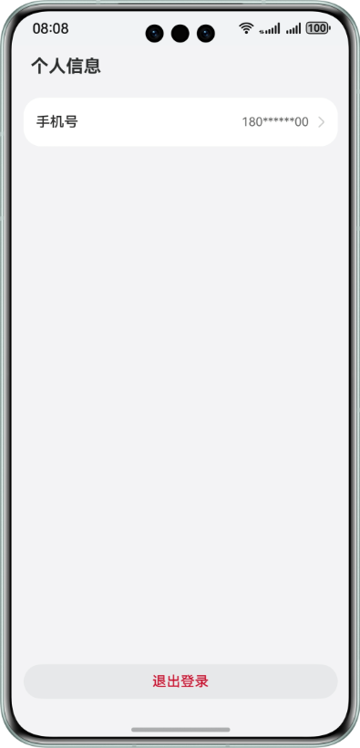

# Account Kit

## 介绍

本示例展示了基于uni-app使用 Account Kit 提供的华为账号一键登录 Button 组件登录的相关流程。

本示例模拟了在应用里，调用华为账号一键登录 Button 组件拉起符合华为规范的登录页面。

需要使用 Account Kit 接口 **@kit.AccountKit**。

## 效果预览

|               **登录/注册页面**               |             **一键登录组件登录页面**              |
|:---------------------------------------:|:---------------------------------------:|
|  |  |

|             **一键登录组件弹窗页面**              |              **用户个人信息页面**               |
|:---------------------------------------:|:---------------------------------------:|
|  |  |

## 本示例的配置与使用

### 在HBuilderX/DevEco中配置本示例的步骤如下
1. 在华为开发者联盟官网下载安装[DevEco Studio](https://developer.huawei.com/consumer/cn/deveco-studio/)(5.0.5 Release 及以上)。
2. 在uni-app官网下载安装4.62及以上版本的[HBuilderX](https://dcloud.io/hbuilderx.html)。
3. 在AppGallery Connect[创建项目](https://developer.huawei.com/consumer/cn/doc/app/agc-help-create-project-0000002242804048)及[应用](https://developer.huawei.com/consumer/cn/doc/app/agc-help-create-app-0000002247955506)。
4. 打开 HBuilderX [设置 DevEco Studio 的安装位置](https://zh.uniapp.dcloud.io/tutorial/harmony/runbuild.html#hbxsettings)。
5. 在 HBuilderX 中打开示例工程，将[AppGallery Connect](https://developer.huawei.com/consumer/cn/service/josp/agc/index.html)配置的应用包名配置到示例工程根目录下的manifest.json中，参考[App配置的图示位置](https://zh.uniapp.dcloud.io/tutorial/harmony/runbuild.html#config-app-harmony)。
6. 在示例工程中使用[AppGallery Connect](https://developer.huawei.com/consumer/cn/service/josp/agc/index.html)配置的应用Client ID替换/harmony-configs/entry/src/main/module.json5文件中的client_id属性值。
7. 参考Account Kit开发指南的[开发准备](https://developer.huawei.com/consumer/cn/doc/harmonyos-guides/account-preparations)章节，申请账号权限（华为账号一键登录）。
8. 请参考应用开发准备中的[配置签名信息](https://developer.huawei.com/consumer/cn/doc/harmonyos-guides/application-dev-overview#section42841246144813)及[添加公钥指纹](https://developer.huawei.com/consumer/cn/doc/harmonyos-guides/application-dev-overview#section1726913517284)章节，生成SHA256应用签名证书指纹并添加到[AppGallery Connect](https://developer.huawei.com/consumer/cn/service/josp/agc/index.html)对应的应用配置中，在 HBuilderX 中进行[证书签名配置](https://uniapp.dcloud.net.cn/tutorial/harmony/runbuild.html#signing)。
9. 编译 uni-app 到设备，请参考[运行项目到设备](https://zh.uniapp.dcloud.io/tutorial/harmony/runbuild.html#run)的第2点。

### 本示例使用说明

1. 运行本示例前，请先查看[约束与限制](#约束与限制)，确保满足示例运行条件。
2. 运行本示例，登录符合条件的账号，应用在申请完 quickLoginMobilePhone 权限后，点击首页的“登录/注册”按钮，会拉起嵌有“华为账号一键登录”按钮的登录页面，登录成功后跳转到个人信息页，展示用户信息（匿名手机号），点击退出按钮返回首页。
3. 点击首页的“登录/注册”按钮时，会先获取匿名手机号，如果未获取成功，则不会拉起嵌有“华为账号一键登录”按钮的登录页面，并且本示例中只声明对应错误码，未做相应处理，请开发者自行实现跳转其他登录页面的逻辑。
4. 点击“华为账号一键登录”按钮时，如果未点击下方的同意协议按钮，则会拉起协议弹窗提示用户同意或取消协议；如点击同意并登录则完成一键登录，点击取消按钮则关闭弹窗。
5. 点击“华为账号一键登录”按钮时，如果系统账号已退出，点击登录会报错[1001502001 用户未登录华为账号](https://developer.huawei.com/consumer/cn/doc/harmonyos-references/account-api-error-code#section539558125020)，本示例只声明对应错误码，未做相应处理，请开发者自行实现跳转其他登录页面的逻辑。业务可以通过[订阅华为账号的登录/登出事件](https://developer.huawei.com/consumer/cn/doc/harmonyos-guides/account-login-state)来提前识别系统账号是否已登出，避免该场景发生。
6. 应用一键登录页面展示后，若此时用户切换为另一个新的华为账号，此时应用需要重新获取匿名手机号刷新一键登录页面上显示的匿名手机号，若未获取到匿名手机号则切换为其他登录方式。请开发者自行实现该要求。
7. 开发者如果需要开启[代码混淆](https://developer.huawei.com/consumer/cn/doc/harmonyos-guides/source-obfuscation-guide)，quickLoginAnonymousPhone（匿名手机号）属性需要在 DevEco 中打开示例工程编译后生成的鸿蒙工程（路径：unpackage/dist/dev/app-harmony）配置混淆白名单防止被release包混淆（extraInfo里面的字段都不能被混淆）。在调用获取匿名手机号方法工程模块的混淆文件obfuscation-rules.txt中添加：
```
# 开发者开启属性混淆需要配置quickLoginAnonymousPhone属性白名单防止其被混淆
-enable-property-obfuscation
-keep-property-name
quickLoginAnonymousPhone
```

## 工程目录

```
├─App.vue                                   // 应用配置，用来配置App全局样式以及监听、应用生命周期
├─index.html                                // 用于web加载渲染的root节点
├─main.js                                   // Vue初始化入口文件
├─manifest.json                             // 应用相关配置
├─pages.json				                // 配置页面路由、导航条、选项卡等页面类信息
├─uni.scss                                  // 内置的常用样式变量
├─harmony-configs		                    // 鸿蒙工程定制化配置目录，每次编译执行HBuilderX 都会检查这个目录，如果目录不存在则会自动创建。
│  └─AppScope
│      └─resources
│          └─rawfile
│              └─data.json		            // 用于读取《华为账号用户认证协议》url
│  └─entry
│      └─src
│          └─main
│              └─module.json5               // 应用配置文件，用于配置Client ID及requestPermissions等
│              └─resources 		            // 资源文件目录，会自动覆盖掉编译uni-app生成鸿蒙工程中的同名文件
│  └─build-profile.json5                    // 应用配置文件，用于配置SDK版本、buildMode等信息
├─pages
│  └─index
│      └─index.vue			                // 登录/注册首页
│      └─quickloginbutton.vue               // 华为账号一键登录页面
│      └─user.vue			                // 个人信息页面
│      └─webview.vue			            // 《华为账号用户认证协议》页面
│          
├─static				                    // 静态资源文件
└─uni_modules
    └─hw-accountkit-component               // 创建组件目录
        └─changelog.md			            // 插件更新日志
        └─package.json			            // 不同程序类型配置文件
        └─utssdk
            └─interface.uts		            // ArkTS方法、数据导出声明文件
            └─app-harmony		            // 编译后的鸿蒙工程。将该工程拖入DevEco中，可使用DevEco的一些能力。比如内存泄漏分析工具。
                 └─Utils		            // 工具方法目录
                    └─AvoidReclick.ets      // 防重复点击方法
                 └─Home.ets		            // 登录/注册ArkTS组件
                 └─index.uts		        // 实现调用鸿蒙API方法
                 └─QuickLoginButton.ets	    // 一键登录 Button 组件
                 └─User.ets		            // 个人信息页ArkTS组件
                 └─Webview.ets		        // 《华为账号用户认证协议》ArkTS组件
```

## 具体实现
在index.vue中调用由 ArkTS 组件封装的登录/注册页面（Home.ets），点击登录/注册获取匿名化手机号：

- 在 index.vue 中嵌入由 ArkTS 组件封装的登录注册页面，应用可根据实际场景决定页面元素是否使用[ ArkTS 组件封装](https://zh.uniapp.dcloud.io/tutorial/harmony/native-component.html#%E5%B5%8C%E5%85%A5%E9%B8%BF%E8%92%99%E5%8E%9F%E7%94%9F%E7%BB%84%E4%BB%B6)
- 在 index.vue 中通过调用Account Kit的授权 executeRequest 接口，先获取到匿名化手机号，uni-app中调用鸿蒙 API可参考[调用鸿蒙 API](https://zh.uniapp.dcloud.io/tutorial/harmony/native-api.html#%E8%B0%83%E7%94%A8%E9%B8%BF%E8%92%99%E5%8E%9F%E7%94%9Fapi)
- 获取匿名化手机号的实现参考 index.uts，并在interface.uts进行方法的导出声明

在quickloginbutton.vue中调用一键登录 Button 组件拉起符合华为规范的登录页面，一键登录 Button 组件参考QuickLoginButton.ets：

* 使用 loginComponentManager.LoginWithHuaweiIDButtonController 构造组件的控制器对象 controller
* 使用 setAgreementStatus 方法设置用户是否同意协议，通过该状态判断是否需要拉起协议弹窗
* 使用 continueLogin 方法设置同意协议与登录同步完成，同意协议后直接触发登录的异步回调，用户无需再次点击登录按钮
* 在LoginWithHuaweiIDButton 组件中设置 param 的 extraStyle 属性，开启一键登录按钮的点击加载态

在 webview.vue 页面中嵌入Web组件显示《华为账号用户认证协议》内容，参考Webview.ets：

* 在 data.json 中获取网页链接，示例仅展示中文链接

在 user.vue 中调用由 ArkTS 组件封装的个人信息页面（User.ets），个人信息页面中仅展示获取到的匿名化手机号。

参考
1. pages\index\index.vue
2. uni_modules\hw-accountkit-component\utssdk\app-harmony\Home.ets
3. uni_modules\hw-accountkit-component\utssdk\app-harmony\index.uts
4. uni_modules\hw-accountkit-component\utssdk\interface.uts
5. pages\index\quickloginbutton.vue
6. uni_modules\hw-accountkit-component\utssdk\app-harmony\QuickLoginButton.ets
7. pages\index\webview.vue
8. uni_modules\hw-accountkit-component\utssdk\app-harmony\Webview.ets
9. pages\index\user.vue
10. uni_modules\hw-accountkit-component\utssdk\app-harmony\User.ets


## 相关权限

1. 本示例需要访问《华为账号用户认证协议》页面，已在 /harmony-configs/entry/src/main/module.json5 文件中添加允许使用 Internet 网络权限"ohos.permission.INTERNET"，参考[权限配置指南](https://zh.uniapp.dcloud.io/tutorial/harmony/runbuild.html#permission)。
2. 本示例在跳转网页前需要查询网络连接状态，已在 /harmony-configs/entry/src/main/module.json5 文件中添加允许应用获取数据网络信息权限"ohos.permission.GET_NETWORK_INFO"，参考[权限配置指南](https://zh.uniapp.dcloud.io/tutorial/harmony/runbuild.html#permission)。

## 依赖

依赖设备具备 WIFI 能力

## 约束与限制

1. 本示例仅支持标准系统上运行，仅支持设备：phone（竖屏），支持账号：已绑定手机号的中国境内（不包含中国香港、中国澳门、中国台湾）账号。
2. 运行本示例前，请确保已登录符合条件的华为账号。
3. 本示例暂不支持切换横屏、分屏、多语言、大字体模式、隐私空间模式、深色模式。
4. HarmonyOS 系统：HarmonyOS 5.0.5 Release 及以上。
5. DevEco Studio 版本：DevEco Studio 5.0.5 Release 及以上。
6. HarmonyOS SDK 版本：HarmonyOS 5.0.5 Release SDK 及以上。
7. DevEco Studio及SDK对应配套关系可参考[所有HarmonyOS版本](https://developer.huawei.com/consumer/cn/doc/harmonyos-releases/overview-allversion)。
8. HBuilderX 4.62及以上版本，并且满足uni-app的[开发环境要求](https://zh.uniapp.dcloud.io/tutorial/harmony/runbuild.html#env)。
