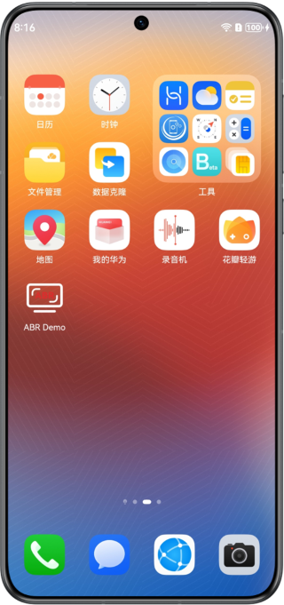
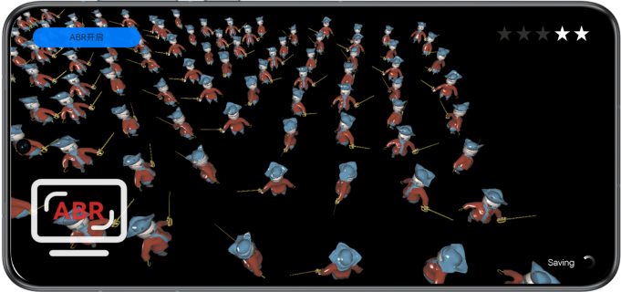

# AdaptiveBufferResolution -- 自适应稳态渲染

## 介绍

本示例展示了基于Graphics Accelerate Kit提供的ABR API在图形绘制场景实现自适应稳态渲染功能。

需要编译依赖AdaptiveBufferResolution的动态库libabr.so。

## 效果预览

|            **桌面**             |                 **主界面**                 |
|:-----------------------------:|:---------------------------------------:|
|  |  |

使用说明：

1. 在手机的主屏幕，点击”ABR Demo“，启动应用，进入图形绘制场景。
2. 点击左上角，可手动开启或关闭ABR功能。显示“ABR开启”表示动态分辨率功能已开启，显示“ABR关闭”表示自适应稳态渲染功能已关闭。
3. 退出应用时，自动关闭ABR。

## 工程目录

```
└── entry/src/main                          // 代码区
    ├── cpp
    │    ├── types/libentry
    │    │     └── index.d.ts               // native层接口注册文件
    │    ├── napi_init.cpp                  // native api层接口的具体实现函数
    │    ├── CMakeLists.txt                 // native层编译配置
    │    ├── include                        // 头文件
    │    ├── source                         // C++代码区
    │    │    ├── core.cpp                  // 核心入口，管理生命周期
    │    │    ├── renderer.cpp              // 渲染管理类的实现
    │    │    ├── scene_base.cpp            // ABR基类的实现
    │    │    ├── scene_abr.cpp             // ABR类的实现
    │    │    ├── opaque_layer_base.cpp     // 场景绘制基类的实现
    │    │    ├── opaque_layer.cpp          // 场景绘制派生类的实现
    │    │    ├── gui.cpp                   // UI绘制
    │    │    └── ...
    ├── ets
    │    ├── ability 
    │    │     └── EntryAbility.ts          // 程序入口类
    │    ├── pages 
    │    │     └── Index.ets                // 主界面
    └── resources
    │    ├── base/media                     // 图片资源
    │    │   └── logo.png
    │    ├── rawfile                        // 模型和UI资源
    │    │    └── ...                       
```


## 具体实现

本示例展示的功能使用了在AdaptiveBufferResolution定义的以下API：

* ABR_Context* HMS_ABR_CreateContext(ABR_RenderAPI_Type type);
* ABR_ErrorCode HMS_ABR_SetTargetFps(ABR_Context* context, const uint32_t targetFps);
* ABR_ErrorCode HMS_ABR_SetScaleRange(ABR_Context* context, const float minValue, const float maxValue);
* ABR_ErrorCode HMS_ABR_UpdateCameraData(ABR_Context* context, ABR_CameraData* data);
* ABR_ErrorCode HMS_ABR_Activate(ABR_Context* context);
* ABR_ErrorCode HMS_ABR_IsActive(ABR_Context* context, bool* isActive);
* ABR_ErrorCode HMS_ABR_Deactivate(ABR_Context* context);
* ABR_ErrorCode HMS_ABR_MarkFrameBuffer_GLES(ABR_Context* context);
* ABR_ErrorCode HMS_ABR_DestroyContext(ABR_Context** context);
* ABR_ErrorCode HMS_ABR_GetScale(ABR_Context* context, float* scale);

在场景初始化阶段调用HMS_ABR_CreateContext、HMS_ABR_SetTargetFps、HMS_ABR_SetScaleRange、HMS_ABR_Activate等接口完成ABR实例创建、属性配置和激活。
在渲染阶段前调用HMS_ABR_UpdateCameraData、接口设置相机参数，调用HMS_ABR_MarkFrameBuffer_GLES接口动态改变buffer的渲染分辨率，实现自适应稳态渲染功能。

## 相关权限

不涉及。

## 依赖

不涉及。

## 约束与限制

<ol>
  <li>
    本示例仅支持标准系统上运行，不支持模拟器，支持设备见下表。
    <table>
      <tr>
        <th>设备类型</th>
        <th>产品系列</th>
        <th>产品型号</th>
      </tr>
      <tr>
        <td rowspan="3">手机</td>
        <td>Mate系列</td>
        <td>
          Mate 60, Mate 60 RS非凡大师, Mate 60 Pro, Mate 60 Pro+,<br>
          Mate 70, Mate 70 RS非凡大师, Mate 70 Pro, Mate 70 Pro+,<br>
          Mate X5
        </td>
      </tr>
      <tr>
        <td>Pura系列</td>
        <td>Pura 70, Pura 70 Pro, Pura 70 Pro+, Pura 70 Ultra</td>
      </tr>
      <tr>
        <td>Nova系列</td>
        <td>Nova 12 Pro, Nova 12 Ultra</td>
      </tr>
      <tr>
        <td>平板</td>
        <td>MatePad系列</td>
        <td>MatePad Pro 11, MatePad Pro 13.2</td>
      </tr>
    </table>
  </li>
  <li>HarmonyOS系统：HarmonyOS Next Developer Beta1及以上。</li>
  <li>DevEco Studio版本：DevEco Studio Next Developer Beta1及以上。</li>
  <li>HarmonyOS SDK版本：HarmonyOS Next Developer Beta1及以上。</li>
</ol>

