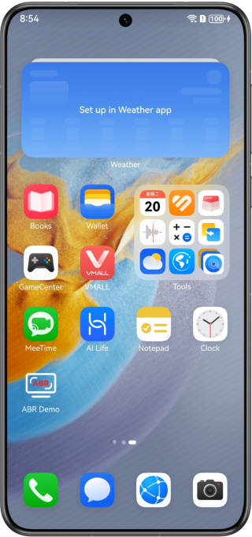
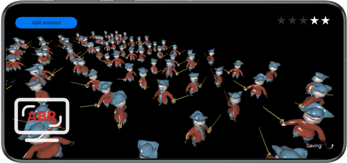

# Adaptive Buffer Resolution (ABR)

## Overview

This sample code illustrates how to implement the ABR capability in graphics rendering scenes based on the ABR APIs provided by Graphics Accelerate Kit.

You need to compile the dependency on the dynamic library **libabr.so**.

## Preview

|            **Home screen**            |                 **App UI**                |
|:-----------------------------:|:---------------------------------------:|
|  |  |

Instructions:

1. On the home screen of a mobile phone, tap **ABR Demo** to start the app.
2. Tap the button in the upper left corner to manually enable or disable the ABR capability. If **ABR enabled** is displayed, the capability is enabled. If **ABR disabled** is displayed, the capability is disabled.
3. When you exit the app, the ABR capability is automatically disabled.

## Project Directory

```
└── entry/src/main                          // Code area
    ├── cpp
    │    ├── types/libentry
    │    │     └── index.d.ts               // API registration file at the native layer
    │    ├── napi_init.cpp                  // Functions of APIs at the native layer
    │    ├── CMakeLists.txt                 // Compilation configurations at the native layer
    │    ├── include                        // Header files
    │    ├── source                         // C++ code area
    │    │    ├── core.cpp                  // Core entry for lifecycle management
    │    │    ├── renderer.cpp              // Rendering management class implementation
    │    │    ├── scene_base.cpp            // ABR base class implementation
    │    │    ├── scene_abr.cpp             // ABR class implementation
    │    │    ├── opaque_layer_base.cpp     // Base class implementation for scene drawing
    │    │    ├── opaque_layer.cpp          // Derived class implementation for scene drawing
    │    │    ├── gui.cpp                   // UI drawing
    │    │    └── ...
    ├── ets
    │    ├── ability 
    │    │     └── EntryAbility.ts          // Entry point class
    │    ├── pages 
    │    │     └── index.ets                // App UI
    └── resources
    │    ├── base/media                     // Image resources
    │    │   └── logo.png
    │    ├── rawfile                        // Model and UI resources
    │    │    └── ...                       
```


## How to Implement

The sample code uses the following APIs defined for the ABR capability:

* ABR_Context* HMS_ABR_CreateContext(ABR_RenderAPI_Type type);
* ABR_ErrorCode HMS_ABR_SetTargetFps(ABR_Context* context, const uint32_t targetFps);
* ABR_ErrorCode HMS_ABR_SetScaleRange(ABR_Context* context, const float minValue, const float maxValue);
* ABR_ErrorCode HMS_ABR_UpdateCameraData(ABR_Context* context, ABR_CameraData* data);
* ABR_ErrorCode HMS_ABR_Activate(ABR_Context* context);
* ABR_ErrorCode HMS_ABR_IsActive(ABR_Context* context, bool* isActive);
* ABR_ErrorCode HMS_ABR_Deactivate(ABR_Context* context);
* ABR_ErrorCode HMS_ABR_MarkFrameBuffer_GLES(ABR_Context* context);
* ABR_ErrorCode HMS_ABR_DestroyContext(ABR_Context** context);
* ABR_ErrorCode HMS_ABR_GetScale(ABR_Context* context, float* scale);

In the scene initialization phase, call the **HMS_ABR_CreateContext**, **HMS_ABR_SetTargetFps**, **HMS_ABR_SetScaleRange**, and **HMS_ABR_Activate** APIs to create an ABR context instance, set attributes, and activate the ABR context instance.
Before rendering, call **HMS_ABR_UpdateCameraData** to set camera parameters and call **HMS_ABR_MarkFrameBuffer_GLES** to dynamically change the rendering resolution of a buffer.

## Required Permissions

None

## Dependencies

None

## Constraints

<ol>
  <li>
    The sample app is applicable to phones and tablets. Supported devices are listed in the table below. Running or debugging using the Emulator is not supported.
    <table>
      <tr>
        <th>Device Type</th>
        <th>Product Series</th>
        <th>Product Model</th>
      </tr>
      <tr>
        <td rowspan="3">Phone</td>
        <td>Mate Series</td>
        <td>
          Mate 60, Mate 60 RS ULTIMATE DESIGN, Mate 60 Pro, Mate 60 Pro+,<br>
          Mate 70, Mate 70 RS ULTIMATE DESIGN, Mate 70 Pro, Mate 70 Pro+,<br>
          Mate X5
        </td>
      </tr>
      <tr>
        <td>Pura Series</td>
        <td>Pura 70, Pura 70 Pro, Pura 70 Pro+, Pura 70 Ultra</td>
      </tr>
      <tr>
        <td>Nova Series</td>
        <td>Nova 12 Pro, Nova 12 Ultra</td>
      </tr>
      <tr>
        <td>Tablet</td>
        <td>MatePad Series</td>
        <td>MatePad Pro 11, MatePad Pro 13.2</td>
      </tr>
    </table>
  </li>
  <li>The HarmonyOS version must be HarmonyOS Next Developer Beta1 or later.</li>
  <li>The DevEco Studio version must be DevEco Studio Next Developer Beta1 or later.</li>
  <li>The HarmonyOS SDK version must be HarmonyOS Next Developer Beta1 or later.</li>
</ol>
