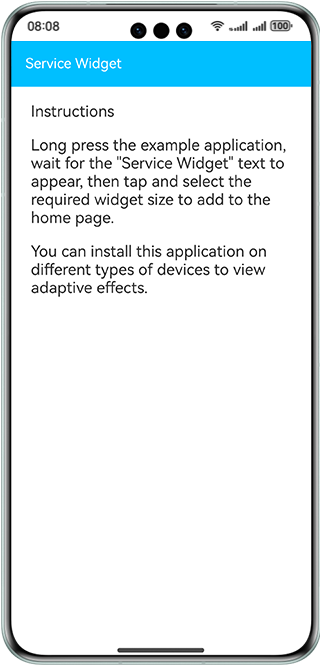

#  Multi-Device Adaptive Service Widget

### Overview

This sample shows the layout and usage of service widgets in a JS project. The widget content display is developed based on one-time development and multi-device deployment to implement multi-device adaptation. The following APIs are used:   
**@ohos.app.form.FormExtensionAbility** : widget extension module API 

@ohos.app.form.formInfo: API for listing the types and enumerations related to widget information and status 

@ohos.app.form.formBindingData: API for binding widget data 


### Preview

| Home page                               | Widget                               |
|-----------------------------------|-----------------------------------|
|  |  |

How to Use

1. The home screens of some devices do not support widgets. You can create, update, and delete widgets by using your own widget host.

2. Install the app and tap and hold the app icon on the home screen to display the option list.

3. Tap a service widget in the pop-up list to enter the widget adding page.

4. Tap the **Add to home screen** button at the bottom of the screen. The widget will then appear on the home screen.

### Project Directory
```
├──entry/src/main/ets                         // ets code
│  ├──entryability  
│  │  └──EntryAbility.ets         
│  ├──entryformability                                   
│  │  └──EntryFormAbility.ets                 // Define the operations to be performed when a widget object is created for the first time.
│  ├──pages  
│  │  └──index.ets                            // Home page
│  └──utils  
│     └──Logger.ets                           // Logger
├──entry/src/main/js                          // Js code area
│     ├──common                               // Card resource file directory         
│     ├──complex/pages/index                  // Securities card (4x4) 
│     ├──grid/pages/index                     // Grid layout card                       
│     ├──i18n                                 // Card Internationalization Language Directory        
│     ├──imgText/pages/index                  // Image and text card               
│     ├──immersive/pages/index                // Immersive card
│     └──test/pages/index                     // Securities card (2x2)                       
└──entry/src/main/resources                   // App resource directory
└──module.json5                               // Add the widget extension capability.                        
```

### How to Implement
1. Add an extension capability to the **module.json5** file, set the type to the widget, and set the widget entry (**srcEntrance**) and widget metadata (**metadata**). For details, see [Source Code Reference](entry/src/main/module.json5). Example: "metadata": [
{
"name": "ohos.extension.form",
"resource": "$profile:form_config"
}. 
2. Initializing a widget: Implement the **@ohos.app.form.FormExtensionAbility** class. When a widget object is created for the first time, the widget binding data is initialized to empty and the widget status is set to **READY**. Example: onCreate(){
formBindingData.createFormBindingData({}) onAcquireFormState(want) {
return formInfo.FormState.READY }.  
3. Configure a widget: Use JavaScript to compile a widget and configure the widget in resources/base/profile/form_config. For details,see [Source Code Reference](entry/src/main/resources/base/profile/form_config.json).

### Required Permissions

N/A

### Dependencies

N/A

### Constraints

1. The sample is only supported on Huawei phones, tablets with standard systems.
2. The HarmonyOS version must be HarmonyOS 5.0.5 Release or later.
3. The DevEco Studio version must be DevEco Studio 5.0.5 Release or later.
4. The HarmonyOS SDK version must be HarmonyOS 5.0.5 Release SDK or later.
