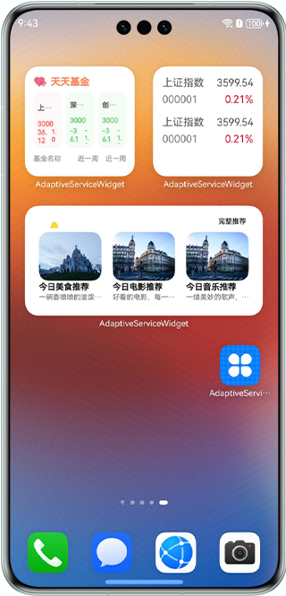

#  基于服务卡片实现多设备自适应能力

### 介绍

本示例采用一次开发、多端部署的技术，简化了JS卡片的布局设计，确保其在多种设备上实现智能自适应。开发者无需为每个设备单独调整布局，从而提高了开发效率和用户体验的一致性。

### 效果预览

| 主页                                | 卡片                                |
|-----------------------------------|-----------------------------------|
|  |  |

使用说明

1.部分设备的桌面不支持卡片，可以通过自己的开发卡片使用方，进行卡片的创建、更新和删除等操作。

2.安装应用，并在桌面上长按本应用的桌面图标，长按后弹出选项列表。

3.点击弹出列表中的**服务卡片**选项进入卡片添加界面。

4.点击正下方的**添加到桌面**按钮，卡片就会出现在桌面上。

### 工程目录
```
├──entry/src/main/ets                         // ets代码区
│  ├──entryability  
│  │  └──EntryAbility.ets         
│  ├──entryformability                                   
│  │  └──EntryFormAbility.ets                 // 定义卡片对象首次被创建时需要做的操作
│  ├──pages  
│  │  └──index.ets                            // 首页
│  └──utils  
│     └──Logger.ets                           // 日志工具类
├──entry/src/main/js                          // js代码区
│     ├──common                               // 卡片资源文件目录               
│     ├──complex/pages/index                  // 证券卡片（4x4）   
│     ├──grid/pages/index                     // 网格布局卡片                       
│     ├──i18n                                 // 卡片国际化语言目录              
│     ├──imgText/pages/index                  // 图文卡片                
│     ├──immersive/pages/index                // 沉浸式卡片
│     └──test/pages/index                     // 证券卡片（2x2）  
├──entry/src/main/resources                   // 应用资源目录 
└──module.json5                               // 添加卡片拓展能力                      
```

### 具体实现
1、在module.json5文件添加拓展能力，类型为卡片，并设置卡片入口srcEntrance和卡片元数据metadata。[源码参考](entry/src/main/module.json5) 例如："metadata": [
{
"name": "ohos.extension.form",
"resource": "$profile:form_config"
}。  
2、初始化卡片：通过实现@ohos.app.form.FormExtensionAbility卡片操作类，在卡片对象首次被创建时，初始化卡片绑定数据为空，并将卡片状态设置为就绪状态READY。 例如：onCreate(){
formBindingData.createFormBindingData({}) onAcquireFormState(want) {
return formInfo.FormState.READY }。   
3、配置卡片：用js编写相应的卡片，将卡片配置到resources/base/profile/form_config, [源码参考](entry/src/main/resources/base/profile/form_config.json) 。

### 相关权限

不涉及。

### 依赖

不涉及。

### 约束与限制

1. 本示例仅支持标准系统上运行，支持设备：华为手机、平板。
2. HarmonyOS系统：HarmonyOS 5.0.5 Release及以上。
3. DevEco Studio版本：DevEco Studio 5.0.5 Release及以上。
4. HarmonyOS SDK版本：HarmonyOS 5.0.5 Release SDK及以上。
