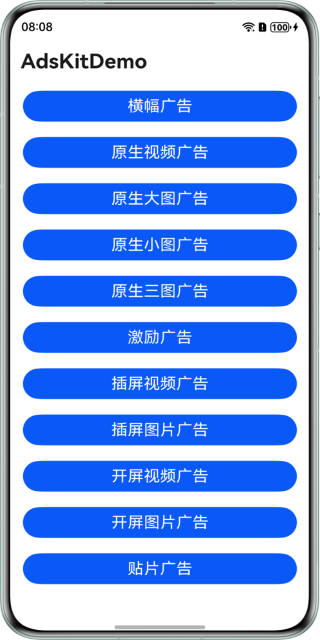
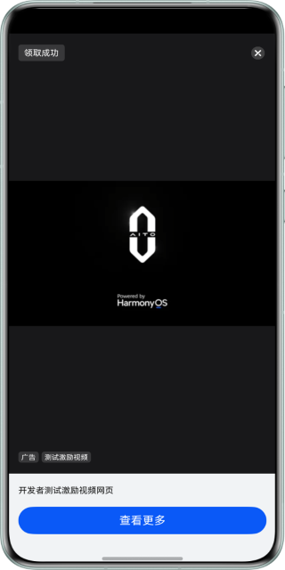
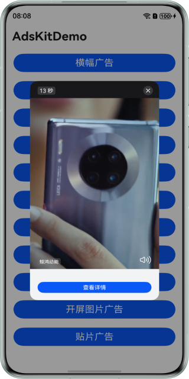
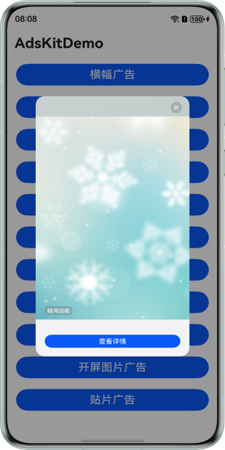

# 鲸鸿动能广告服务HarmonyOS ArkTs示例代码

## 目录

- [简介](#简介)
- [使用说明](#使用说明)
- [效果预览](#效果预览)
- [工程目录](#工程目录)
- [示例代码](#示例代码)
- [相关权限](#相关权限)
- [约束与限制](#约束与限制)

## 简介

鲸鸿动能广告服务HarmonyOS ArkTs示例代码向您介绍如何在应用中使用将鲸鸿动能API并实现广告展示。

## 使用说明

运行本示例前需要参考指导[配置应用签名信息](https://developer.huawei.com/consumer/cn/doc/harmonyos-guides/application-dev-overview#section42841246144813)。

## 效果预览

| 广告样式主页面                                       | 横幅广告页面                                     | 原生视频广告页面                                         |
|-----------------------------------------------|--------------------------------------------|--------------------------------------------------|
|  |  |  | 

| 原生大图广告页面                                               | 原生小图广告页面                                               | 原生三图广告页面                                               |
|--------------------------------------------------------|--------------------------------------------------------|--------------------------------------------------------|
|  |  |  |

| 激励广告页面                                     | 插屏视频广告页面                                               | 插屏图片广告页面                                                  |
|--------------------------------------------|--------------------------------------------------------|-----------------------------------------------------------|
|  |  |  |

| 开屏视频广告页面                                         | 开屏图片广告页面                                            | 贴片广告页面                                   |
|--------------------------------------------------|-----------------------------------------------------|------------------------------------------|
|  |  |  |

## 工程目录

```
├─entry/src/main/ets                  // 代码区
│ ├─constant                          // 存放常量
│ │ ├─AdStatus.ets                    // 广告回调状态枚举类
│ │ └─AdType.ets                      // 广告类型枚举类
│ ├─entryability
│ │ └─EntryAbility.ets                // 主程序入口类
│ ├─event
│ │ ├─InterstitialAdStatusHandler.ets // 插屏广告事件订阅类
│ │ ├─RewardAdStatusHandler.ets       // 激励广告事件订阅类
│ │ └─TimeOutHandler.ets              // 超时处理类
│ ├─pages                             // 存放页面文件目录                
│ │ ├─Index.ets                       // 应用主页面
│ │ └─ads
│ │   ├─BannerAdPage.ets              // 横幅广告页面
│ │   ├─NativeAdPage.ets              // 原生广告页面
│ │   ├─RollAdPage.ets                // 贴片广告页面
│ │   └─SplashAdPage.ets              // 开屏广告页面
│ ├─viewmodel                         // 存放ViewModel文件目录
│ │ └─AdsViewModel.ets                // 广告ViewModel
└─entry/src/main/resources            // 资源文件目录
```

## 示例代码

### 流量变现服务示例代码

鲸鸿动能广告服务HarmonyOS-ArkTs示例代码为您提供各种广告样式的展示页面。
本示例代码包括以下文件，便于您进行广告请求、广告展示：

1. Index.ets
   流量变现服务演示界面，可以请求并展示横幅广告、激励广告、原生广告、开屏广告、贴片广告、插屏广告，点击对应按钮可以展示相应的广告内容。
   <br>代码位置： entry\src\main\ets\pages\Index.ets</br>
2. BannerAdPage.ets
   用于展示横幅广告。
   <br>代码位置：entry\src\main\ets\pages\ads\BannerAdPage.ets</br>
3. NativeAdPage.ets
   用于展示原生广告。
   <br>代码位置：entry\src\main\ets\pages\ads\NativeAdPage.ets</br>
4. RollAdPage.ets
   用于展示贴片广告。
   <br>代码位置：entry\src\main\ets\pages\ads\RollAdPage.ets</br>
5. SplashAdPage.ets
   用于展示开屏广告。
   <br>代码位置：entry\src\main\ets\pages\ads\SplashAdPage.ets</br>
6. AdsViewModel.ets
   用于管理广告UI状态和业务逻辑。
   <br>代码位置：entry\src\main\ets\viewmodel\AdsViewModel.ets</br>
7. InterstitialAdStatusHandler.ets
   用于订阅com.huawei.hms.pps.action.PPS_INTERSTITIAL_STATUS_CHANGED事件来监听插屏广告页面变化。
   <br>代码位置：entry\src\main\ets\event\InterstitialAdStatusHandler.ets</br>
8. RewardAdStatusHandler.ets
   用于订阅com.huawei.hms.pps.action.PPS_REWARD_STATUS_CHANGED事件来监听激励广告页面变化并接收奖励信息。
   <br>代码位置：entry\src\main\ets\event\RewardAdStatusHandler.ets</br>
9. TimeOutHandler.ets
   用于封装定时器处理超时。
   <br>代码位置：entry\src\main\ets\event\TimeOutHandler.ets</br>

## 相关权限

- 获取开放匿名设备标识符需要申请跨应用关联权限：[ohos.permission.APP_TRACKING_CONSENT](https://developer.huawei.com/consumer/cn/doc/harmonyos-guides/permissions-for-all-user#ohospermissionapp_tracking_consent)。
- 请求展示广告需要申请Internet网络权限：[ohos.permission.INTERNET](https://developer.huawei.com/consumer/cn/doc/harmonyos-guides/permissions-for-all#ohospermissioninternet)。

## 约束与限制

1. 本示例仅支持标准系统上运行，支持设备：华为手机、平板设备。
2. HarmonyOS系统：HarmonyOS NEXT Developer Beta1及以上。
3. DevEco Studio版本：DevEco Studio NEXT Developer Beta1及以上。
4. HarmonyOS SDK版本：HarmonyOS NEXT Developer Beta1及以上。