# Ads Kit Sample Code (HarmonyOS ArkTS)

## Contents

- [Overview](#Overview)
- [How to Use](#How-to-Use)
- [Preview](#Preview)
- [Project Directory](#Project-Directory)
- [Sample Code](#Sample-Code)
- [Required Permissions](#Required-Permissions)
- [Constraints](#Constraints)

## Overview

The sample code of Ads Kit for HarmonyOS ArkTS describes how to use APIs of Ads Kit in your app to display ads.

## How to Use

Before running this demo, you need to [configure app signing information](https://developer.huawei.com/consumer/en/doc/harmonyos-guides/application-dev-overview#section42841246144813).

## Preview

| Home screen for various ad formats                  | Banner ad page                                   | Native video ad page                                   |
| --------------------------------------------------- | ------------------------------------------------ | ------------------------------------------------------ |
| 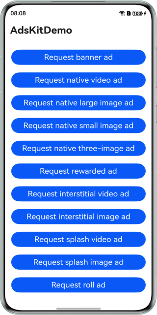 | 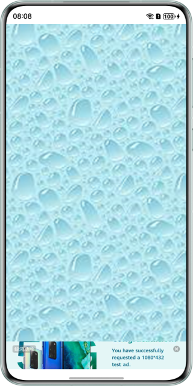 | 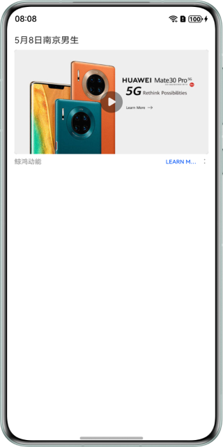 |

| Native large image ad page                                   | Native small image ad page                                   | Native three-image ad page                                   |
| ------------------------------------------------------------ | ------------------------------------------------------------ | ------------------------------------------------------------ |
| 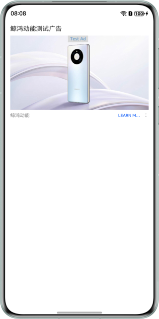 | 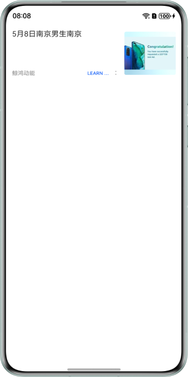 | 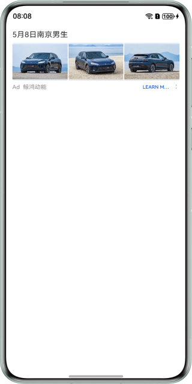 |

| Rewarded ad page                                 | Interstitial video ad page                                   | Interstitial image ad page                                   |
| ------------------------------------------------ | ------------------------------------------------------------ | ------------------------------------------------------------ |
| 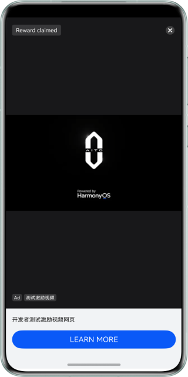 | 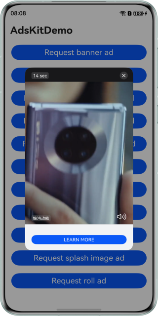 | 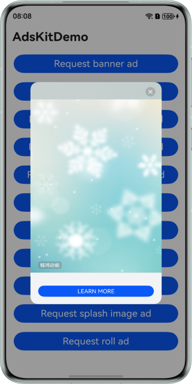 |

| Splash video ad page                                   | Splash image ad page                                      | Roll ad page                                   |
| ------------------------------------------------------ | --------------------------------------------------------- | ---------------------------------------------- |
| 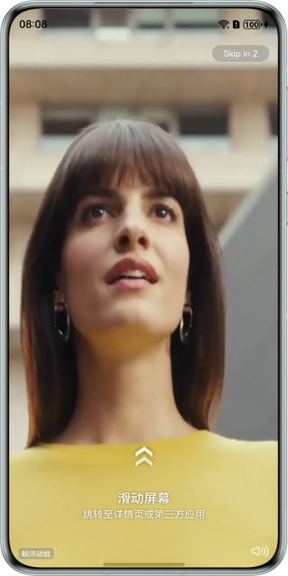 | 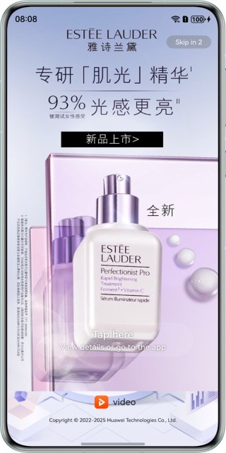 | 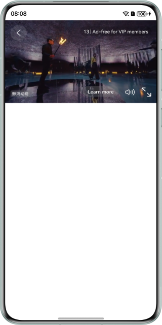 |

## Project Directory

```
├─entry/src/main/ets                  // Code area.
│ ├─constant                          // Constants.
│ │ ├─AdStatus.ets                    // Class of enumerated ad callback statuses.
│ │ └─AdType.ets                      // Class of enumerated ad formats.
│ ├─entryability
│ │ └─EntryAbility.ets                // Entry point class.
│ ├─event
│ │ ├─InterstitialAdStatusHandler.ets // Class for subscribing to interstitial ad events.
│ │ ├─RewardAdStatusHandler.ets       // Class for subscribing to rewarded ad events.
│ │ └─TimeOutHandler.ets              // Timeout handler class.
│ ├─pages                             // Directory for storing app UI files.               
│ │ ├─Index.ets                       // App home screen.
│ │ └─ads
│ │   ├─BannerAdPage.ets              // Banner ad page.
│ │   ├─NativeAdPage.ets              // Native ad page.
│ │   ├─RollAdPage.ets                // Roll ad page.
│ │   └─SplashAdPage.ets              // Splash ad page.
│ ├─viewmodel                         // Directory for storing the ViewModel file.
│ │ └─AdsViewModel.ets                // ViewModel for ads.
└─entry/src/main/resources            // Directory for storing resource files.
```

## Sample Code

### Petal Ads Publisher Service

The sample code is used to implement a UI to display various formats of ads.
The sample code includes the following files for you to request and display ads:

1. Index.ets
   Demo UI of Petal Ads Publisher Service, where you can tap the corresponding button to request and display banner ads, rewarded ads, native ads, splash ads, roll ads, and interstitial ads.
   <br>Code location: **entry\src\main\ets\pages\Index.ets**<br>
2. BannerAdPage.ets
   Used to display banner ads.
   <br>Code location: **entry\src\main\ets\pages\ads\BannerAdPage.ets**<br>
3. NativeAdPage.ets
   Used to display native ads.
   <br>Code location: **entry\src\main\ets\pages\ads\NativeAdPage.ets**<br>
4. RollAdPage.ets
   Used to display roll ads.
   <br>Code location: **entry\src\main\ets\pages\ads\RollAdPage.ets**<br>
5. SplashAdPage.ets
   Used to display splash ads.
   <br>Code location: **entry\src\main\ets\pages\ads\SplashAdPage.ets**<br>
6. AdsViewModel.ets
   Used to manage the ad UI status and service logic.
   <br>Code location: **entry\src\main\ets\viewmodel\AdsViewModel.ets**<br>
7. InterstitialAdStatusHandler.ets
   Used to subscribe to the **com.huawei.hms.pps.action.PPS_INTERSTITIAL_STATUS_CHANGED** event to track changes on the interstitial ad page.
   <br>Code location: **entry\src\main\ets\event\InterstitialAdStatusHandler.ets**<br>
8. RewardAdStatusHandler.ets
   Used to subscribe to the **com.huawei.hms.pps.action.PPS_REWARD_STATUS_CHANGED** event to track changes on the rewarded ad page and receive reward information.
   <br>Code location: **entry\src\main\ets\event\RewardAdStatusHandler.ets**<br>
9. TimeOutHandler.ets
   Used to encapsulate timer-based timeout handling.
   <br>Code location: **entry\src\main\ets\event\TimeOutHandler.ets**<br>

## Required Permissions

- To obtain the OAID, you need to request the activity tracking permission [ohos.permission.APP_TRACKING_CONSENT](https://developer.huawei.com/consumer/en/doc/harmonyos-guides/permissions-for-all-user#ohospermissionapp_tracking_consent).
- To request and display ads, you need to request the Internet permission [ohos.permission.INTERNET](https://developer.huawei.com/consumer/en/doc/harmonyos-guides/permissions-for-all#ohospermissioninternet).

## Constraints

1. The sample app is only supported on Huawei phones and tablets with standard systems.
2. The HarmonyOS version must be HarmonyOS NEXT Developer Beta1 or later.
3. The DevEco Studio version must be DevEco Studio NEXT Developer Beta1 or later.
4. The HarmonyOS SDK version must be HarmonyOS NEXT Developer Beta1 or later.
