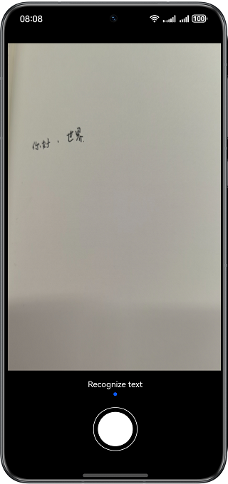
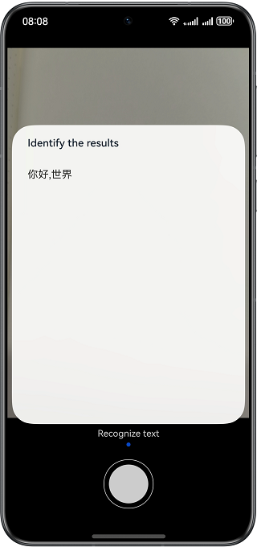

# Photo Text Recognition

## Overview

This sample shows how to use the APIs provided by @ohos.multimedia.camera (camera management) and textRecognition (text recognition) to recognize and extract text in images.

## Preview

| Home page                            | Text recognition dialog               |
| ------------------------------------ | ------------------------------------- |
|  |  |

## How to Use

1. Tap the round button in the lower part of the page. A dialog is displayed, showing the text extracted from the image.

2. Tap a blank area except the dialog to close the dialog and return to the home screen.

## Project Directory

```

├──entry/src/main/ets/
│  ├──common/constant
│  │  └──CommonConstants.ets            // Common constants
│  ├──common/utils
│  │  ├──DeviceScreen.ets               // Utility used to calculate the screen size
│  │  ├──Logger.ets                     // Logging utility
│  │  ├──PermissionUtils.ets            // Utility used to obtain permissions
│  │  └──Camera.ets                     // Utility used to manage the camera
│  ├──entryability
│  │  └──EntryAbility.ets               // Entry ability
│  ├──page                  
│  │  └──Index.ets                      // Home page
│  └──view                  
│     └──CustomDialogView.ets           // Dialog for displaying the text extracted from the image
└──entry/src/main/resources             // Static resources of the app
```

## How to Implement

* The APIs for AI text recognition are encapsulated in **CameraModel**. For details about the source code, see [Camera.ets](entry/src/main/ets/common/utils/Camera.ets).
  * Camera module: encapsulates the APIs for initializing and releasing the camera.
  * On the Index page, a click event triggers camera shooting. After the photo output stream is obtained, use @hms.ai.ocr.textRecognition to extract the text from the photo.

## Required Permissions

**ohos.permission.CAMERA**: allows an app to use the camera.

## Constraints

1. The sample is only supported on Huawei phones with standard systems.

2. The HarmonyOS version must be HarmonyOS 5.0.5 Release or later.

3. The DevEco Studio version must be DevEco Studio 5.0.5 Release or later.

4. The HarmonyOS SDK version must be HarmonyOS 5.0.5 Release SDK or later.

5. The permission ohos.permission.CAMERA is of the normal level. For details about the permission level, see the permission list.


