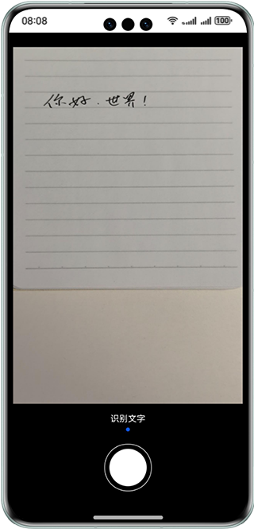
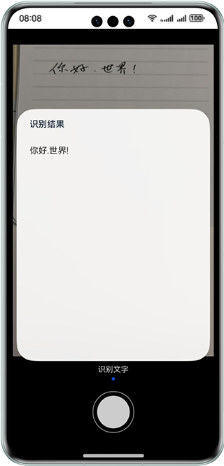

# 基于基础视觉服务及相机实现拍照识别文字功能

## 介绍

本示例通过使用@ohos.multimedia.camera (相机管理)和textRecognition（文字识别）接口实现拍照后识别提取照片内文字的功能。帮助开发者了解开发文字识别工具类应用时，如何将照片输入流与文字识别接口关联，从而实现文字识别的功能。

## 效果预览

| 主页                                | 文字识别弹窗                             |
|-----------------------------------|------------------------------------|
|  |  |

使用说明

1.点击界面下方圆形文字识别图标，弹出文字识别结果信息界面，显示当前照片的文字识别结果；

2.点击除了弹窗外的空白区域，弹窗关闭，返回主页。

## 工程目录

```
├──entry/src/main/ets/
│  ├──common/constant
│  │  └──CommonConstants.ets            // 公共常量类
│  ├──common/utils
│  │  ├──DeviceScreen.ets               // 屏幕尺寸计算工具
│  │  ├──Logger.ets                     // 日志工具
│  │  ├──PermissionUtils.ets            // 权限获取工具
│  │  └──Camera.ets                     // 相机管理工具
│  ├──entryability
│  │  └──EntryAbility.ets               // 程序入口类
│  ├──page                  
│  │  └──Index.ets                      // 首页
│  └──view                  
│     └──CustomDialogView.ets           // 识别弹窗页面
└──entry/src/main/resources             // 应用静态资源目录
```
## 具体实现

* 本实例完成AI文字识别的功能模块主要封装在CameraModel，源码参考:[Camera.ets](entry/src/main/ets/common/utils/Camera.ets) 。
    * 相机模块：在Camera中封装了相机初始化、相机释放。
    * 在Index页面通过点击事件触发相机拍摄，在获取到照片输出流后通过@hms.ai.ocr.textRecognition文字识别接口进行识别。

## 相关权限

获取相机权限：ohos.permission.CAMERA。

## 约束与限制

1.本示例仅支持标准系统上运行，支持设备：华为手机。

2.HarmonyOS系统：HarmonyOS 5.0.5 Release及以上。

3.DevEco Studio版本：DevEco Studio 5.0.5 Release及以上。

4.HarmonyOS SDK版本：HarmonyOS 5.0.5 Release SDK及以上。

5.本示例所配置的权限ohos.permission.CAMERA为normal级别(相关权限级别可通过权限定义列表查看)