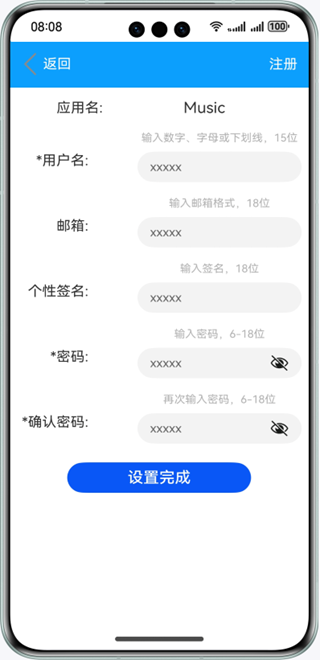

# 基于AppAccountManager能力实现应用账号管理

### 介绍
本示例通过使用AppAccountManager能力，实现了一个支持注册/登录，并设置账号相关信息的功能，帮助开发者掌握应用账号管理AppAccountManager的基本能力。 效果图如下：

### 效果预览

|主页| 注册页面                                 | 登录页面                              | 账户信息页面|
|--------------------------------|--------------------------------------|-----------------------------------|------|
||  |  ||

使用说明

1.首页面选择想要进入的应用，首次进入该应用需要进行注册，如已注册账号则直接登录。

2.注册页面可设置账号名、邮箱、个性签名、密码（带*号为必填信息），注册完成后返回登录页面使用注册的账号进行登录。

3.登录后进入账号详情界面，点击**修改信息**按钮可跳转至账号信息修改页面重新设置账号信息。

4.点击**切换应用**按钮则退出该账号并返回首页面。重新选择想要进入的应用。

5.点击**删除账号**按钮则会删除该账号所有相关信息。

### 工程目录
```
├──entry/src/main/ets                         // 代码区
│  ├──common
│  │  ├──AccountInfo.ets                      // 切换应用组件
│  │  ├──BundleInfo.ets                       // 首页列表组件
│  │  ├──LoginInfo.ets                        // 登录组件
│  │  ├──ModifyInfo.ets                       // 修改信息组件
│  │  ├──NavigationBar.ets                    // 路由跳转组件
│  │  └──RegisterInfo.ets                     // 注册组件
│  ├──entryAbility  
│  │  └──EntryAbility.ts               
│  ├──model  
│  │  ├──AccountData.ts                       // 数据存储
│  │  ├──AccountModel.ts                      // 数据管理
│  │  └──Logger.ts                            // 日志工具
│  └──pages  
│     ├──Index.ets                            // 首页
│     ├──Account.ets                          // 切换应用页面
│     ├──Login.ets                            // 登录页面
│     ├──Modify.ets                           // 修改信息页面
│     └──Register.ets                         // 注册信息页面
└──entry/src/main/resources                   // 应用资源目录

```

### 具体实现

* 本示例分为音乐，视频，地图三个模块
  * 音乐模块
    * 使用Navigation,Button，Text,TextInput组件开发注册，登录，修改信息和切换应用页面， createAppAccountManager方法创建应用账号管理器对象
    * 源码链接：[AccountData.ets](entry/src/main/ets/model/AccountData.ets)，[AccountModel.ets](entry/src/main/ets/model/AccountModel.ets)
    * 接口参考：@ohos.account.appAccount，@ohos.data.preferences，@ohos.router

  * 视频模块
    * 使用Navigation,Button，Text,TextInput组件开发注册，登录，修改信息和切换应用页面，createAppAccountManager方法创建应用账号管理器对象
    * 源码链接：[AccountData.ets](entry/src/main/ets/model/AccountData.ets)，[AccountModel.ets](entry/src/main/ets/model/AccountModel.ets)
    * 接口参考：@ohos.account.appAccount，@ohos.data.preferences，@ohos.router

  * 地图模块
    * 使用Navigation,Button，Text,TextInput组件开发注册，登录，修改信息和切换应用页面，createAppAccountManager方法创建应用账号管理器对象
    * 源码链接：[AccountData.ets](entry/src/main/ets/model/AccountData.ets)，[AccountModel.ets](entry/src/main/ets/model/AccountModel.ets)
    * 接口参考：@ohos.account.appAccount，@ohos.data.preferences，@ohos.router

#### 相关概念

应用账号管理：本模块不仅用于对应用账号的添加、删除、查询、修改和授权，且提供账号将数据写入磁盘和数据同步的能力。

### 相关权限

不涉及。

### 依赖

不涉及。

### 约束与限制

1. 本示例仅支持标准系统上运行，支持设备：华为手机。
2. HarmonyOS系统：HarmonyOS 5.0.5 Release及以上。
3. DevEco Studio版本：DevEco Studio 5.0.5 Release及以上。
4. HarmonyOS SDK版本：HarmonyOS 5.0.5 Release SDK及以上。