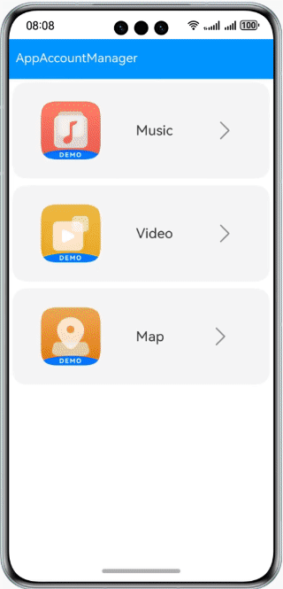
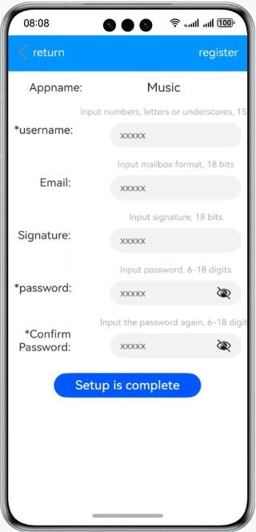
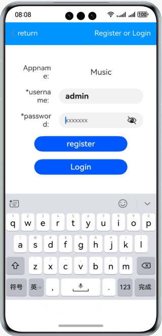
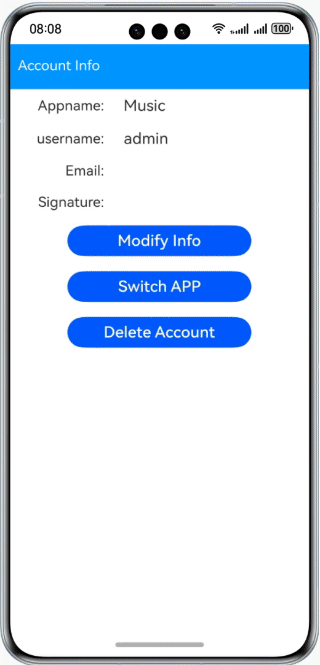

# App Account Management

### Overview

This sample shows how to register an account, log in to an app using the registered account, and set account information.  

### Preview

|Home Page| Registration Page                                | Login Page                             | Account Infor Page|
|--------------------------------|--------------------------------------|-----------------------------------|------|
||  |  ||

### How to Use

1. On the home page, select the app you want to access. If you are accessing the app for the first time, you need to register an account. If you already have an account, you can directly log in.

2. On the registration page, enter the account name, email address, signature, and password. The items marked with an asterisk (*) are mandatory. After the registration is complete, use the registered account to log in.

3. After sign-in, the account details page is displayed. You can tap **Modify** to modify the account information.

4. Tap **Switch app** to exit the current app and select the app you want to access.

5. Tap **Delete** to delete all information about the account.

### Project Directory
```
├──entry/src/main/ets                        // Code
│  ├──common
│  │  ├──AccountInfo.ets                      // Component for switching app
│  │  ├──BundleInfo.ets                       // List on the home page
│  │  ├──LoginInfo.ets                        // Login component
│  │  ├──ModifyInfo.ets                       // Component for modifying information
│  │  ├──NavigationBar.ets                    // Navigation bar
│  │  └──RegisterInfo.ets                     // Component for registration
│  ├──entryAbility  
│  │  └──EntryAbility.ts               
│  ├──model  
│  │  ├──AccountData.ts                       // Account data storage
│  │  ├──AccountModel.ts                      // Data management
│  │  └──Logger.ts                            // Logger
│  └──pages  
│     └──Index.ets                            // Home page
│     ├──Account.ets                          // Page for switching app
│     ├──Login.ets                            // Login page
│     ├──Modify.ets                           // Page for account info modification
│     └──Register.ets                         // Page for account registration
└──entry/src/main/resources                   // Static resources of the app

```

### How to Implement

This sample has three modules:
* Music module
  * Use the **Navigation**, **Button**, **Text**, and **TextInput** components to implement the registration page, login page, information modification page, and app switching page, and use **createAppAccountManager** to create an app account manager object.
  * Source code: [AccountData.ets](entry/src/main/ets/model/AccountData.ets), [AccountModel.ets](entry/src/main/ets/model/AccountModel.ets)
  * APIs: @ohos.account.appAccount, @ohos.data.preferences, @ohos.router

* Video module
  * Use the **Navigation**, **Button**, **Text**, and **TextInput** components to implement the registration page, login page, information modification page, and app switching page, and use **createAppAccountManager** to create an app account manager object.
  * Source code: [AccountData.ets](entry/src/main/ets/model/AccountData.ets), [AccountModel.ets](entry/src/main/ets/model/AccountModel.ets)
  * APIs: @ohos.account.appAccount, @ohos.data.preferences, @ohos.router

* Map module
  * Use the **Navigation**, **Button**, **Text**, and **TextInput** components to implement the registration page, login page, information modification page, and app switching page, and use **createAppAccountManager** to create an app account manager object.
  * Source code: [AccountData.ets](entry/src/main/ets/model/AccountData.ets), [AccountModel.ets](entry/src/main/ets/model/AccountModel.ets)
  * APIs: @ohos.account.appAccount, @ohos.data.preferences, @ohos.router

#### Concepts

App account manager: You can use the APIs provided by this module to add, delete, query, modify, and authorize an app account and persist and synchronize data.

### Required Permissions

N/A

### Dependencies

N/A

### Constraints

1. The sample app is supported only on Huawei phones running the standard system.
2. The HarmonyOS version must be HarmonyOS 5.0.5 Release or later.
3. The DevEco Studio version must be DevEco Studio 5.0.5 Release or later.
4. The HarmonyOS SDK version must be HarmonyOS 5.0.5 Release or later.
