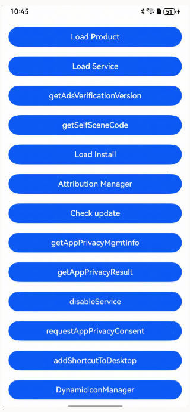
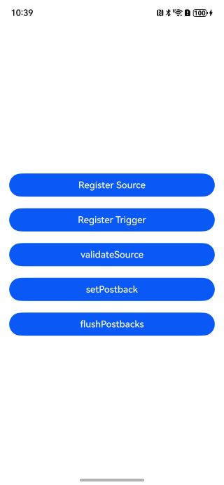

# AppGallery Kit (ArkTS)

## Overview

Based on the stage model, this demo implements features such as displaying an app details page for downloading and installing the target app, displaying an atomic service details page for adding the atomic service widget to the home screen, querying the ad signature verification version, obtaining module installation information, adding a module for on-demand loading, displaying reminders of updates on AppGallery, performing app attribution, querying privacy agreement URLs, querying the privacy agreement signing results, and terminating privacy agreements.

## Preview






## Project Directory

```
├─Attribution/src/main/ets
│                       │  
│                       ├─attributionability/AttributionAbility.ets  // Ability to locally start app attribution.
│                       ├─common/utils/SignUtil.ets     // Signature generation method.   
│                       └─pages
│                           └─Attribution.ets  // Page of the app attribution service and debugging function.
├─entry/src/main/ets
                   ├─common/bean/EntryItemInfo.ets   // Page entry utility class.
                   ├─entryability/EntryAbility.ets   // Ability for local startup.  
                   │              
                   └─pages
                       ├─ CheckUpdatePage.ets           // App update detection.
                       ├─ DisableService.ets            // Terminate privacy agreements.
                       ├─ GetAdsVerificationVersion.ets // Query the ad signature verification version.
                       ├─ GetAppPrivacyMgmtInfo.ets     // Query privacy agreement URLs.
                       ├─ GetAppPrivacyResult.ets       // Query privacy agreement signing results.
                       ├─ GetSelfSceneCode.ets          // Query the scene value of your atomic service.
                       ├─ IndexPage.ets                 // Entrance to the home screen.
                       ├─ LoadInstallService.ets        // Page for on-demand feature distribution.
                       ├─ LoadProduct.ets               // App details page for app download and installation.
                       ├─ LoadService.ets               // Page for adding your atomic service widget to the home screen.
                       ├─ AddShortcutToDesktop.ets      // Add an app shortcut to the home screen.
                       └─ RequestAppPrivacyConsent.ets  // Launch the standardized privacy agreement pop-up.
                       └─ DynamicIconManager.ets        // Manage custom app icons.

```

## How to Implement

1. Your app contains modules such as **Load Product**, **Load Service**, **Load Install**, **Check update**, and **Attribution Manager**.

2. Tap **Load Product** to access the app details page, where you can download and install the target app.

3. Tap **Load Service** to access the atomic service details page, where you can add the atomic service widget to the home screen.

4. Tap **Load Install** to access the page for on-demand feature distribution.

5. Tap **getSelfSceneCode** to query the scene value of the atomic service.

6. Tap **getAdsVerificationVersion** to return the ad signature verification version.

7. Tap **Check update** to access the app update page.

8. Install the HAP file of the app attribution service to register ad attribution sources and conversion events with the app attribution service, and perform debugging when you use the app attribution service.

9. Tap **getAppPrivacyMgmtInfo** to query privacy agreement URLs.

10. Tap **getAppPrivacyResult** to query the privacy agreement signing results.

11. Tap **disableService** to terminate privacy agreements.

12. Tap **requestAppPrivacyConsent** to launch the standardized privacy agreement pop-up.

13. Tap **addShortcutToDesktop** to add an app shortcut to the home screen.

14. Tap **DynamicIconManager** to access the app icon management page.

### Calling the loadService API for Displaying the Atomic Service Details Page
Step 1: Apply for a link for adding an atomic service widget to the home screen.

> Currently, the link for adding an atomic service widget to the home screen is not provided. If needed, you can request one by following the Apply for the Add Table Link Interface.

Step 2: Change **uri** in **LoadService.ets**.

Step 3: Compile and install the demo and tap **Load Service**.

### Debugging the getSelfSceneCode API
Step 1: Change the app to an atomic service.

&emsp;&emsp;&emsp;&emsp;Modify the **module.json5** file in the **entry/src/main** directory.

&emsp;&emsp;&emsp;&emsp;Change the value of **installationFree** to **true**.

Step 2: Use another app or atomic service to start your atomic service. Query the scene values generated by your atomic service.

&emsp;&emsp;&emsp;&emsp;Add the **bundleType** field to the **app.json5** file in the **AppScope** directory and set the attribute value to **atomicService**.

&emsp;&emsp;&emsp;&emsp;Example: "bundleType": "atomicService"

Step 3: Tap the corresponding button to query scene values of the atomic service.

### Debugging the getAdsVerificationVersion API
Step 1: Tap **getAdsVerificationVersion**.

Step 2: Obtain the returned ad signature verification version. Currently, the return value is **1**. In the advertising scenario, you need to include the following parameters in the **want** parameter: **ohos.market.param.signature**, **ohos.market.param.ad_networkid**, **ohos.market.param.timestamp**, **ohos.market.param.verify_version**, and **ohos.market.param.ad_nonce**. These parameters and the public key will be used for signature verification.


### Calling APIs for On-Demand Feature Distribution
There are five modules, including two HAP modules: **entry** and **commonHap**, and three HSP modules: **AModulelib** (approximately 10 MB), **BModulelib**, and **commonLibrary**. Additionally, a fake module **XModulelib** is constructed.

To dynamically load a specific module, you need to release the demo app and its HSPs and HAPs to AppGallery.

Once the demo app is available on AppGallery, you can download it from AppGallery and then dynamically load a module.

The following APIs are available, used to query module installation information, request module loading, cancel module loading, enable mobile data reminders, monitor the download progress, and cancel monitoring of the download progress, respectively:

* getInstalledModule()
* fetchModules()
* cancelTask()
* showCellularDataConfirmation()
* on('moduleInstallStatus')
* off('moduleInstallStatus')


Step 1: Perform the preliminary steps:

&emsp;&emsp;&emsp;&emsp;- Connect to the network.

&emsp;&emsp;&emsp;&emsp;- Install the latest version of AppGallery.

&emsp;&emsp;&emsp;&emsp;- Flash the latest version of the ROM.

Step 2: Download and install app A from AppGallery. The installed app A is only a basic package, and features of module B (the function package) cannot be used.

Step 3: Within app A, download module B.

Step 4: After the download and installation are complete, use features of module B within app A.


### Calling APIs for App Attribution and Service Debugging (Supported by API Versions 12 and Later)

Note: After downloading the project, click **Run** in the IDE, click **Edit Configurations**, and select **Attribution** from the module selection box.

There are a total of five APIs, with **validateSource()**, **setPostback()**, and **flushPostbacks()** being the debugging APIs for the app attribution service.
* registerSource()
* registerTrigger()
* validateSource()
* setPostback()
* flushPostbacks()

#### Preparations for testing:

&emsp;&emsp;&emsp;&emsp;- Obtain **adTechId**.

&emsp;&emsp;&emsp;&emsp;- Obtain **triggerdata**.

&emsp;&emsp;&emsp;&emsp;- Generate a signature.


##### Obtaining adTechId

Step 1: Sign in to HUAWEI Developers.

Step 2: Click **Console** in the upper right corner to go to the ecosystem service center.

Step 3: Go to **Ecosystem services** > **App services** > **Development** > **AG Service** to access the cloud platform of the app attribution service.

Step 4: Register an ad ecosystem partner role (ad platform in this step).

Step 5: Check the attribution role ID of the ad platform after the request is approved.


##### Obtaining triggerdata

Step 1: Sign in to HUAWEI Developers.

Step 2: Click **Console** in the upper right corner to go to the ecosystem service center.

Step 3: Go to **Ecosystem services** > **App services** > **Development** > **AG Service** to access the cloud platform of the app attribution service.

Step 4: Register an ad ecosystem partner role (advertiser in this step).

Step 5: Click a conversion event to view its ID.

##### Generating a signature

Step 1: Generate an RSA3072 asymmetric key pair.

Step 2: Register the public key with the cloud platform of the app attribution service.

Step 3: Generate the content to be signed. The format is as follows:

mmpIdStr:string = mmpId1 + '\u2063' + mmpId2
signContent: string= adTechId+ '\u2063' + campaignId+ '\u2063' + destinationId+ '\u2063' + serviceTag+ '\u2063' + mmpIdStr + '\u2063' + nonce + '\u2063' + timestamp

Step 4: Execute the **import {AegRsaSign} from "@hw-agconnect/petal-aegis"** code to import **AegRsaSign** from **@hw-agconnect/petal-aegis**, and use **AegRsaSign.ohAegSignRSAWithPSSTextBase64** to generate a signature. For details, please refer to the following websites:
>ohpm i @hw-agconnect/petal-aegis

> Usage of ohAegSignRSAWithPSSTextBase64

#### Calling APIs of the App Attribution Service Steps

Step 1: Tap **Register Source** to call the **registerSource** API, which will return whether the attribution source registration is successful.

Step 2: Tap **Register Trigger** to call the **registerTrigger()** API, which will return whether the conversion registration is successful.

Step 3: Tap **validateSource** to call the **validateSource()** API, which will return whether the validation of the attribution source information is successful.

Step 4: Tap **setPostback** to call the **setPostback()** API, which will return whether the attribution result is successfully set.

Step 5: Tap **flushPostbacks** to call the **flushPostbacks()** API, which will return whether the attribution result postback is successfully triggered.


### Calling APIs of the Update Function (Supported by API Versions 12 and Later)

* checkAppUpdate()
* showUpdateDialog()

Step 1: Tap **Call the checkAppUpdate API**, which will return whether there is a version update.

Step 2: When a new version is available, tap **Call the showUpdateDialog API** to show a dialog box that provides a new version.

### Calling APIs of the Privacy Agreement Management Service (Supported by API Versions 12 and Later)
* getAppPrivacyMgmtInfo()
* getAppPrivacyResult()
* disableService()
* requestAppPrivacyConsent(context:common.UIAbilityContext):Promise<ConsentResult> (supported by API versions 14 and later)

Step 1: Integrate the standardized privacy statement hosting service into your app.
For apps that have not been released, you can [simulate the integration of the standardized privacy statement hosting service](https://developer.huawei.com/consumer/en/doc/harmonyos-guides/store-privacy#section133476117117).

Step 2: After your app integrates the standardized privacy statement hosting service, you can query privacy agreement URLs, check the privacy agreement signing results, terminate privacy agreements, and launch the standardized privacy agreement pop-up. (Note: If your app has not integrated the privacy statement hosting service, error code **1006700003** will be returned when an API is called.)

### Calling the APIs for Adding a Shortcut to the Home Screen (Supported by API Version 12)
* checkPinShortcutPermitted()
* requestNewPinShortcut()

Step 1: Tap **checkPinShortcutPermitted with resName** to call the **checkPinShortcutPermitted()** API by passing the resource index name. The result of whether the shortcut can be added to the home screen will be returned.

Also, you can tap **checkPinShortcutPermitted with file** to call the **checkPinShortcutPermitted()** API by passing the shortcut name and icon file. The result of whether the shortcut can be added to the home screen will be returned.

Note: If you choose to tap the **checkPinShortcutPermitted with file** button, you need to preset a foreground image and a background image (optional) in the sandbox in advance and modify the source code based on the actual path, for example, **/data/storage/el2/base/haps/entry/files/boat.svg**. You can use either mode to call the **checkPinShortcutPermitted()** API.

Step 2: Tap **requestNewPinShortcut**. The **requestNewPinShortcut()** API will carry the check result returned in step 1 and display a pop-up for users to confirm whether they want to add the shortcut to the home screen.

### Calling the APIs for Managing Custom Icons (Supported by API Version 15)
* queryDynamicIcons()
* selectDynamicIcon(iconId: string)
* disableDynamicIcon()

Note: Before calling the APIs, ensure that you have [submitted a custom app icon in AppGallery Connect](https://developer.huawei.com/consumer/en/doc/harmonyos-guides/appgallery-appinfo-manage).

Step 1: Tap **queryDynamicIcons** to query information about the custom icon that has passed the release review and been successfully distributed.

Step 2: Tap **selectDynamicIcon: {*iconId*}** and pass the custom icon ID obtained in step 1 to switch to that icon.

Step 3: Tap **disableDynamicIcon** to disable the custom icon. After that, the default icon of the app will be displayed.

## Required Permissions

N/A

## Constraints

1. The sample app is only supported on Huawei phones, tablets, and 2-in-1 devices/PCs with standard systems.

2. The HarmonyOS version must be HarmonyOS NEXT Developer Beta1 or later.

3. The DevEco Studio version must be DevEco Studio NEXT Developer Beta1 or later.

4. The HarmonyOS SDK version must be HarmonyOS NEXT Developer Beta1 SDK or later.

5. Install AppGallery 14.0.1.300 or later.
