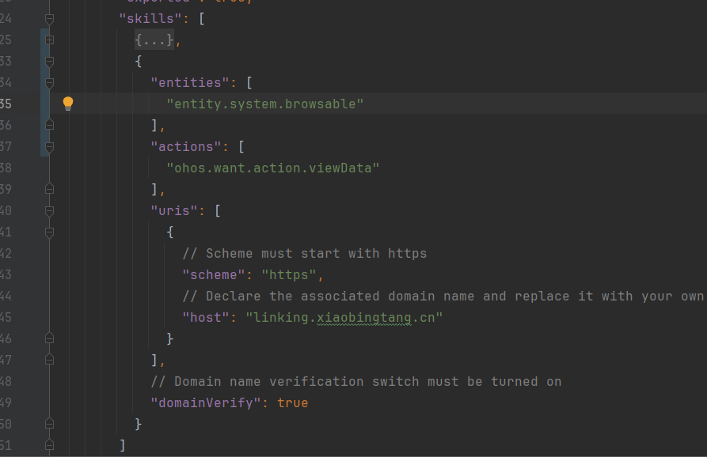

# 基于延迟链接跳转详情页

## 简介

本示例展示了作为目标方如何获取拉起方的延迟链接地址，并跳转详情页面，提升用户体验和链接转化率。

1.在demo的module.json5里面配置需要拉起的延迟链接的skills信息。

2.使用deferredLink.popDeferredLink()接口获取延迟链接的url。

## 效果预览

|              **主页面**              |
| :----------------------------------: |
|  |


## 配置与使用

### 配置步骤

1. [创建项目](https://developer.huawei.com/consumer/cn/doc/app/agc-help-create-project-0000002242804048)及[应用](https://developer.huawei.com/consumer/cn/doc/app/agc-help-create-app-0000002247955506)。

2. 打开应用，使用[AppGallery Connect](https://developer.huawei.com/consumer/cn/service/josp/agc/index.html)配置的应用包名替换app.json5文件中的bundleName属性值。

3. 使用[手动签名](https://developer.huawei.com/consumer/cn/doc/harmonyos-guides/ide-signing#section297715173233)创建一个签名，替换工程中build-profile.json5文件中的signingConfigs的内容。

4. 在[AppGallery Connect](https://developer.huawei.com/consumer/cn/service/josp/agc/index.html)平台开通App Linking服务，并且配置网址域名，具体操作步骤请参见[开发准备](https://developer.huawei.com/consumer/cn/doc/harmonyos-guides/applinking-preparations)。

5. 在应用的module.json5里面配置skills的相关信息，可以参考以下图片。



### 使用说明

1. 提前将AppLinkingSampleOriginal应用安装到手机上，点击页面上的按钮会触发打开链接的功能。

2. 首次安装并点击AppLinkingSampleDestination应用会触发延迟链接功能，跳转到详情页面。


## 工程目录

```
├──entry/src/main/ets                         // 代码区
│  ├──entryability
│  │  └──EntryAbility.ets                     // 程序入口类
│  ├──pages                                   // 存放页面文件目录
│  │  ├──Index.ets                            // 入口类文件
│  │  └──Page1.ets                            // 详情页
│  └──constants                               // 常量文件夹
│     └──Constants.ets                        // 常量文件
└──entry/src/main/resources                   // 应用资源目录
```

## 具体实现

调用deferredLink.popDeferredLink()接口获取App Linking的延迟链接，并跳转到详情页面Page1。

**参考**

1. [entry\src\main\ets\pages\Index.ets](./entry/src/main/ets/pages/Index.ets)

2. [entry\src\main\ets\pages\Page1.ets](./entry/src/main/ets/pages/Page1.ets)


## 相关权限

不涉及。

## 约束与限制

1. 本示例仅支持标准系统上运行，支持设备：华为手机。
2. 本示例支持API version 17及以上。
3. HarmonyOS系统：HarmonyOS 5.0.5 Release及以上。
4. DevEco Studio版本：DevEco Studio 5.0.5 Release及以上。
5. HarmonyOS SDK版本：HarmonyOS 5.0.5 Release SDK及以上。 
