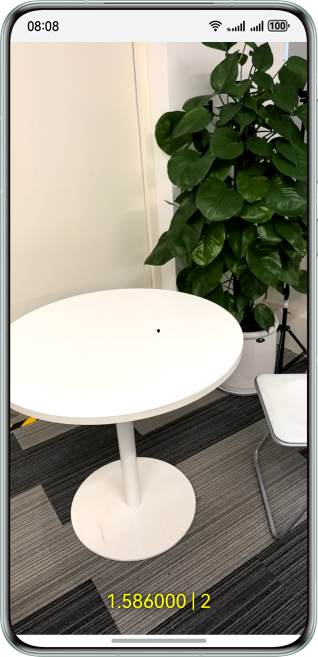

# AREngine

## 介绍

AR Engine（以下统称AR引擎）助力应用融合虚拟世界与现实世界，打造全新的视觉体验和交互方式。

本示例展示了AR引擎提供的平面检测，运动跟踪，环境跟踪和命中检测能力。

- 运动跟踪能力，可以实时获取设备在空间中任意时刻的位姿。
- 环境跟踪能力，可以跟踪设备周围的平面，辅助开发者实现虚拟物体以场景化的方式逼真地融入现实物理世界。
- 命中检测能力，可以通过点击终端设备屏幕选中现实环境中的兴趣点，与虚拟物体进行交互。

## 效果预览

### ARWorld效果预览

|                  **应用首页**                  |             **识别平面**             |         **通过命中检测显示模型**         |
|:------------------------------------------:|:--------------------------------:|:------------------------------:|
|  |  |  |

1. 在手机的主屏幕，点击“ARSample”，启动应用，在主界面可见“ARWorld”按钮。
2. 点击“ARWorld”按钮，拉起AR引擎的平面识别界面，对准地面，桌面，墙面等平面缓慢移动扫描，即可识别到平面并绘制到屏幕上。
3. 识别出平面后，点击平面上某个点，通过AR引擎提供的命中检测的能力，会在屏幕被点击位置放置一个3D模型。

### ARMesh效果预览

|                 **应用首页**                  |          **绘制Mesh网格**           |            **通过命中检测显示模型**            |
|:-----------------------------------------:|:-------------------------------:|:------------------------------------:|
|  |  |  |

1. 在手机的主屏幕，点击“ARSample”，启动应用，在主界面可见“ARMesh”按钮。
2. 点击“ARMesh”按钮，拉起AR引擎平面识别界面，对准地面，桌面，墙面等平面缓慢移动扫描，即可绘制mesh网格到屏幕上。
3. 绘制出mesh网格后，点击网格上某个点，通过AR引擎提供的命中检测的能力，会在屏幕被点击位置放置一个3D模型。

### ARDepth效果预览

|                  **应用首页**                  |         **Depth模式选择**          |           **关闭深度图渲染模式**            |          **开启深度图渲染模式**           |
|:------------------------------------------:|:------------------------------:|:----------------------------------:|:--------------------------------:|
|  |  |  |  |

1. 在手机的主屏幕，点击“ARSample”，启动应用，在主界面可见“ARDepth”按钮。
2. 选择是否开启深度渲染图模式。
3. 进入AR场景，屏幕中心上的点，即为相机距离点的位置，距离会显示在屏幕上。
4. 选择开启深度图渲染的模式，屏幕上即可显示深度渲染图。

### ARImage效果预览

|                  **应用首页**                  |            **Image模式选择**             |           **选取跟踪图片**           |           **跟踪图片**            |
|:------------------------------------------:|:------------------------------------:|:------------------------------:|:-----------------------------:|
|  |  |  |  |

1. 在手机的主屏幕，点击“ARSample”，启动应用，在主界面可见“ARImage”按钮。
2. 选择添加图片跟踪或者使用本地数据库。
3. 若选择添加图片，则弹出图片添加窗口，否则直接进入下一步。
4. 开始跟踪目标图片，屏幕上可看见红色线框框选的目标图片。

### ARSemanticDense效果预览

|                      **应用首页**                      |              **SemanticDense模式选择**              |           **开启稠密点云**            |           **打开体积测量**            |           **打开空间测量**           |
|:--------------------------------------------------:|:-----------------------------------------------:|:-------------------------------:|:-------------------------------:|:------------------------------:|
|  |  |  |  |  |

1. 在手机的主屏幕，点击“ARSample”，启动应用，在主界面可见“ARSemanticDense”按钮。
2. 选择点击开启稠密点云，打开体积测量和打开空间测量中的任意一个按钮。
3. 三个模式下分别对着相对应的地面，物体或墙角进行扫描。
4. 识别出相应主体信息后，屏幕上可以看见相对应的稠密点云或立方体信息。

## 使用说明

开发者使用DevEco Studio打开本工程，签名后直接在真机设备上运行即可。

## 工程目录

```cpp
├──entry/src/main
│
├──module.json5                                     // 模块的配置文件
│
├──cpp                                              // C++代码区
│  ├──CMakeLists.txt                                // CMake配置文件
│  │
│  ├──src
│  │  ├──app_napi.h                                 // 业务侧虚基类
│  │  ├──global.cpp                                 // NAPI初始化
│  │  ├──global.h                                   // C++和ets接口映射配置
│  │  ├──module.cpp                                 // C++接口注册
│  │  ├──napi_manager.cpp                           // C++接口实现
│  │  ├──napi_manager.h
│  │  │
│  │  ├──depth                                      // ARDepth模块 
│  │  │  ├──depth_ar_application.cpp                // ARDepth模块接口实现
│  │  │  ├──depth_ar_application.h
│  │  │  ├──depth_background_no_renderer.cpp        // 背景渲染
│  │  │  ├──depth_background_no_renderer.h
│  │  │  ├──depth_background_renderer.cpp           // 深度图背景渲染
│  │  │  ├──depth_background_renderer.h
│  │  │  ├──depth_render_manager.cpp                // 每一帧渲染
│  │  │  └──depth_render_manager.h
│  │  │
│  │  ├──graphic                                    // 渲染相关工具类
│  │  │
│  │  ├──image                                      // ARImage模块 
│  │  │  ├──image_ar_application.cpp                // ARImage模块接口实现
│  │  │  ├──image_ar_application.h
│  │  │  ├──image_background_renderer.cpp           // 背景渲染
│  │  │  ├──image_background_renderer.h
│  │  │  ├──image_line_render.cpp                   // 线框渲染
│  │  │  ├──image_line_render.h
│  │  │  ├──image_render_base.cpp                   // 图像渲染
│  │  │  ├──image_render_base.h
│  │  │  ├──image_render_manager.cpp                // 每一帧渲染
│  │  │  └──image_render_manager.h
│  │  │
│  │  ├──mesh                                       // ARMesh模块 
│  │  │  ├──mesh_ar_application.cpp                 // ARMesh模块接口实现
│  │  │  ├──mesh_ar_application.h
│  │  │  ├──mesh_background_renderer.cpp            // 背景渲染
│  │  │  ├──mesh_background_renderer.h
│  │  │  ├──mesh_object_renderer.cpp                // 3D物体渲染
│  │  │  ├──mesh_object_renderer.h
│  │  │  ├──mesh_render_manager.cpp                 // 每一帧渲染
│  │  │  ├──mesh_render_manager.h
│  │  │  ├──scenemesh_display_renderer.cpp          // Mesh网格渲染
│  │  │  └──scenemesh_display_renderer.h
│  │  │
│  │  ├──utils                                      // Util工具类
│  │  │
│  │  ├──semanticdense 
│  │  │  ├──semanticdense_ar_application.cpp        // ARSemanticDense模块接口实现
│  │  │  ├──semanticdense_ar_application.h
│  │  │  ├──semanticdense_background_renderer.cpp   // 背景渲染
│  │  │  ├──semanticdense_background_renderer.h
│  │  │  ├──semanticdense_cube_renderer.cpp         // 立方体渲染
│  │  │  ├──semanticdense_cube_renderer.h
│  │  │  ├──semanticdense_point_cloud_renderer.cpp  // 点云渲染
│  │  │  ├──semanticdense_point_cloud_renderer.h
│  │  │  ├──semanticdense_render_manager.cpp        // 每一帧渲染
│  │  │  └──semanticdense_render_manager.h
│  │  │ 
│  │  └──world                                      // ARWorld模块
│  │     ├──world_ar_application.cpp                // ARWorld模块接口实现
│  │     ├──world_ar_application.h
│  │     ├──world_background_renderer.cpp           // 背景渲染
│  │     ├──world_background_renderer.h
│  │     ├──world_file_manager.cpp                  // 文件操作
│  │     ├──world_file_manager.h
│  │     ├──world_object_renderer.cpp               // 3D物体渲染
│  │     ├──world_object_renderer.h
│  │     ├──world_plane_renderer.cpp                // 平面渲染
│  │     ├──world_plane_renderer.h
│  │     ├──world_render_manager.cpp                // 每一帧渲染
│  │     └──world_render_manager.h
│  │
│  ├──thirdparty                                    // 渲染相关三方库
│  │
│  └──types                                         // 接口存放文件夹
│     └──libentry
│        ├──index.d.ts                              // 接口文件
│        └──oh-package.json5                        // 接口注册配置文件
│
├──ets                                              // ets代码区
│  ├──entryability
│  │  └──EntryAbility.ets                           // 程序入口类
│  │
│  ├──pages
│  │  ├──ARDepth.ets                                // ARDepth选择模式界面
│  │  ├──ARDepthRender.ets                          // ARDepth界面
│  │  ├──ARImage.ets                                // ARImage选择模式界面
│  │  ├──ARImageByAdd.ets                           // ARImage本地图片模式界面
│  │  ├──ARImageByDatabase.ets                      // ARImage本地数据库模式界面
│  │  ├──ARMesh.ets                                 // ARMesh界面
│  │  ├──ARSemanticDense.ets                        // ARSemanticDense模式选择界面
│  │  ├──ARSemanticDenseRender.ets                  // ARSemanticDense界面
│  │  ├──ARWorld.ets                                // ARWorld界面
│  │  └──Selector.ets                               // 主界面
│  │
│  └──utils                                         // Util工具类
│
└──resources                                        // 资源文件目录
```

## 具体实现

### 集成服务

使用AREngine服务接口需要在`CMakeLists`中引入依赖：

```cmake
find_library(
    arengine-lib
    libarengine_ndk.z.so
)
target_link_libraries(entry PUBLIC
    ${arengine-lib}
)
```

使用时引入头文件：

```c
#include "ar/ar_engine_core.h"
```

### 创建会话和帧数据相关接口

```c
AREngine_ARStatus HMS_AREngine_ARConfig_Create(const AREngine_ARSession *session, AREngine_ARConfig **outConfig);
void HMS_AREngine_ARConfig_Destroy(AREngine_ARConfig *config);

AREngine_ARStatus HMS_AREngine_ARSession_Create(void *env, void *applicationContext, AREngine_ARSession **outSessionPointer);
AREngine_ARStatus HMS_AREngine_ARSession_Configure(AREngine_ARSession *session, const AREngine_ARConfig *config);
void HMS_AREngine_ARSession_Destroy(AREngine_ARSession *session);

AREngine_ARStatus HMS_AREngine_ARFrame_Create(const AREngine_ARSession *session, AREngine_ARFrame **outFrame);
void HMS_AREngine_ARFrame_Destroy(AREngine_ARFrame *frame);
```

### 平面识别相关接口

```c
AREngine_ARStatus HMS_AREngine_ARTrackableList_Create(const AREngine_ARSession *session, AREngine_ARTrackableList **outTrackableList);
AREngine_ARStatus HMS_AREngine_ARSession_GetAllTrackables(const AREngine_ARSession *session, AREngine_ARTrackableType filterType, AREngine_ARTrackableList *outTrackableList);
AREngine_ARStatus HMS_AREngine_ARTrackableList_GetSize(const AREngine_ARSession *session, const AREngine_ARTrackableList *trackableList, int32_t *outSize);
AREngine_ARStatus HMS_AREngine_ARTrackableList_AcquireItem(const AREngine_ARSession *session, const AREngine_ARTrackableList *trackableList, int32_t index, AREngine_ARTrackable **outTrackable);
void HMS_AREngine_ARTrackableList_Destroy(AREngine_ARTrackableList *trackableList);

AREngine_ARStatus HMS_AREngine_ARTrackable_GetTrackingState(const AREngine_ARSession *session, const AREngine_ARTrackable *trackable, AREngine_ARTrackingState *outTrackingState);
void HMS_AREngine_ARTrackable_Release(AREngine_ARTrackable *trackable);

AREngine_ARStatus HMS_AREngine_ARPlane_AcquireSubsumedBy(const AREngine_ARSession *session, const AREngine_ARPlane *plane, AREngine_ARPlane **outSubsumedBy);
AREngine_ARStatus HMS_AREngine_ARPlane_AcquireSubsumedBy(const AREngine_ARSession *session, const AREngine_ARPlane *plane, AREngine_ARPlane **outSubsumedBy);
AREngine_ARStatus HMS_AREngine_ARPlane_GetCenterPose(const AREngine_ARSession *session, const AREngine_ARPlane *plane, AREngine_ARPose *outPose);
AREngine_ARStatus HMS_AREngine_ARPlane_GetPolygonSize(const AREngine_ARSession *session, const AREngine_ARPlane *plane, int32_t *outPolygonSize);
AREngine_ARStatus HMS_AREngine_ARPlane_GetPolygon(const AREngine_ARSession *session, const AREngine_ARPlane *plane, float *outPolygonXz, int32_t polygonSize);
AREngine_ARStatus HMS_AREngine_ARPlane_IsPoseInPolygon(const AREngine_ARSession *session, const AREngine_ARPlane *plane, const AREngine_ARPose *pose, int32_t *outPoseInPolygon);
```

### 命中检测相关接口

```c
AREngine_ARStatus HMS_AREngine_ARHitResultList_Create(const AREngine_ARSession *session, AREngine_ARHitResultList **outHitResultList);
AREngine_ARStatus HMS_AREngine_ARHitResultList_GetSize(const AREngine_ARSession *session, const AREngine_ARHitResultList *hitResultList, int32_t *outSize);
AREngine_ARStatus HMS_AREngine_ARHitResultList_GetItem(const AREngine_ARSession *session, const AREngine_ARHitResultList *hitResultList, int32_t index, AREngine_ARHitResult *outHitResult);
void HMS_AREngine_ARHitResultList_Destroy(AREngine_ARHitResultList *hitResultList);

AREngine_ARStatus HMS_AREngine_ARHitResult_AcquireNewAnchor(AREngine_ARSession *session, AREngine_ARHitResult *hitResult, AREngine_ARAnchor **outAnchor);
AREngine_ARStatus HMS_AREngine_ARHitResult_GetHitPose(const AREngine_ARSession *session, const AREngine_ARHitResult *hitResult, AREngine_ARPose *outPose);
AREngine_ARStatus HMS_AREngine_ARHitResult_AcquireTrackable(const AREngine_ARSession *session, const AREngine_ARHitResult *hitResult, AREngine_ARTrackable **outTrackable);
void HMS_AREngine_ARHitResult_Destroy(AREngine_ARHitResult *hitResult);
```

### 深度估计相关接口

```c
AREngine_ARStatus HMS_AREngine_ARConfig_SetDepthMode(const AREngine_ARSession *session, AREngine_ARConfig *config, AREngine_ARDepthMode depthMode);
AREngine_ARStatus HMS_AREngine_ARFrame_AcquireDepthImage16Bits(const AREngine_ARSession *session, const AREngine_ARFrame *frame, AREngine_ARImage **outDepthImage);
AREngine_ARStatus HMS_AREngine_ARFrame_AcquireDepthConfidenceImage(const AREngine_ARSession *session, const AREngine_ARFrame *frame, AREngine_ARImage **outConfidenceImage);
```

### 网格扫描相关接口

```c
AREngine_ARStatus HMS_AREngine_ARConfig_SetMeshMode(const AREngine_ARSession *session, AREngine_ARConfig *config, AREngine_ARMeshMode meshMode);
AREngine_ARStatus HMS_AREngine_ARFrame_AcquireSceneMesh(const AREngine_ARSession *session, const AREngine_ARFrame *frame,  AREngine_ARSceneMesh **outSceneMesh);
AREngine_ARStatus HMS_AREngine_ARSceneMesh_AcquireVerticesSize(const AREngine_ARSession *session, const AREngine_ARSceneMesh *sceneMesh, int32_t *outSize);
AREngine_ARStatus HMS_AREngine_ARSceneMesh_AcquireVertexList(const AREngine_ARSession *session, const AREngine_ARSceneMesh *sceneMesh, float *outData, int32_t dataSize);
AREngine_ARStatus HMS_AREngine_ARSceneMesh_AcquireVertexNormalList(const AREngine_ARSession *session, const AREngine_ARSceneMesh *sceneMesh, float *outData, int32_t dataSize);
AREngine_ARStatus HMS_AREngine_ARSceneMesh_AcquireIndexListSize(const AREngine_ARSession *session, const AREngine_ARSceneMesh *sceneMesh, int32_t *outSize);
AREngine_ARStatus HMS_AREngine_ARSceneMesh_AcquireIndexList(const AREngine_ARSession *session, const AREngine_ARSceneMesh *sceneMesh, int32_t *outData, int32_t dataSize);
void HMS_AREngine_ARSceneMesh_Release(AREngine_ARSceneMesh *sceneMesh);
```

### 图像跟踪相关接口

```c
AREngine_ARStatus HMS_AREngine_ARAugmentedImageDatabase_Create(AREngine_ARAugmentedImageDatabase **outDatabase);
AREngine_ARStatus HMS_AREngine_ARAugmentedImageDatabase_AddImage(AREngine_ARAugmentedImageDatabase *database, const AREngine_ARAugmentedImageSource *image, uint32_t *outIndex, AREngine_ARAddAugmentedImageReason *outReason);
AREngine_ARStatus HMS_AREngine_ARSession_GetAllTrackables(const AREngine_ARSession *session, AREngine_ARTrackableType filterType, AREngine_ARTrackableList *outTrackableList);
AREngine_ARStatus HMS_AREngine_ARTrackableList_GetSize(const AREngine_ARSession *session, const AREngine_ARTrackableList *trackableList, int32_t *outSize);
AREngine_ARStatus HMS_AREngine_ARAugmentedImage_GetCenterPose(const AREngine_ARSession *session, const AREngine_ARAugmentedImage *augmentedImage, AREngine_ARPose *outPose);
AREngine_ARStatus HMS_AREngine_ARAugmentedImage_GetExtendX(const AREngine_ARSession *session, const AREngine_ARAugmentedImage *augmentedImage, float *outExtendX);
AREngine_ARStatus HMS_AREngine_ARAugmentedImage_GetExtendZ(const AREngine_ARSession *session, const AREngine_ARAugmentedImage *augmentedImage, float *outExtendZ);
AREngine_ARStatus HMS_AREngine_ARAugmentedImageDatabase_Serialize(const AREngine_ARAugmentedImageDatabase *database, uint8_t **outBuffer, uint64_t *outBufSize);
AREngine_ARStatus HMS_AREngine_ARAugmentedImageDatabase_Deserialize(const uint8_t *buffer, const uint64_t bufSize, AREngine_ARAugmentedImageDatabase **outDatabase);
```

### 高精几何重建相关接口

```c
AREngine_ARStatus HMS_AREngine_ARConfig_SetSemanticDenseMode(const AREngine_ARSession *session, AREngine_ARConfig *config, AREngine_ARSemanticDenseMode semanticDenseMode);
AREngine_ARStatus HMS_AREngine_ARConfig_GetSemanticDenseMode(const AREngine_ARSession *session, const AREngine_ARConfig *config, AREngine_ARSemanticDenseMode *outSemanticDenseMode);
AREngine_ARStatus HMS_AREngine_ARFrame_AcquireSemanticDenseData(const AREngine_ARSession *session, const AREngine_ARFrame *frame, AREngine_ARSemanticDenseData **outSemanticDenseData);
AREngine_ARStatus HMS_AREngine_ARSemanticDense_AcquirePointData(const AREngine_ARSession *session, const AREngine_ARSemanticDenseData* semanticDenseData, AREngine_ARSemanticDensePointData **outPointData);
AREngine_ARStatus HMS_AREngine_ARSemanticDense_AcquirePointDataSize(const AREngine_ARSession *session,const AREngine_ARSemanticDenseData* semanticDenseData, int64_t *outSize);
AREngine_ARStatus HMS_AREngine_ARSemanticDense_AcquireCubeData(const AREngine_ARSession *session, const AREngine_ARSemanticDenseData* semanticDenseData, AREngine_ARSemanticDenseCubeData **outCubeData);
AREngine_ARStatus HMS_AREngine_ARSemanticDense_AcquireCubeDataSize(const AREngine_ARSession *session, const AREngine_ARSemanticDenseData* semanticDenseData, int64_t *outSize);
void HMS_AREngine_ARSemanticDense_Release(AREngine_ARSemanticDenseData *semanticDenseData);
```

### 运动跟踪能力图文介绍

AR引擎通过获取终端设备摄像头数据，结合图像特征和惯性传感器（IMU），计算设备位置（沿x、y、z轴方向位移）和位姿（绕x、y、z轴旋转），
实现6自由度（6DoF）运动跟踪能力。

6DoF运动跟踪能力示意图（红色线代表设备运动方向）


## 相关权限

1. 获取相机权限：`ohos.permission.CAMERA`。
2. 获取加速度传感器权限：`ohos.permission.ACCELEROMETER`。
3. 获取陀螺仪传感器权限：`ohos.permission.GYROSCOPE`。

## 约束与限制

1. 开发者可通过接口调用判断当前设备是否支持AR Engine。接口的调用参考方式如下：

```c
#include "ar/ar_engine_core.h" 

bool isSupportAREngine() {
    AREngine_ARSession *arSession = nullptr;
    if(HMS_AREngine_ARSession_Create(nullptr, nullptr, &arSession) == ARENGINE_ERROR_DEVICE_NOT_SUPPORTED){
        return false;
    }
    return true;
}
```
若对应接口返回错误码为ARENGINE_ERROR_DEVICE_NOT_SUPPORTED，则表示AR Engine不支持当前设备。
2. 本实例支持的DevEco Studio版本：推荐DevEco Studio 6.0.0 Release及以上。
3. 本实例为Stage模型，支持的HarmonyOS SDK版本：推荐HarmonyOS 6.0.0 Release SDK及以上。

## AR Engine深度估计功能技术局限性及免责声明

1. 技术局限性声明：本功能提供的能力，涉及深度估计精度可能受以下因素影响：
   1. 环境光照条件（例如强光/弱光/反光场景）。
   2. 物体表面材质特性（例如透明/镜面/单色物体）。
   3. 设备硬件性能差异（例如摄像头/传感器参数）。
   4. 动态场景下的实时性限制等。
2. 免责声明：
   本深度估计仅提供功能，并不构成对产品的质量保证或任何承诺。开发者自主选择是否使用HarmonyOS提供的功能开发应用软件，开发者对应用软件的使用目的、
   效果和责任自行负责。若开发用于视障人士避障、残疾人辅助等场景的应用软件，开发者应承担开展多场景压力测试，并建立数据校验机制，特别在安全相关场景需
   部署冗余保障方案，并确保应用合法合规的开发和运营。HarmonyOS不承担由此产生的任何直接或间接责任。

   深度估计提供的功能：
   1. 不作为医疗设备或生命安全系统设计。
   2. 未经认证，不作为医疗辅助设备；不作为医疗器材；未经无障碍设施认证或生命安全认证。

## AR Engine高精几何重建功能技术局限性及免责声明

1. 技术局限性声明：本功能提供的能力，涉及几何数值精度可能受以下因素影响：
   1. 环境光照条件（例如强光/弱光/反光场景）。
   2. 物体表面材质特性（例如透明/镜面/单色物体）。
   3. 设备硬件性能差异（例如摄像头/传感器参数）。
   4. 动态场景下的实时性限制等。
2. 免责声明：
   本高精几何重建仅提供功能，并不构成对产品的质量保证或任何承诺。开发者自主选择是否使用HarmonyOS提供的功能开发应用软件，开发者对应用软件的使用目的、
   效果和责任自行负责。若开发用于视障人士避障、残疾人辅助等场景的应用软件，开发者应承担开展多场景压力测试，并建立数据校验机制，特别在安全相关场景需
   部署冗余保障方案，并确保应用合法合规的开发和运营。HarmonyOS不承担由此产生的任何直接或间接责任。

   高精几何重建提供的功能：
   1. 不作为医疗设备或生命安全系统设计。
   2. 未经认证，不作为医疗辅助设备；不作为医疗器材；未经无障碍设施认证或生命安全认证。

## 更新日志

### 1.3.0版本更新功能介绍

1. ARSemanticDense能力上线。<br>
   高精几何重建能力上线，开发者可以进行空间测量，获取立方体的体积。
2. 修改了工程模板，适配最新的API20工程。

### 1.2.0版本更新功能介绍

1. ARMesh能力上线。<br>
   网格扫描、网格图绘制能力上线。
2. ARImage能力上线。<br>
   图像跟踪能力上线，开发者可通过本地图片检测环境目标特征点。
3. 修改了工程模板，适配最新的API18工程。

### 1.1.0版本更新功能介绍

1. ARDepth能力上线。<br>
   深度估计、深度图渲染功能上线。
2. 修改了工程模板，适配最新的API17工程。

### 1.0.0版本更新功能介绍

1. ARWorld能力上线。<br>
   平面识别、碰撞检测、物体摆放功能上线。

## 相关文档

[AREngine开发指南](https://developer.huawei.com/consumer/cn/doc/harmonyos-guides/ar-engine-kit-guide)

[AREngine API参考](https://developer.huawei.com/consumer/cn/doc/harmonyos-references/ar-engine-api)
