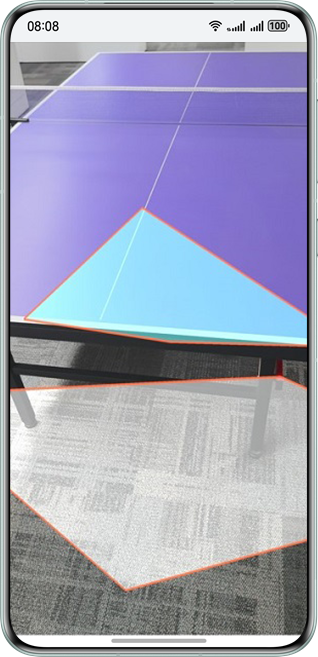
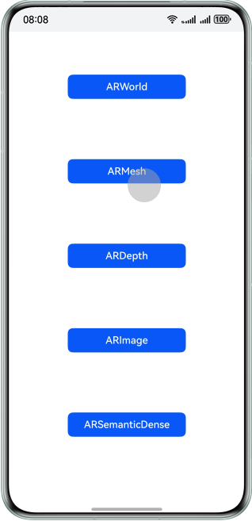
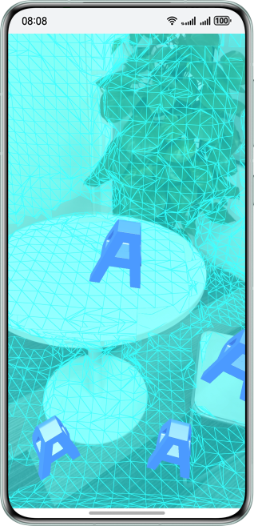
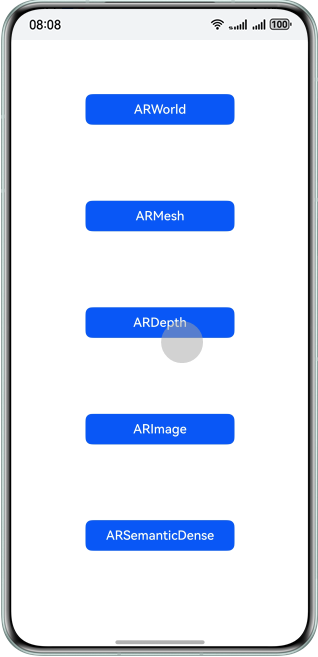
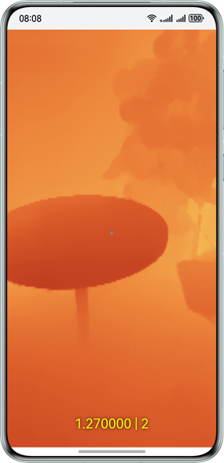
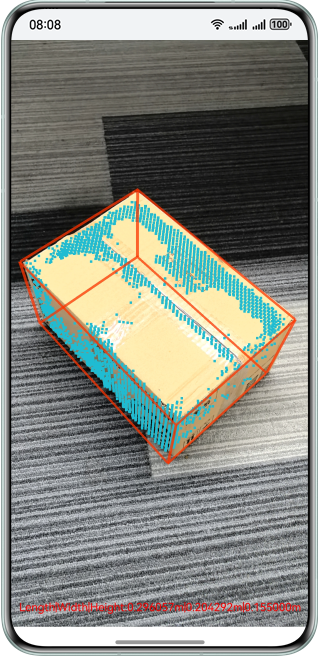
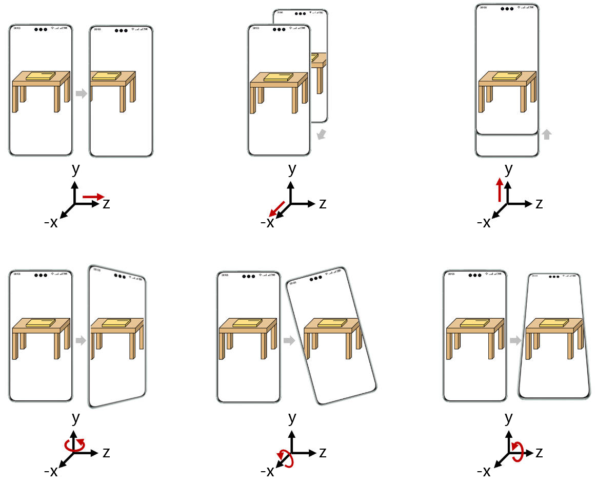

# AREngine

## Overview

AR Engine offers AR capabilities for apps to merge the virtual world with the real world, offering consumers a new
visual experience and way of interaction.

This sample code illustrates the plane detection, motion tracking, environment tracking, and hit testing capabilities
provided by AR Engine.

- Motion tracking capability: Obtains the pose of a device at any time in space in real time.
- Environment tracking capability: Tracks planes around the device, for naturally integrating virtual objects into
  the physical world.
- Hit testing capability: Allow users to select points of interest (POIs) in the real environment by tapping on
  the device screen, to interact with virtual objects.

## Preview

### ARWorld preview

|            **App home screen**             |      **Plane recognition**       | **Model display through hit testing** |
|:------------------------------------------:|:--------------------------------:|:-------------------------------------:|
|  |  |         |

1. On the home screen of your phone, touch **ARSample** to start the app. You'll find an **ARWorld** button on
   the app home screen.
2. Tap **ARWorld** to start the plane recognition screen of AR Engine. Slowly move your phone while pointing it at
   the ground, table, wall, or other flat surfaces to scan for planes. Recognized planes will be drawn on the screen.
3. Tap any point on an identified plane and a 3D model will be placed at the tapped position on the screen using
   the hit testing capability of AR Engine.

### ARMesh preview

|            **App home screen**            |        **Mesh drawing**         | **Model display through hit testing** |
|:-----------------------------------------:|:-------------------------------:|:-------------------------------------:|
|  |  |   |

1. On the home screen of your phone, tap **ARSample** to start the app. You'll find an **ARMesh** button on the app
   home screen.
2. Tap **ARMesh**  to start the plane recognition screen of AR Engine. Slowly move your phone while pointing it at
   the ground, table, wall, or other flat surfaces to scan for planes. The mesh will be drawn on the screen.
3. Tap any point on the mesh and a 3D model will be placed at the tapped position on the screen using
   the hit testing capability of AR Engine.

### ARDepth preview

|            **App home screen**             |     **Depth mode selection**      |    **Depth rendering disabled**    |   **Depth rendering enabled**    |
|:------------------------------------------:|:---------------------------------:|:----------------------------------:|:--------------------------------:|
|  |  |  |  |

1. On the home screen of your phone, tap **ARSample** to start the app. You'll find an **ARDepth** button on the app
   home screen.
2. Choose whether to enable depth rendering.
3. The AR scene will appear, with the center point on the screen representing the camera's position relative to
   the target point. The distance will also be shown on the screen.
4. Enable depth rendering. The rendered image will be displayed on the screen.

### ARImage preview

|            **App home screen**             |        **Image mode selection**         |    **Select tracking images**     |  **Display tracking image**   |
|:------------------------------------------:|:---------------------------------------:|:---------------------------------:|:-----------------------------:|
|  |  |  |  |

1. On the home screen of your phone, tap **ARSample** to start the app. You'll find an **ARImage** button on the app
   home screen.
2. Choose to add a local image or load local database.
3. If you choose to add a local image, the image adding screen will be displayed. Otherwise, this step is skipped.
4. The tracking starts for the target image, which is framed in red.

### ARSemanticDense preview

|                **App home screen**                 |          **SemanticDense mode selection**           |  **Enable dense point cloud**   | **Open Semantic Dense Cube Volume** | **Open Semantic Dense Cube Space** |
|:--------------------------------------------------:|:---------------------------------------------------:|:-------------------------------:|:-----------------------------------:|:----------------------------------:|
|  |  |  |      |      |

1. On the home screen of your phone, tap **ARSample** to start the app. You'll find an **ARSemanticDense** button on the
   app
   home screen.
2. Select to click to enable dense point cloud, and open either of the buttons for semantic dense cube volume or
   semantic dense cube space.
3. Scan the corresponding ground, object, or corner of the wall in three different modes.
4. After identifying the relevant subject information, corresponding dense point clouds, cube information can
   be seen on the screen.

## Usage Instructions

Developers can open this project using DevEco, sign it, and directly run it on a real device.

## Project Directory

```cpp
├──entry/src/main
│
├──module.json5                                     // Module configuration file
│
├──cpp                                              // C++ code area
│  ├──CMakeLists.txt                                // CMake configuration file
│  │
│  ├──src
│  │  ├──app_napi.h                                 // Virtual base class on the service side
│  │  ├──global.cpp                                 // NAPI initialization
│  │  ├──global.h                                   // Mapping configuration between C++ and ETS APIs
│  │  ├──module.cpp                                 // C++ API registration
│  │  ├──napi_manager.cpp                           // C++ API implementation
│  │  ├──napi_manager.h
│  │  │
│  │  ├──depth                                      // ARDepth module
│  │  │  ├──depth_ar_application.cpp                // ARDepth module API implementation
│  │  │  ├──depth_ar_application.h
│  │  │  ├──depth_background_no_renderer.cpp        // Background rendering
│  │  │  ├──depth_background_no_renderer.h
│  │  │  ├──depth_background_renderer.cpp           // Depth rendering for background
│  │  │  ├──depth_background_renderer.h
│  │  │  ├──depth_render_manager.cpp                // Rendering of each frame
│  │  │  └──depth_render_manager.h
│  │  │
│  │  ├──graphic                                    // Rendering-related utility class
│  │  │
│  │  ├──image                                      // ARImage module
│  │  │  ├──image_ar_application.cpp                // ARImage module API implementation
│  │  │  ├──image_ar_application.h
│  │  │  ├──image_background_renderer.cpp           // Background rendering
│  │  │  ├──image_background_renderer.h
│  │  │  ├──image_line_render.cpp                   // Wireframe rendering
│  │  │  ├──image_line_render.h
│  │  │  ├──image_render_base.cpp                   // Image rendering
│  │  │  ├──image_render_base.h
│  │  │  ├──image_render_manager.cpp                // Rendering of each frame
│  │  │  └──image_render_manager.h
│  │  │
│  │  ├──mesh                                       // ARMesh module
│  │  │  ├──mesh_ar_application.cpp                 // ARMesh module API implementation
│  │  │  ├──mesh_ar_application.h
│  │  │  ├──mesh_background_renderer.cpp            // Background rendering
│  │  │  ├──mesh_background_renderer.h
│  │  │  ├──mesh_object_renderer.cpp                // 3D object rendering
│  │  │  ├──mesh_object_renderer.h
│  │  │  ├──mesh_render_manager.cpp                 // Rendering of each frame
│  │  │  ├──mesh_render_manager.h
│  │  │  ├──scenemesh_display_renderer.cpp          // Mesh rendering
│  │  │  └──scenemesh_display_renderer.h
│  │  │
│  │  ├──utils                                      // Utility class
│  │  │
│  │  ├──semanticdense 
│  │  │  ├──semanticdense_ar_application.cpp        // ARSemanticDense module API implementation
│  │  │  ├──semanticdense_ar_application.h
│  │  │  ├──semanticdense_background_renderer.cpp   // Background rendering
│  │  │  ├──semanticdense_background_renderer.h
│  │  │  ├──semanticdense_cube_renderer.cpp         // Cube rendering
│  │  │  ├──semanticdense_cube_renderer.h
│  │  │  ├──semanticdense_point_cloud_renderer.cpp  // Point cloud rendering
│  │  │  ├──semanticdense_point_cloud_renderer.h
│  │  │  ├──semanticdense_render_manager.cpp        // Rendering of each frame
│  │  │  └──semanticdense_render_manager.h
│  │  │ 
│  │  └──world                                      // ARWorld module
│  │     ├──world_ar_application.cpp                // ARWorld module API implementation
│  │     ├──world_ar_application.h
│  │     ├──world_background_renderer.cpp           // Background rendering
│  │     ├──world_background_renderer.h
│  │     ├──world_file_manager.cpp                  // File operations
│  │     ├──world_file_manager.h
│  │     ├──world_object_renderer.cpp               // 3D object rendering
│  │     ├──world_object_renderer.h
│  │     ├──world_plane_renderer.cpp                // Plane rendering
│  │     ├──world_plane_renderer.h
│  │     ├──world_render_manager.cpp                // Rendering of each frame
│  │     └──world_render_manager.h
│  │
│  ├──thirdparty                                    // Rendering-related third-party libraries
│  │
│  └──types                                         // Folder for storing APIs
│     └──libentry
│        ├──index.d.ts                              // API file
│        └──oh-package.json5                        // API registration configuration file
│
├──ets                                              // ETS code area
│  ├──entryability
│  │  └──EntryAbility.ets                           // Entry point class
│  │
│  ├──pages
│  │  ├──ARDepth.ets                                // ARDepth mode selection screen
│  │  ├──ARDepthRender.ets                          // ARDepth screen
│  │  ├──ARImage.ets                                // ARImage mode selection screen
│  │  ├──ARImageByAdd.ets                           // ARImage local image mode screen
│  │  ├──ARImageByDatabase.ets                      // ARImage local database mode screen
│  │  ├──ARMesh.ets                                 // ARMesh screen
│  │  ├──ARSemanticDense.ets                        // ARSemanticDense mode selection screen
│  │  ├──ARSemanticDenseRender.ets                  // ARSemanticDense screen
│  │  ├──ARWorld.ets                                // ARWorld screen
│  │  └──Selector.ets                               // Home screen
│  │
│  └──utils                                         // Utility class
│
└──resources                                        // Directory of resource files
```

## How to Implement

### Integrating a service

To use AR Engine APIs, you need to add the following dependencies to **CMakeLists**:

```cmake
find_library(
    arengine-lib
    libarengine_ndk.z.so
)
target_link_libraries(entry PUBLIC
    ${arengine-lib}
)
```

Import the header file:

```c
#include "ar/ar_engine_core.h"
```

### APIs for creating sessions and frame data

```c
AREngine_ARStatus HMS_AREngine_ARConfig_Create(const AREngine_ARSession *session, AREngine_ARConfig **outConfig);
void HMS_AREngine_ARConfig_Destroy(AREngine_ARConfig *config);

AREngine_ARStatus HMS_AREngine_ARSession_Create(void *env, void *applicationContext, AREngine_ARSession **outSessionPointer);
AREngine_ARStatus HMS_AREngine_ARSession_Configure(AREngine_ARSession *session, const AREngine_ARConfig *config);
void HMS_AREngine_ARSession_Destroy(AREngine_ARSession *session);

AREngine_ARStatus HMS_AREngine_ARFrame_Create(const AREngine_ARSession *session, AREngine_ARFrame **outFrame);
void HMS_AREngine_ARFrame_Destroy(AREngine_ARFrame *frame);
```

### APIs for plane recognition

```c
AREngine_ARStatus HMS_AREngine_ARTrackableList_Create(const AREngine_ARSession *session, AREngine_ARTrackableList **outTrackableList);
AREngine_ARStatus HMS_AREngine_ARSession_GetAllTrackables(const AREngine_ARSession *session, AREngine_ARTrackableType filterType, AREngine_ARTrackableList *outTrackableList);
AREngine_ARStatus HMS_AREngine_ARTrackableList_GetSize(const AREngine_ARSession *session, const AREngine_ARTrackableList *trackableList, int32_t *outSize);
AREngine_ARStatus HMS_AREngine_ARTrackableList_AcquireItem(const AREngine_ARSession *session, const AREngine_ARTrackableList *trackableList, int32_t index, AREngine_ARTrackable **outTrackable);
void HMS_AREngine_ARTrackableList_Destroy(AREngine_ARTrackableList *trackableList);

AREngine_ARStatus HMS_AREngine_ARTrackable_GetTrackingState(const AREngine_ARSession *session, const AREngine_ARTrackable *trackable, AREngine_ARTrackingState *outTrackingState);
void HMS_AREngine_ARTrackable_Release(AREngine_ARTrackable *trackable);

AREngine_ARStatus HMS_AREngine_ARPlane_AcquireSubsumedBy(const AREngine_ARSession *session, const AREngine_ARPlane *plane, AREngine_ARPlane **outSubsumedBy);
AREngine_ARStatus HMS_AREngine_ARPlane_AcquireSubsumedBy(const AREngine_ARSession *session, const AREngine_ARPlane *plane, AREngine_ARPlane **outSubsumedBy);
AREngine_ARStatus HMS_AREngine_ARPlane_GetCenterPose(const AREngine_ARSession *session, const AREngine_ARPlane *plane, AREngine_ARPose *outPose);
AREngine_ARStatus HMS_AREngine_ARPlane_GetPolygonSize(const AREngine_ARSession *session, const AREngine_ARPlane *plane, int32_t *outPolygonSize);
AREngine_ARStatus HMS_AREngine_ARPlane_GetPolygon(const AREngine_ARSession *session, const AREngine_ARPlane *plane, float *outPolygonXz, int32_t polygonSize);
AREngine_ARStatus HMS_AREngine_ARPlane_IsPoseInPolygon(const AREngine_ARSession *session, const AREngine_ARPlane *plane, const AREngine_ARPose *pose, int32_t *outPoseInPolygon);
```

### APIs for hit testing

```c
AREngine_ARStatus HMS_AREngine_ARHitResultList_Create(const AREngine_ARSession *session, AREngine_ARHitResultList **outHitResultList);
AREngine_ARStatus HMS_AREngine_ARHitResultList_GetSize(const AREngine_ARSession *session, const AREngine_ARHitResultList *hitResultList, int32_t *outSize);
AREngine_ARStatus HMS_AREngine_ARHitResultList_GetItem(const AREngine_ARSession *session, const AREngine_ARHitResultList *hitResultList, int32_t index, AREngine_ARHitResult *outHitResult);
void HMS_AREngine_ARHitResultList_Destroy(AREngine_ARHitResultList *hitResultList);

AREngine_ARStatus HMS_AREngine_ARHitResult_AcquireNewAnchor(AREngine_ARSession *session, AREngine_ARHitResult *hitResult, AREngine_ARAnchor **outAnchor);
AREngine_ARStatus HMS_AREngine_ARHitResult_GetHitPose(const AREngine_ARSession *session, const AREngine_ARHitResult *hitResult, AREngine_ARPose *outPose);
AREngine_ARStatus HMS_AREngine_ARHitResult_AcquireTrackable(const AREngine_ARSession *session, const AREngine_ARHitResult *hitResult, AREngine_ARTrackable **outTrackable);
void HMS_AREngine_ARHitResult_Destroy(AREngine_ARHitResult *hitResult);
```

### APIs for depth estimation

```c
AREngine_ARStatus HMS_AREngine_ARConfig_SetDepthMode(const AREngine_ARSession *session, AREngine_ARConfig *config, AREngine_ARDepthMode depthMode);
AREngine_ARStatus HMS_AREngine_ARFrame_AcquireDepthImage16Bits(const AREngine_ARSession *session, const AREngine_ARFrame *frame, AREngine_ARImage **outDepthImage);
AREngine_ARStatus HMS_AREngine_ARFrame_AcquireDepthConfidenceImage(const AREngine_ARSession *session, const AREngine_ARFrame *frame, AREngine_ARImage **outConfidenceImage);
```

### APIs for mesh scanning

```c
AREngine_ARStatus HMS_AREngine_ARConfig_SetMeshMode(const AREngine_ARSession *session, AREngine_ARConfig *config, AREngine_ARMeshMode meshMode);
AREngine_ARStatus HMS_AREngine_ARFrame_AcquireSceneMesh(const AREngine_ARSession *session, const AREngine_ARFrame *frame,  AREngine_ARSceneMesh **outSceneMesh);
AREngine_ARStatus HMS_AREngine_ARSceneMesh_AcquireVerticesSize(const AREngine_ARSession *session, const AREngine_ARSceneMesh *sceneMesh, int32_t *outSize);
AREngine_ARStatus HMS_AREngine_ARSceneMesh_AcquireVertexList(const AREngine_ARSession *session, const AREngine_ARSceneMesh *sceneMesh, float *outData, int32_t dataSize);
AREngine_ARStatus HMS_AREngine_ARSceneMesh_AcquireVertexNormalList(const AREngine_ARSession *session, const AREngine_ARSceneMesh *sceneMesh, float *outData, int32_t dataSize);
AREngine_ARStatus HMS_AREngine_ARSceneMesh_AcquireIndexListSize(const AREngine_ARSession *session, const AREngine_ARSceneMesh *sceneMesh, int32_t *outSize);
AREngine_ARStatus HMS_AREngine_ARSceneMesh_AcquireIndexList(const AREngine_ARSession *session, const AREngine_ARSceneMesh *sceneMesh, int32_t *outData, int32_t dataSize);
void HMS_AREngine_ARSceneMesh_Release(AREngine_ARSceneMesh *sceneMesh);
```

### APIs for image tracking

```c
AREngine_ARStatus HMS_AREngine_ARAugmentedImageDatabase_Create(AREngine_ARAugmentedImageDatabase **outDatabase);
AREngine_ARStatus HMS_AREngine_ARAugmentedImageDatabase_AddImage(AREngine_ARAugmentedImageDatabase *database, const AREngine_ARAugmentedImageSource *image, uint32_t *outIndex, AREngine_ARAddAugmentedImageReason *outReason);
AREngine_ARStatus HMS_AREngine_ARSession_GetAllTrackables(const AREngine_ARSession *session, AREngine_ARTrackableType filterType, AREngine_ARTrackableList *outTrackableList);
AREngine_ARStatus HMS_AREngine_ARTrackableList_GetSize(const AREngine_ARSession *session, const AREngine_ARTrackableList *trackableList, int32_t *outSize);
AREngine_ARStatus HMS_AREngine_ARAugmentedImage_GetCenterPose(const AREngine_ARSession *session, const AREngine_ARAugmentedImage *augmentedImage, AREngine_ARPose *outPose);
AREngine_ARStatus HMS_AREngine_ARAugmentedImage_GetExtendX(const AREngine_ARSession *session, const AREngine_ARAugmentedImage *augmentedImage, float *outExtendX);
AREngine_ARStatus HMS_AREngine_ARAugmentedImage_GetExtendZ(const AREngine_ARSession *session, const AREngine_ARAugmentedImage *augmentedImage, float *outExtendZ);
AREngine_ARStatus HMS_AREngine_ARAugmentedImageDatabase_Serialize(const AREngine_ARAugmentedImageDatabase *database, uint8_t **outBuffer, uint64_t *outBufSize);
AREngine_ARStatus HMS_AREngine_ARAugmentedImageDatabase_Deserialize(const uint8_t *buffer, const uint64_t bufSize, AREngine_ARAugmentedImageDatabase **outDatabase);
```

### APIs for high-precision geometric reconstruction

```c
AREngine_ARStatus HMS_AREngine_ARConfig_SetSemanticDenseMode(const AREngine_ARSession *session, AREngine_ARConfig *config, AREngine_ARSemanticDenseMode semanticDenseMode);
AREngine_ARStatus HMS_AREngine_ARConfig_GetSemanticDenseMode(const AREngine_ARSession *session, const AREngine_ARConfig *config, AREngine_ARSemanticDenseMode *outSemanticDenseMode);
AREngine_ARStatus HMS_AREngine_ARFrame_AcquireSemanticDenseData(const AREngine_ARSession *session, const AREngine_ARFrame *frame, AREngine_ARSemanticDenseData **outSemanticDenseData);
AREngine_ARStatus HMS_AREngine_ARSemanticDense_AcquirePointData(const AREngine_ARSession *session, const AREngine_ARSemanticDenseData* semanticDenseData, AREngine_ARSemanticDensePointData **outPointData);
AREngine_ARStatus HMS_AREngine_ARSemanticDense_AcquirePointDataSize(const AREngine_ARSession *session,const AREngine_ARSemanticDenseData* semanticDenseData, int64_t *outSize);
AREngine_ARStatus HMS_AREngine_ARSemanticDense_AcquireCubeData(const AREngine_ARSession *session, const AREngine_ARSemanticDenseData* semanticDenseData, AREngine_ARSemanticDenseCubeData **outCubeData);
AREngine_ARStatus HMS_AREngine_ARSemanticDense_AcquireCubeDataSize(const AREngine_ARSession *session, const AREngine_ARSemanticDenseData* semanticDenseData, int64_t *outSize);
void HMS_AREngine_ARSemanticDense_Release(AREngine_ARSemanticDenseData *semanticDenseData);
```

### About motion tracking capability

AR Engine acquires camera data from the device, combines it with image features and the inertial measurement unit (IMU)
sensor, calculates the device's position (translation along the x, y, and z axes) and pose (rotation around the x, y,
and z axes) to achieve 6 degrees of freedom (6DoF) motion tracking.

6DoF motion tracking (the red arrows indicate the device's moving directions)<br>


## Required Permissions

1. Camera permission: **ohos.permission.CAMERA**
2. Accelerometer sensor permission: **ohos.permission.ACCELEROMETER**
3. Gyroscope permission: **ohos.permission.GYROSCOPE**

## Constraints

1. Developers can use interface calls to determine whether the current device supports AR Engine.
   The interface is called in the following way:

```c
#include "ar/ar_engine_core.h" 

bool isSupportAREngine() {
    AREngine_ARSession *arSession = nullptr;
    if(HMS_AREngine_ARSession_Create(nullptr, nullptr, &arSession) == ARENGINE_ERROR_DEVICE_NOT_SUPPORTED){
        return false;
    }
    return true;
}
```
If the error code returned by the corresponding interface is ARENGINE_ERROR_DEVICE_NOT_SUPPORTED, AR Engine does not support the current device.
2. It is recommended that DevEco Studio 6.0.0 Release or later be used.
3. This sample is based on the stage model. It is recommended that HarmonyOS 6.0.0 Release SDK or later be used.

## AR Engine Depth Estimation Technology Limitations and Disclaimer

1. Technology limitations: The capabilities provided by this feature may have their depth estimation accuracy influenced
   by the following factors:
   1. Ambient lighting conditions (such as strong light, low light, or reflective environments).
   2. Surface material characteristics of objects (such as transparency, mirror-like surfaces, or uniform colors).
   3. Differences in device hardware performance (such as variations in camera/sensor parameters).
   4. Real-time limitations in dynamic scenes, among others.
2. Disclaimer:
   This depth estimation feature is provided solely for functionality and does not constitute a warranty regarding
   product quality or any other commitments. Developers have the sole discretion to decide whether to use
   the functionalities offered by HarmonyOS in developing their apps, and they are entirely responsible for the apps'
   intended purpose, performance, and any associated liabilities. If an app is developed for scenarios such as obstacle
   avoidance for visually impaired individuals or assistance for persons with disabilities, developers must conduct
   extensive multi-scenario stress testing and implement a data validation mechanism. Particularly in safety-related
   contexts, redundant safeguards should be deployed, and it must be ensured that the app is developed and operated in
   full compliance with legal and regulatory requirements. HarmonyOS shall not bear any direct or indirect liability
   arising from such use.

   Additional note on depth estimation functionality:
   1. The depth estimation functionality is not designed as a medical device or life safety system.
   2. Without the proper certifications, the depth estimation functionality should not be used as a medical assistive
      device. It is not intended for use as medical equipment. It also hasn't been approved to meet accessibility or
      life safety standards.

## AR Engine High-Precision Geometric Reconstruction Technology Limitations and Disclaimer

1. Technology limitations: The capabilities provided by this feature may have their geometric reconstruction accuracy influenced
   by the following factors:
   1. Ambient lighting conditions (such as strong light, low light, or reflective environments).
   2. Surface material characteristics of objects (such as transparency, mirror-like surfaces, or uniform colors).
   3. Differences in device hardware performance (such as variations in camera/sensor parameters).
   4. Real-time limitations in dynamic scenes, among others.
2. Disclaimer:
   This high-precision geometric reconstruction feature is provided solely for functionality and does not constitute a warranty regarding
   product quality or any other commitments. Developers have the sole discretion to decide whether to use
   the functionalities offered by HarmonyOS in developing their apps, and they are entirely responsible for the apps'
   intended purpose, performance, and any associated liabilities. If an app is developed for scenarios such as obstacle
   avoidance for visually impaired individuals or assistance for persons with disabilities, developers must conduct
   extensive multi-scenario stress testing and implement a data validation mechanism. Particularly in safety-related
   contexts, redundant safeguards should be deployed, and it must be ensured that the app is developed and operated in
   full compliance with legal and regulatory requirements. HarmonyOS shall not bear any direct or indirect liability
   arising from such use.

   Additional note on High-Precision geometric reconstruction functionality:
   1. The high-precision geometric reconstruction functionality is not designed as a medical device or life safety system.
   2. Without the proper certifications, the High-Precision geometric reconstruction functionality should not be used as a medical assistive
      device. It is not intended for use as medical equipment. It also hasn't been approved to meet accessibility or
      life safety standards.

## Change log

### Features of Version 1.3.0 Update

1. **ARSemanticDense** capability launched.<br>
   With the launch of high-precision geometric reconstruction capabilities, developers can perform spatial measurements
   and obtain the volume of a cube.
2. The project template has been modified to adapt to the latest API20 framework.

### Features of Version 1.2.0 Update

1. **ARMesh** capability launched.<br>
   Mesh scanning and mesh map rendering capabilities are now available.
2. **ARImage** capability launched.<br>
   Image tracking capability is now available, enabling developers to detect environmental target feature points via
   local images.
3. The project template has been modified to adapt to the latest API18 framework.

### Features of Version 1.1.0 Update

1. **ARDepth** capability launched.<br>
   Depth estimation and depth map rendering features are now available.
2. The project template has been modified to adapt to the latest API17 framework.

### Features of Version 1.0.0 Update

1. **ARWorld** capability launched.<br>
   Plane recognition, collision detection, and object placement features are now available.

## Related documents

[AREngine Development Guide](https://developer.huawei.com/consumer/en/doc/harmonyos-guides/ar-engine-kit-guide)

[AREngine API Reference](https://developer.huawei.com/consumer/en/doc/harmonyos-references/ar-engine-api)