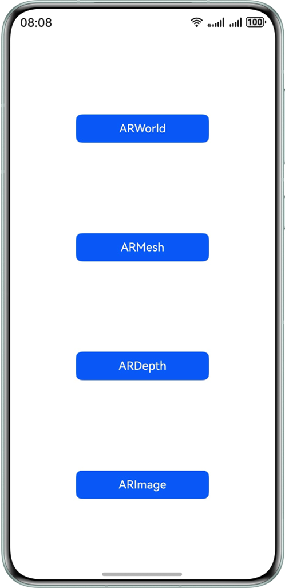
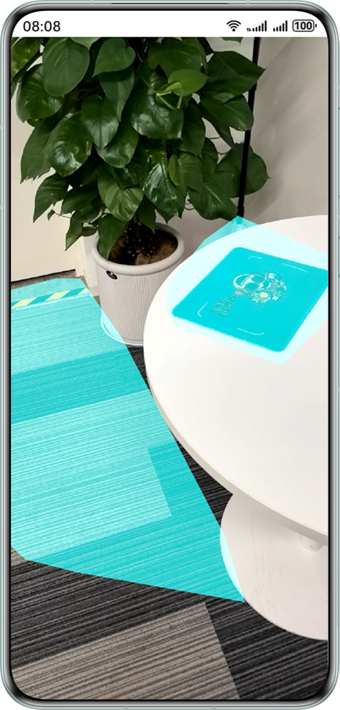
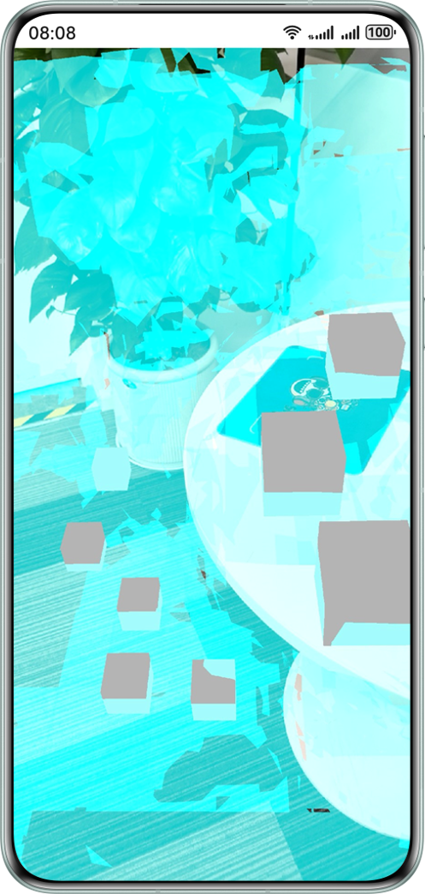
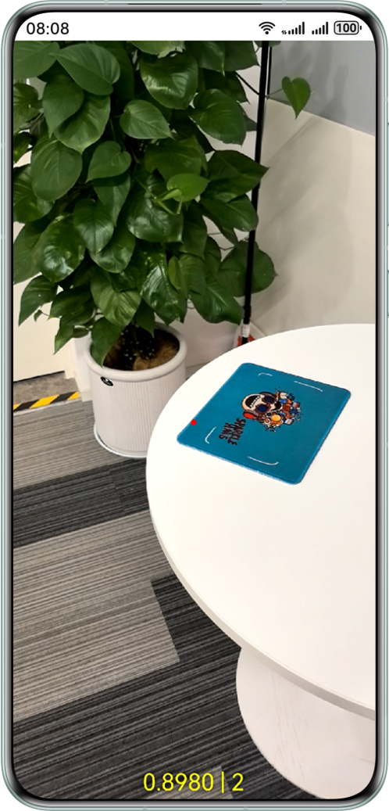
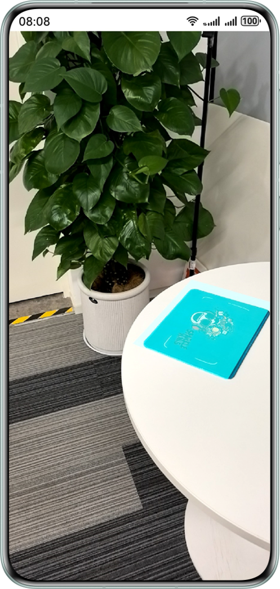

# 基于AR引擎实现空间感知能力（ArkTS）

## 介绍

AR Engine（以下统称AR引擎）助力应用融合虚拟世界与现实世界，打造全新的视觉体验和交互方式。

本示例展示了AR引擎提供的平面检测，运动跟踪，环境跟踪和命中检测能力。

- 运动跟踪能力，可以实时获取设备在空间中任意时刻的位姿。
- 环境跟踪能力，可以跟踪设备周围的平面，辅助开发者实现虚拟物体以场景化的方式逼真地融入现实物理世界。
- 命中检测能力，可以通过点击终端设备屏幕选中现实环境中的兴趣点，与虚拟物体进行交互。

## 效果预览

### ARWorld效果预览

|           **应用首页**            |           **识别平面**            |        **通过命中检测显示模型**         |
|:-----------------------------:|:-----------------------------:|:-----------------------------:|
|  |  |  |

1. 在手机的主屏幕，点击“ARSampleArkts”，启动应用，在主界面可见“ARWorld”按钮。
2. 点击“ARWorld”按钮，拉起AR引擎的平面识别界面，对准地面，桌面，墙面等平面缓慢移动扫描，即可识别到平面并绘制到屏幕上。
3. 识别出平面后，点击平面上某个点，通过AR引擎提供的命中检测的能力，会在屏幕被点击位置放置一个3D模型。

### ARMesh效果预览

|           **应用首页**            |         **识别Mesh网格**         |        **通过命中检测显示模型**        |
|:-----------------------------:|:----------------------------:|:----------------------------:|
|  |  |  |

1. 在手机的主屏幕，点击“ARSampleArkts”，启动应用，在主界面可见“ARMesh”按钮。
2. 点击“ARMesh”按钮，拉起AR引擎平面识别界面，对准地面，桌面，墙面等平面缓慢移动扫描，即可绘制mesh网格到屏幕上。
3. 绘制出mesh网格后，点击网格上某个点，通过AR引擎提供的命中检测的能力，会在屏幕被点击位置放置一个3D模型。

### ARDepth效果预览

|            **应用首页**            |             **深度估计信息**             |
|:------------------------------:|:----------------------------------:|
|  |  |

1. 在手机的主屏幕，点击“ARSampleArkts”，启动应用，在主界面可见“ARDepth”按钮。
2. 开启深度深度估计模式，屏幕上即可看见深度估计信息及深度置信度信息。

### ARImage效果预览

|           **应用首页**            |            **Image模式选择**             |           **选取跟踪图片**           |       **跟踪图片（显示预览流）**        |
|:-----------------------------:|:------------------------------------:|:------------------------------:|:----------------------------:|
|  |  |  |  |

1. 在手机的主屏幕，点击“ARSampleArkts”，启动应用，在主界面可见“ARImage”按钮。
2. 选择添加图片跟踪或者使用本地数据库。
3. 若选择添加图片，则弹出图片添加窗口，否则直接进入下一步。
4. 开始跟踪目标图片，屏幕上可看见蓝色线框框选的目标图片。

## 使用说明

开发者使用DevEco Studio打开本工程，签名后直接在真机设备上运行即可。

## 工程目录

```cpp
├──entry/src/main
├──module.json5                                     // 模块的配置文件
├──ets                                              // ets代码区
│  ├──entryability
│  │  └──EntryAbility.ets                           // 程序入口类
│  ├──pages
│  │  ├──ARDepth.ets                                // ARDepth选择模式界面
│  │  ├──ARImage.ets                                // ARImage选择模式界面
│  │  ├──ARImageByAdd.ets                           // ARImage本地图片模式界面
│  │  ├──ARImageByDatabase.ets                      // ARImage本地数据库模式界面
│  │  ├──ARMesh.ets                                 // ARMesh界面
│  │  ├──ARWorld.ets                                // ARWorld界面
│  │  └──Selector.ets                               // 主界面
│  └──utils                                          // Util工具类
└──resources                                         // 资源文件目录
```

## 相关权限

1. 获取相机权限：ohos.permission.CAMERA。
2. 获取加速度传感器权限：ohos.permission.ACCELEROMETER。
3. 获取陀螺仪传感器权限：ohos.permission.GYROSCOPE。

## 约束与限制

1. 开发者可通过接口调用判断当前设备是否支持AR Engine。接口的调用参考方式如下：

```javascript
import { arViewController, ARView } from '@kit.AREngine';
import { BusinessError } from '@kit.BasicServicesKit';
@Component
struct ARTest {
  @State arContext?: arViewController.ARViewContext = undefined;
  build() {
    NavDestination() {
      RelativeContainer() {
        if (this.arContext) {
          ARView({ context: this.arContext })
        }
      }
    }
    .onAppear(() => {
      this.initARView()
    })
    .onWillDisappear(() => {
      this.arContext?.destroy();
    })
  }

  private initARView(): void {
    let context = new arViewController.ARViewContext()
    context.init().then(() => {
      this.arContext = context;
      console.info(`Succeeded in initializing ARView.`);
    }).catch((err: BusinessError) => {
      console.error(`Failed to init context. Code is ${err.code}, message is ${err.message}`);
    });
  }
}
```
若对应接口返回错误码为801，则表示AR Engine不支持当前设备。

2. 本实例支持的DevEco Studio版本：推荐DevEco Studio 5.1.0 Release及以上。
3. 本实例为Stage模型，支持的HarmonyOS SDK版本：推荐HarmonyOS 5.1.0 Release SDK及以上。

## AR Engine深度估计功能技术局限性及免责声明

1. 技术局限性声明：本功能提供的能力，涉及深度估计精度可能受以下因素影响：
   1. 环境光照条件（例如强光/弱光/反光场景）。
   2. 物体表面材质特性（例如透明/镜面/单色物体）。
   3. 设备硬件性能差异（例如摄像头/传感器参数）。
   4. 动态场景下的实时性限制等。
2. 免责声明：
   本深度估计仅提供功能，并不构成对产品的质量保证或任何承诺。开发者自主选择是否使用HarmonyOS提供的功能开发应用软件，开发者对应用软件的使用目的、
   效果和责任自行负责。若开发用于视障人士避障、残疾人辅助等场景的应用软件，开发者应承担开展多场景压力测试，并建立数据校验机制，特别在安全相关场景需
   部署冗余保障方案，并确保应用合法合规的开发和运营。HarmonyOS不承担由此产生的任何直接或间接责任。

   深度估计提供的功能：
   1. 不作为医疗设备或生命安全系统设计。
   2. 未经认证，不作为医疗辅助设备；不作为医疗器材；未经无障碍设施认证或生命安全认证。

## 更新日志

### 1.0.0版本更新功能介绍

1. ARWorld能力上线。<br>
   平面识别、碰撞检测、物体摆放功能上线。
2. ARDepth能力上线。<br>
   深度估计、深度图渲染功能上线。
3. ARMesh能力上线。<br>
   网格扫描、网格图绘制能力上线。
4. ARImage能力上线。<br>
   图像跟踪能力上线，开发者可通过本地图片检测环境目标特征点。

## 相关文档

[AREngine开发指南](https://developer.huawei.com/consumer/cn/doc/harmonyos-guides/ar-engine-kit-guide)

[AREngine API参考](https://developer.huawei.com/consumer/cn/doc/harmonyos-references/ar-engine-api)
