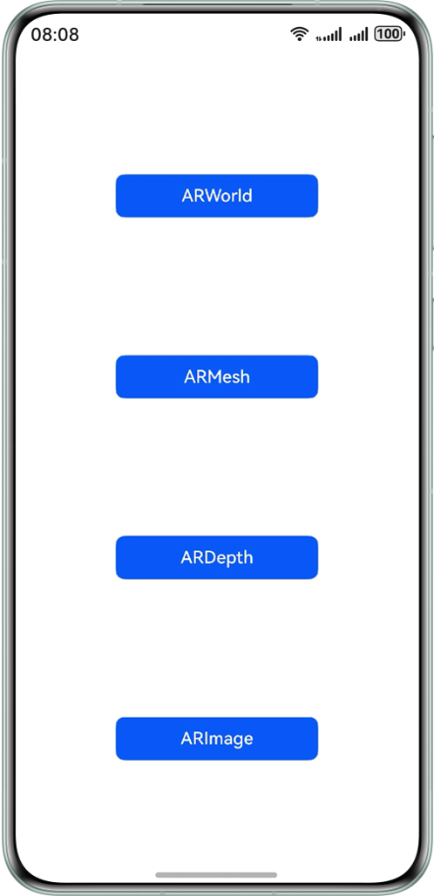
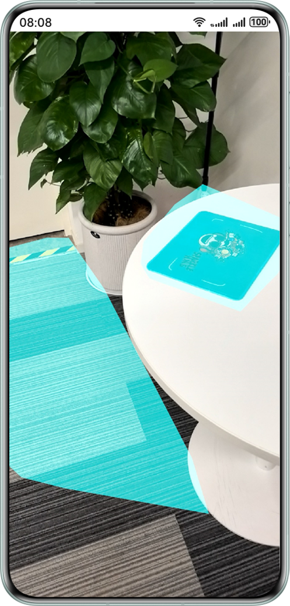
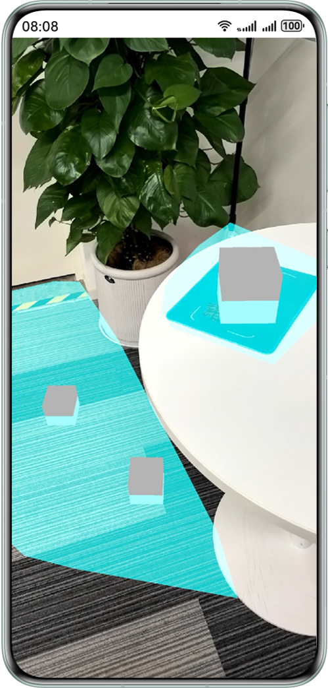
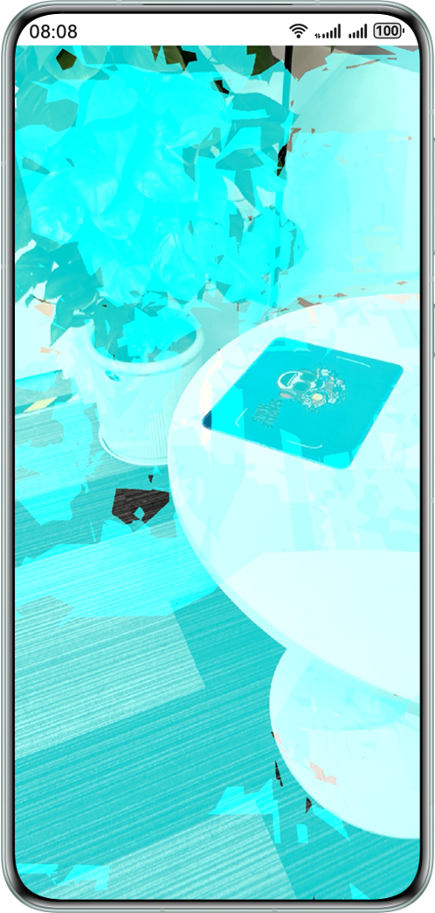
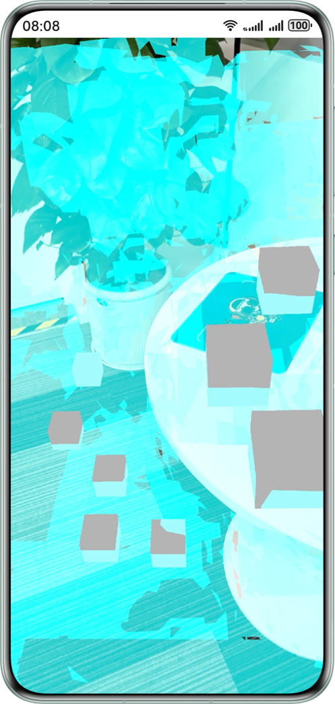
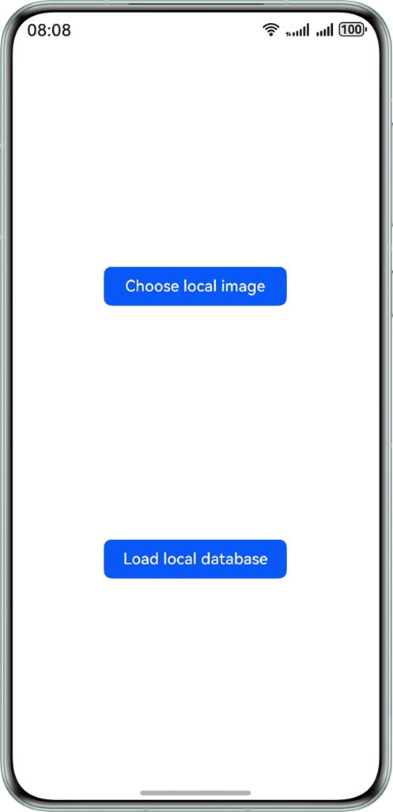
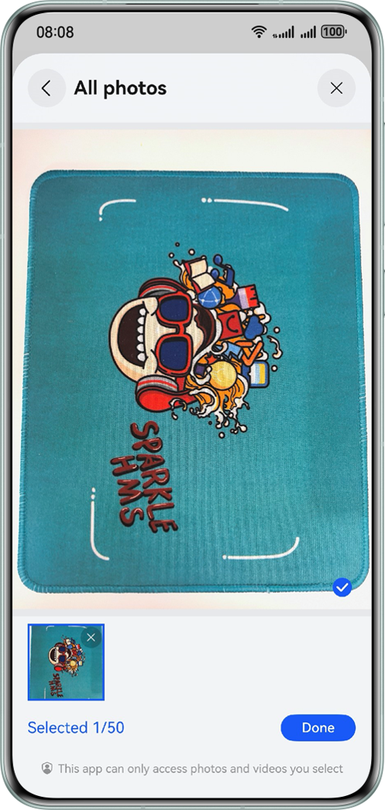
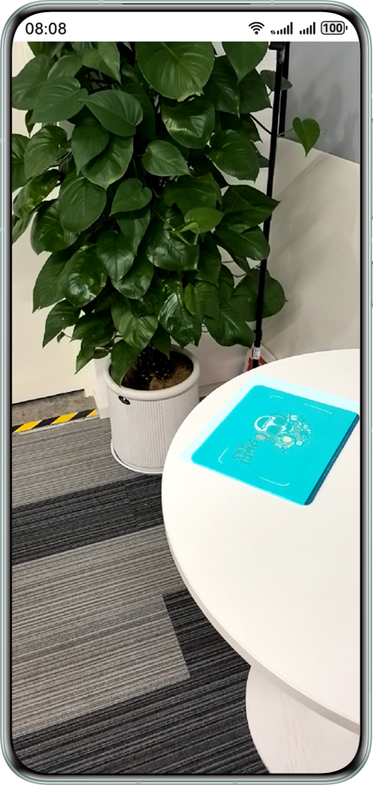

# Spatial Awareness Capability Based on AR Engine (ArkTS)

## Overview

AR Engine offers AR capabilities for apps to merge the virtual world with the real world, offering consumers a new
visual experience and way of interaction.

This sample code illustrates the plane detection, motion tracking, environment tracking, and hit testing capabilities
provided by AR Engine.

- Motion tracking capability: Obtains the pose of a device at any time in space in real time.
- Environment tracking capability: Tracks planes around the device, for naturally integrating virtual objects into
  the physical world.
- Hit testing capability: Allow users to select points of interest (POIs) in the real environment by tapping on
  the device screen, to interact with virtual objects.

## Preview

### ARWorld preview

|       **App home page**       |      **Recognize plane**      | **Display model through hit testing** |
|:-----------------------------:|:-----------------------------:|:-------------------------------------:|
|  |  |          |

1. On the home screen of your phone, tap **ARSampleArkts** to start the app. You'll find an **ARWorld** button on the app
   home screen.
2. Tap **ARWorld** to start the plane recognition screen of AR Engine. Slowly move your phone while pointing it at the
   ground, table, wall, or other flat surfaces to scan for planes.Recognized planes will be drawn on the screen.
3. Tap any point on an identified plane and a 3D model will be placed at the tapped position on the screen using the
   hit testing capability of AR Engine.

### ARMesh preview

|      **App home screen**      |      **Recognize mesh**      | **Display model through hit testing** |
|:-----------------------------:|:----------------------------:|:-------------------------------------:|
|  |  |           |

1. On the home screen of your phone, tap **ARSampleArkts** to start the app. You'll find an **ARMesh** button on the app
   home screen.
2. Tap **ARMesh** to start the plane recognition screen of AR Engine. Slowly move your phone while pointing it at the
   ground, table, wall, or other flat surfaces to scan for planes. The mesh will be drawn on the screen.
3. Tap any point on the mesh and a 3D model will be placed at the tapped position on the screen using the hit testing
   capability of AR Engine.

### ARDepth preview

|      **App home screen**      |     **Depth estimation info**      |
|:-----------------------------:|:----------------------------------:|
|  |  |

1. On the home screen of your phone, tap **ARSampleArkts** to start the app. You'll find an **ARDepth** button on the app
   home screen.
2. Enable depth estimation, and the depth estimation information and depth confidence information will be displayed on
   the screen.

### ARImage preview

|      **App home screen**      |             **Select mode**             |    **Select tracking images**     | **Display tracking image(show preview stream)** |
|:-----------------------------:|:---------------------------------------:|:---------------------------------:|:-----------------------------------------------:|
|  |  |  |                     |

1. On the home screen of your phone, tap **ARSampleArkts** to start the app. You'll find an **ARImage** button on the app
   home screen.
2. Choose to add a local image or load local database.
3. If you choose to add a local image, the image adding screen will be displayed. Otherwise, this step is skipped.
4. The tracking starts for the target image, which is framed in blue.

## Usage Instructions

Developers can open this project using DevEco, sign it, and directly run it on a real device.

## Project Directory

```cpp
├──entry/src/main
├──module.json5                                     // Module configuration file
├──ets                                              // ETS code area
│  ├──entryability
│  │  └──EntryAbility.ets                           // Entry point class
│  ├──pages
│  │  ├──ARDepth.ets                                // ARDepth screen
│  │  ├──ARImage.ets                                // ARImage mode selection screen
│  │  ├──ARImageByAdd.ets                           // ARImage local image mode screen
│  │  ├──ARImageByDatabase.ets                      // ARImage local database mode screen
│  │  ├──ARMesh.ets                                 // ARMesh screen
│  │  ├──ARWorld.ets                                // ARWorld screen
│  │  └──Selector.ets                               // Home screen
│  └──utils                                         // Utility class
└──resources                                        // Directory of resource files
```

## Required Permissions

1. Camera permission: **ohos.permission.CAMERA**
2. Accelerometer sensor permission: **ohos.permission.ACCELEROMETER**
3. Gyroscope permission: **ohos.permission.GYROSCOPE**

## Constraints

1. Developers can use interface calls to determine whether the current device supports AR Engine.
   The interface is called in the following way:

```javascript
import { arViewController, ARView } from '@kit.AREngine';
import { BusinessError } from '@kit.BasicServicesKit';
@Component
struct ARTest {
  @State arContext?: arViewController.ARViewContext = undefined;
  build() {
    NavDestination() {
      RelativeContainer() {
        if (this.arContext) {
          ARView({ context: this.arContext })
        }
      }
    }
    .onAppear(() => {
      this.initARView()
    })
    .onWillDisappear(() => {
      this.arContext?.destroy();
    })
  }

  private initARView(): void {
    let context = new arViewController.ARViewContext()
    context.init().then(() => {
      this.arContext = context;
      console.info(`Succeeded in initializing ARView.`);
    }).catch((err: BusinessError) => {
      console.error(`Failed to init context. Code is ${err.code}, message is ${err.message}`);
    });
  }
}
```
If the error code returned by the corresponding interface is 801, AR Engine does not support the current device.

2. It is recommended that DevEco Studio 5.1.0 Release or later be used.
3. This sample is based on the stage model. It is recommended that HarmonyOS 5.1.0 Release SDK or later be used.

## AR Engine Depth Estimation Technology Limitations and Disclaimer

1. Technology limitations: The capabilities provided by this feature may have their depth estimation accuracy influenced
   by the following factors:
   1. Ambient lighting conditions (such as strong light, low light, or reflective environments).
   2. Surface material characteristics of objects (such as transparency, mirror-like surfaces, or uniform colors).
   3. Differences in device hardware performance (such as variations in camera/sensor parameters).
   4. Real-time limitations in dynamic scenes, among others.
2. Disclaimer:
   This depth estimation feature is provided solely for functionality and does not constitute a warranty regarding
   product quality or any other commitments. Developers have the sole discretion to decide whether to use
   the functionalities offered by HarmonyOS in developing their apps, and they are entirely responsible for the apps'
   intended purpose, performance, and any associated liabilities. If an app is developed for scenarios such as obstacle
   avoidance for visually impaired individuals or assistance for persons with disabilities, developers must conduct
   extensive multi-scenario stress testing and implement a data validation mechanism. Particularly in safety-related
   contexts, redundant safeguards should be deployed, and it must be ensured that the app is developed and operated in
   full compliance with legal and regulatory requirements. HarmonyOS shall not bear any direct or indirect liability
   arising from such use.

   Additional note on depth estimation functionality:
   1. The depth estimation functionality is not designed as a medical device or life safety system.
   2. Without the proper certifications, the depth estimation functionality should not be used as a medical assistive
      device. It is not intended for use as medical equipment. It also hasn't been approved to meet accessibility or
      life safety standards.

## Change log

### Features of Version 1.0.0 Update

1. **ARWorld** capability launched.<br>
   Plane recognition, collision detection, and object placement features are now available.
2. **ARDepth** capability launched.<br>
   Depth estimation and depth map rendering features are now available.
3. **ARMesh** capability launched.<br>
   Mesh scanning and mesh map rendering capabilities are now available.
4. **ARImage** capability launched.<br>
   Image tracking capability is now available, enabling developers to detect environmental target feature points via
   local images.

## Related documents

[AREngine Development Guide](https://developer.huawei.com/consumer/en/doc/harmonyos-guides/ar-engine-kit-guide)

[AREngine API Reference](https://developer.huawei.com/consumer/en/doc/harmonyos-references/ar-engine-api)
