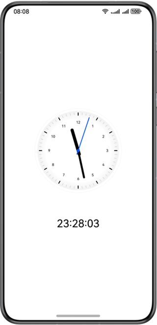

# Simple Clock

### Overview

This sample describes how to implement a simple clock app with the **@ohos.display** API and Canvas component.

### Preview

| Home page                                  |
|--------------------------------------|
|  |

How to Use

1. The UI uses **setInterval** to update the time at regular intervals and uses **Canvas** to draw the clock, where the rotation angles of the clock hands are obtained through calculation.

For example, **2 * Math.PI / 60 * second** indicates the rotation angle of the second hand.

### Project Directory
```
├──entry/src/main/ets                         // Code area
│  ├──common
│  │  └──CommonConstants.ets                  // Common constants
│  ├──entryability
│  │  └──EntryAbility.ets 
│  ├──pages
│  │  └──Index.ets                            // Home page
│  └──utils
│     ├──DrawClock.ets                        // Clock Drawing util
│     └──Logger.ets                           // Logger util
└──entry/src/main/resources                   // App resource directory
```
### How to Implement

* In this sample, the method for displaying a simple clock is encapsulated in **Index**. For details about the source code, see [Index.ets](entry/src/main/ets/pages/Index.ets).
    * Set the clock face size: Call the **display.getDefaultDisplay()** method in the index file to obtain the device width and height and calculate the clock face size.
    * Obtain the current time: Call the **updateTime** function and execute **new Date().getHours()**, **new Date().getMinutes()**, and **new Date().getSeconds()**.
    * Draw the clock face content: Use **CanvasRenderingContext2D** to draw the clock face background, hour hand, minute hand, second hand, circle center, and text below the clock face.
    * Start the clock: Add the **setInterval** timer and execute the **updateTime** function every 1s.

### Required Permissions

N/A

### Dependencies

N/A

### Constraints

1. The sample app is supported only on Huawei phones running the standard system.

2. The HarmonyOS version must be HarmonyOS 5.0.5 Release or later.

3. The DevEco Studio version must be DevEco Studio 5.0.5 Release or later.

4. The HarmonyOS SDK version must be HarmonyOS 5.0.5 Release SDK or later.
