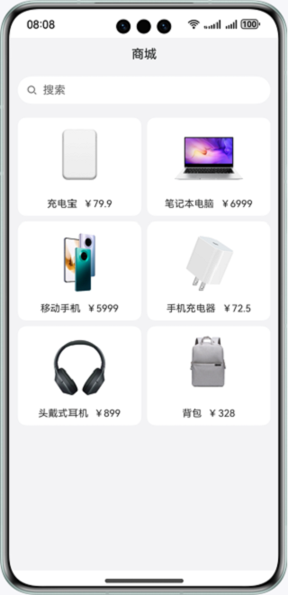

# 基于ArkWeb实现系统原生组件渲染至H5页面上

### 介绍

该方案展示了采用ArkWeb进行同层渲染的示例，可以将系统原生组件的内容直接渲染到前端H5页面上，原生组件不仅提供了H5组件无法实现的一些功能，还能提升流畅度，并增强用户的体验感。

### 效果图预览



**使用说明**

进入页面即可看到同层渲染效果，Text，Image都是原生组件。

### 高性能知识点

ArkWeb同层渲染原生组件，原生组件不仅可以提供H5组件无法实现的一些功能，还能提升用户体验的流畅度；同层渲染节点上下树，实现节点复用，节省节点重复开销。

### 工程结构&模块类型
```
├──entry/src/main/ets/
│  ├──entryability
│  │  └──EntryAbility.ets                    // 配置类
│  ├──model
│  │  └──GoodsModel.ets                      // 类型声明
│  ├──pages
│  │  └──Index.ets                           // 程序入口类
│  └──viewmodel
│     └──GoodsViewModel.ets                  // 模拟数据类
└──entry/src/main/resource                   // 应用静态资源目录
```
### 相关权限

- 允许应用使用Internet网络权限：ohos.permission.INTERNET。

### 约束与限制

1. 本示例仅支持标准系统上运行，支持设备：华为手机。

2. HarmonyOS系统：HarmonyOS 5.0.5 Release及以上。

3. DevEco Studio版本：DevEco Studio 5.0.5 Release及以上。

4. HarmonyOS SDK版本：HarmonyOS 5.0.5 Release SDK及以上。