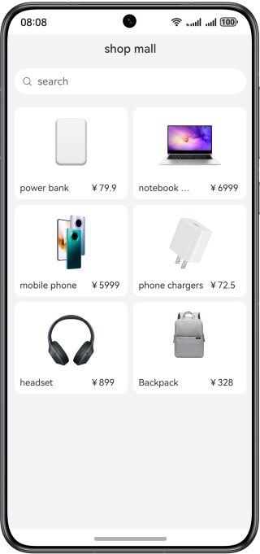

# Same-level Rendering of ArkWeb

### Overview

This sample shows how to use the same-level rendering of ArkWeb. The native components of the system are directly rendered to the front-end HTML5 page. They not only provide some functions that cannot be implemented by the HTML5 components, but also improve user experience.

### Preview



**How to Use**

View the rendering effect at the same level on the page. **Text** and **Image** are native components.

### High-Performance Knowledge

The native same-level rendering components of ArkWeb not only provide some functions that cannot be implemented by HTML5 components, but also improve user experience. By rendering nodes at the same level, you can reuse nodes and reduce repeated node overhead.

### Project Directory
```
├──entry/src/main/ets/
│  ├──entryability
│  │  └──EntryAbility.ets                    // Configuration class
│  ├──model
│  │  └──GoodsModel.ets                      // Type declaration
│  ├──pages
│  │  └──Index.ets                           // Entry point class
│  └──viewmodel
│     └──GoodsViewModel.ets                  // Simulated data class
└──entry/src/main/resource                   // Static resources of the app
```
### Required Permissions

- **ohos.permission.INTERNET**, which allows an app to access the Internet.

### Constraints

1. The sample app is supported only on Huawei phones running the standard system.

2. The HarmonyOS version must be HarmonyOS 5.0.5 Release or later.

3. The DevEco Studio version must be DevEco Studio 5.0.5 Release or later.

4. The HarmonyOS SDK version must be HarmonyOS 5.0.5 Release SDK or later.
