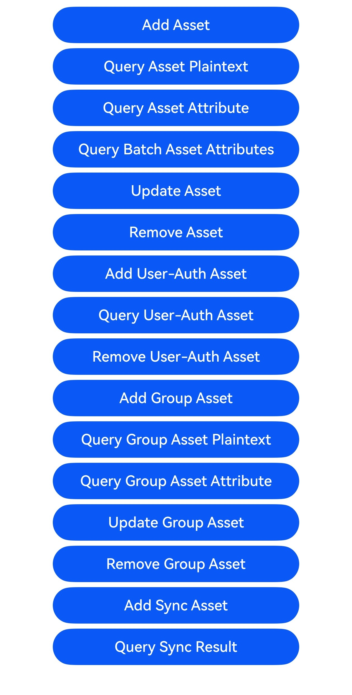
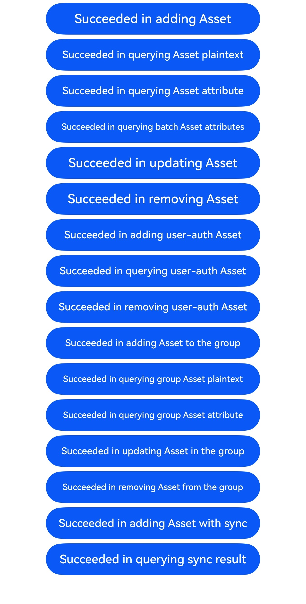

# Asset Store Kit开发指导(ArkTS)

### 介绍

Asset Store Kit（关键资产存储开发套件）包含了关键资产存储服务（ASSET）开放的接口能力集合，提供了用户短敏感数据的安全存储及管理能力。其中，短敏感数据可以是密码类（账号/密码）、Token类（应用凭据）、关键明文（如银行卡号）等长度较短的用户敏感数据。

本示例主要展示了Asset Store Kit开发指导(ArkTS)中新增关键资产、删除关键资产、更新关键资产、查询关键资产等场景。该工程中展示的代码详细描述可查如下链接中业务扩展场景介绍部分。

- [新增关键资产(ArkTS)](https://docs.openharmony.cn/pages/v6.0/zh-cn/application-dev/security/AssetStoreKit/asset-js-add.md)
- [删除关键资产(ArkTS)](https://docs.openharmony.cn/pages/v6.0/zh-cn/application-dev/security/AssetStoreKit/asset-js-remove.md)
- [更新关键资产(ArkTS)](https://docs.openharmony.cn/pages/v6.0/zh-cn/application-dev/security/AssetStoreKit/asset-js-update.md)
- [查询关键资产(ArkTS)](https://docs.openharmony.cn/pages/v6.0/zh-cn/application-dev/security/AssetStoreKit/asset-js-query.md)
- [查询需要用户的关键资产(ArkTS)](https://docs.openharmony.cn/pages/v6.0/zh-cn/application-dev/security/AssetStoreKit/asset-js-query-auth.md)
- [管理群组关键资产(ArkTS)](https://docs.openharmony.cn/pages/v6.0/zh-cn/application-dev/security/AssetStoreKit/asset-js-group-access-control.md)
- [同步（备份恢复）关键资产(ArkTS)](https://docs.openharmony.cn/pages/v6.0/zh-cn/application-dev/security/AssetStoreKit/asset-js-sync.md)

### 效果预览

| 首页效果图                                                   | 执行结果图                                                   |
| ------------------------------------------------------------ | ------------------------------------------------------------ |
|  |  |

### 使用说明

1. 运行Index主界面。
2. 页面呈现为上述首页效果图，点击对应文本的按钮可以管理关键资产，其中'Query User-Auth Asset'按钮需要设置锁屏密码才能查询成功。

### 工程目录

```
entry/src/
 ├── main
     ├── ets
     │   ├── entryability
     │   ├── entrybackupability
     │   ├── operations                    // Asset Store Kit开发指导(ArkTS)示例代码
     │       ├── add.ets
     │       ├── add_auth.ets
     │       ├── add_group.ets
     │       ├── index.ets
     │       ├── query.ets
     │       ├── query_auth.ets
     │       ├── query_group.ets
     │       ├── remove.ets
     │       ├── remove_auth.ets
     │       ├── remove_group.ets
     │       ├── sync.ets
     │       ├── update.ets
     │       ├── update_group.ets
     │   ├── pages
     │       ├── Index.ets
     ├── module.json5
     └── resources
```

### 相关权限

ohos.permission.ACCESS_BIOMETRIC

### 依赖

不涉及。

### 约束与限制

1.本示例仅支持标准系统上运行，支持设备：华为手机。

2.HarmonyOS系统：HarmonyOS 6.0.0及以上。

3.DevEco Studio版本：DevEco Studio 6.0.0 Release及以上。

4.HarmonyOS SDK版本：HarmonyOS 6.0.0 Release SDK及以上。