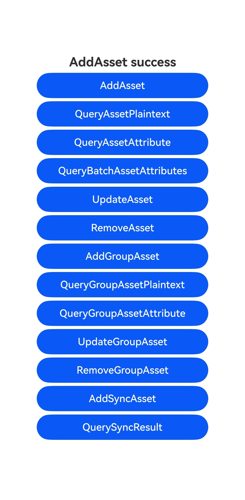
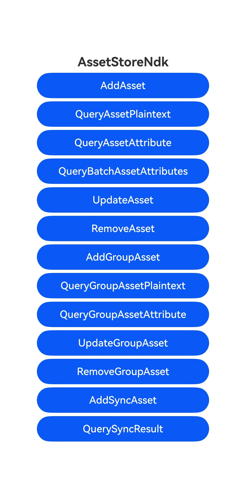

# Asset Store Kit Development (C/C++)

### Introduction

Asset Store Kit (ASSET for short) provides a series of open APIs to securely store and manage short sensitive data, including but not limited to passwords (accounts/passwords), tokens (application credentials), and important plaintext (such as bank card numbers).

This sample primarily demonstrates scenarios from the Asset Store Kit Development (C/C++), including adding, deleting, updating, and querying assets. The detailed description of the code demonstrated in this project can be found via the following links.

- [Adding an Asset (C/C++)](https://docs.openharmony.cn/pages/v6.0/en/application-dev/security/AssetStoreKit/asset-native-add.md)
- [Removing Assets (C/C++)](https://docs.openharmony.cn/pages/v6.0/en/application-dev/security/AssetStoreKit/asset-native-remove.md)
- [Updating an Asset (C/C++)](https://docs.openharmony.cn/pages/v6.0/en/application-dev/security/AssetStoreKit/asset-native-update.md)
- [Querying Assets (C/C++)](https://docs.openharmony.cn/pages/v6.0/en/application-dev/security/AssetStoreKit/asset-native-query.md)
- [Managing Assets in a Group (C/C++)](https://docs.openharmony.cn/pages/v6.0/en/application-dev/security/AssetStoreKit/asset-native-group-access-control.md)
- [Syncing Assets (Backup and Restore) (C/C++)](https://docs.openharmony.cn/pages/v6.0/en/application-dev/security/AssetStoreKit/asset-native-sync.md)

### Preview

| Home Page                                                   | Execution Result                                                   |
| ------------------------------------------------------------ | ------------------------------------------------------------ |
|  |  |

### How to Use

1. Run the app.
2. The page will display the effect shown in the Home Page above. Click the buttons to manage assets correspondingly.

### Project Directory

```
entry/src/
 ├── main
     ├── cpp
     │   ├── types
     │       ├── libentry
     │       |   ├── index.d.ts
     │   ├── CMakeLists.txt
     │   ├── napi_init.cpp               // Asset Store Kit Development (C/C++) Sample Code
     ├── ets
     │   ├── entryability
     │   ├── entrybackupability
     │   ├── pages
     │       ├── Index.ets
     ├── module.json5
     └── resources
```

### Required Permissions

N/A

### Dependencies

N/A

### Constraints and Limitations

1.The sample app is supported only on Huawei phones running the standard system.

2.The HarmonyOS version must be HarmonyOS 6.0.0 or later.

3.The DevEco Studio version must be DevEco Studio 6.0.0 Release or later.

4.The HarmonyOS SDK version must be HarmonyOS 6.0.0 Release or later.