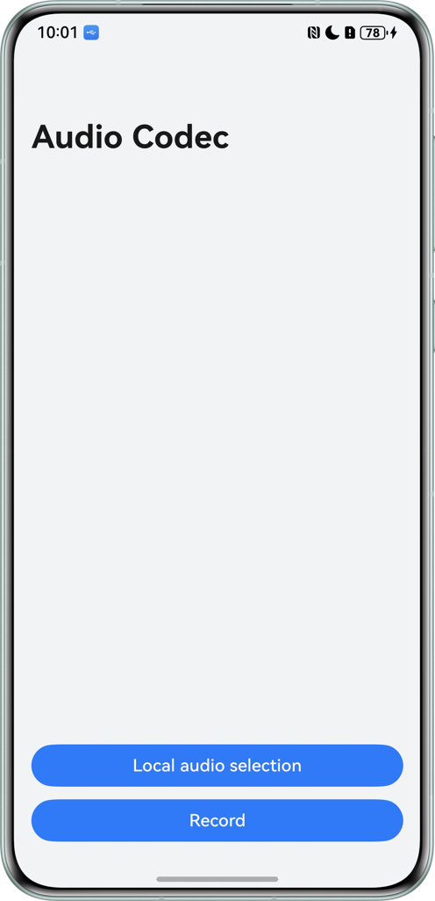

# OH_AVCodec-Based Video Codec

## Overview
This sample demonstrates how to implement audio playback, compression, conversion, and recording using OH_AVCodec and OH_Audio. You can record audio with the native-layer audio capturer, and use the encoder, decoder, demuxer, and muxer to enable audio playback and transcoding. This sample helps develop applications requiring codec for audio playback and recording.

- Main audio playback process: Select a local audio file -> Demux -> Decode -> Play
- Main audio transcoding process: Select a local audio file -> Demux -> Decode -> Encode -> Mux -> Save the file locally
- Main audio recording process: Microphone capture -> Encode -> Mux -> Save the file locally

## Effect
| Home Page                                            | Usage                                           |
|--------------------------------------------------|--------------------------------------------------|
|  |  | 


## How to Use

### Recording

1. Tap Record. A dialog box is displayed, where you can allow AudioCodec to access your microphone.
2. Then, in dialogs displayed, choose the recording format, target format, and the file path and name.
3. Tap the pause icon to pause recording, the resume icon to continue, and the red icon again to stop.
4. Once you stop the recording, a dialog will pop up asking if you want to save the recording locally. Tap confirm, wait for 3 seconds, and exit the recording screen.

### Playback
1. Tap the Local audio selection button to select the audio file to be played. Tap the play icon to start playing, and tap the pause icon to pause the playback.
2. Tap Transcoding, select the format to be transcoded, choose the file path and file name, and confirm. In the dialog box asking you whether to save the file locally, tap confirm.

## Project Directory

```
├──entry/src/main/cpp                    // Native layer
│  ├──capbilities
│  │  ├──include
│  │  │  ├──AudioCapturer.h              // Audio capture interface definition
│  │  │  ├──AudioDecoder.h               // Audio decoding interface definition
│  │  │  ├──AudioEncoder.h               // Audio encoding interface definition
│  │  │  ├──AVCodecSampleError.h         // Log parameter interface definition
│  │  │  ├──Demuxer.h                    // Demuxing interface definition
│  │  │  ├──Muxer.h                      // Muxing interface definition
│  │  │  ├──SampleCallback.h             // Codec callback interface definition
│  │  │  └──SampleInfo.h                 // Common classes for functionality implementation 
│  │  └──src 
│  │     ├──AudioCapturer.cpp            // Audio capture implementation
│  │     ├──AudioDecoder.cpp             // Audio decoding implementation
│  │     ├──AudioEncoder.cpp             // Audio encoding implementation
│  │     ├──Demuxer.cpp                  // Demuxing implementation
│  │     ├──Muxer.cpp                    // Muxing implementation
│  │     └──SampleCallback.cpp           // Codec callback implementation 
│  ├──player
│  │  ├──include
│  │  │  ├──Player.h                     // Player interfaces at the native layer
│  │  │  ├──PlayerNative.h               // Player entry at the native layer 
│  │  │  ├──Summary.h                    // Transcoding entry at the native layer
│  │  │  └──Transcoding.h                // Configuration entry at the native layer
│  │  └──src
│  │     ├──Player.cpp                   // Player implementation at the native layer
│  │     ├──PlayerNative.cpp             // Player entry at the native layer
│  │     ├──Summary.cpp                  // Transcoding entry at the native layer
│  │     └──Transcoding.cpp              // Configuration entry at the native layer 
│  │──recorder
│  │  ├──include
│  │  │  ├──Recorder.h                  // Recorder interfaces at the native layer
│  │  │  └──RecorderNative.h            // Recording entry at the native layer
│  │  └──src
│  │     ├──Recorder.cpp                // Recorder implementation at the native layer
│  │     └──RecorderNative.cpp          // Recorder entry at the native layer
│  ├──types
│  │  ├──libplayer                      // Interfaces exposed by the player to the UI layer
│  │  └──librecorder                    // Interfaces exposed by the recorder to the UI layer
│  └──CMakeLists.txt                    // CMake configuration file
├──ets                                  // UI layer
│  ├──common
│  │  ├──utils
│  │  │  └──Logger.ets                  // Log utility
│  │  │  └──MusicMetadataService.ets    // Audio metadata
│  │  └──CommonConstants.ets            // Common constants
│  ├──component
│  │  ├──SavePicker.ets                 // Saving format
│  │  └──SelectPicker.ets               // Recording parameters
│  ├──entryability                    
│  │  └──EntryAbility.ets
│  ├──entrybackupability            
│  │  └──EntryBackupAbility.ets     
│  └──pages
│     ├──BehaviorChoice.ets             // Playback and transcoding page
│     ├──Index.ets                      // Home page
│     └──Recorder.ets                   // Recording page
├──resources                            // Static resources
└──module.json5                         // Module configuration
```

## Required Permissions

1. ohos.permission.MICROPHONE: allows an application to use the microphone.

## Constraints

1. This sample is only supported on Huawei phones running standard systems.
2. The HarmonyOS version must be HarmonyOS 5.1.1 Release.
3. The DevEco Studio version must be DevEco Studio 5.1.1 Release.
4. The HarmonyOS SDK version must be HarmonyOS 5.1.1 Release SDK.