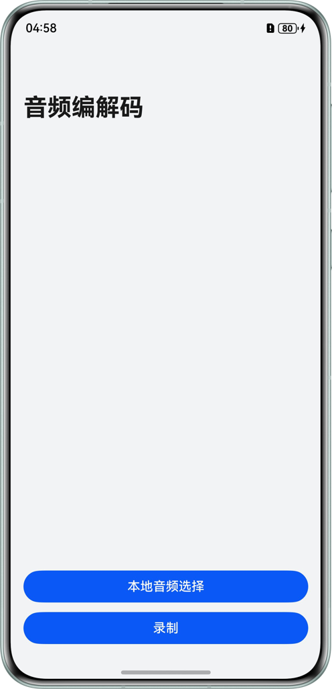

# 基于OH_AVCodec编解码能力实现音频编解码

## 项目简介
本示例基于OH_AVCodec编解码能力和OH_Audio能力，实现音频的播放、压缩、转换和录制等功能。通过调用Native侧的音频采集器实现音频的录制，通过编码器，解码器，以及封装和解封装，实现音频的播放和转码。基于本示例可帮助应用开发需要编解码进行音频播放和录制的场景。

- 音频播放的主要流程：选择本地音频->解封装->解码->播放
- 音频转码的主要流程：选择本地音频->解封装->解码->编码->封装->保存文件到本地
- 音频录制的主要流程：麦克风采集->编码->封装->保存文件到本地

## 效果预览
| 应用主界面                              | 应用使用展示                             |
|------------------------------------|------------------------------------|
|  |  | 


## 使用说明

### 录制

1. 点击“录制”按钮，弹出是否允许“AudioCodec”访问你的麦克风，点击“允许”。
2. 点击“允许”后，弹出选择录制格式，选好需要录制的格式后，弹出目标保存格式，选好保存格式后，弹出选择保存文件路径和文件名。
3. 点击“暂停”图标暂停录制，点击“继续”图标继续录制，再次点击红色图标终止录制。
4. 终止录制后，弹出是否保存到本地，点击“确定”，等待3秒后再退出录制界面。

### 播放
1. 点击“本地音频选择”按钮，选择要播放的音频文件，点击“播放”图标开始播放音频，点击“暂停”图标暂停播放音频。
2. 点击“转码”按钮，弹出转码格式，选好需要转码的格式后后，弹出选择保存文件路径和文件名，点击“确定”，弹出是否保存到本地，点击“确定”。

## 工程目录

```
├──entry/src/main/cpp                    // Native层
│  ├──capbilities
│  │  ├──include
│  │  │  ├──AudioCapturer.h              // 音频采集接口定义
│  │  │  ├──AudioDecoder.h               // 音频解码接口定义
│  │  │  ├──AudioEncoder.h               // 音频编码接口定义
│  │  │  ├──AVCodecSampleError.h         // 日志参数接口定义
│  │  │  ├──Demuxer.h                    // 解封装接口定义
│  │  │  ├──Muxer.h                      // 封装接口定义
│  │  │  ├──SampleCallback.h             // 编解码回调接口定义
│  │  │  └──SampleInfo.h                 // 功能实现公共类 
│  │  └──src 
│  │     ├──AudioCapturer.cpp            // 音频采集实现
│  │     ├──AudioDecoder.cpp             // 音频解码实现
│  │     ├──AudioEncoder.cpp             // 音频编码实现
│  │     ├──Demuxer.cpp                  // 解封装实现
│  │     ├──Muxer.cpp                    // 封装实现
│  │     └──SampleCallback.cpp           // 编解码回调实现 
│  ├──player
│  │  ├──include
│  │  │  ├──Player.h                     // Native层播放功能调用逻辑接口
│  │  │  ├──PlayerNative.h               // Native层 播放的入口
│  │  │  ├──Summary.h                    // Native层 转码的入口
│  │  │  └──Transcoding.h                // Native层 配置的入口
│  │  └──src
│  │     ├──Player.cpp                   // Native层播放功能调用逻辑的实现
│  │     ├──PlayerNative.cpp             // Native层 播放的入口
│  │     ├──Summary.cpp                  // Native层 转码的入口
│  │     └──Transcoding.cpp              // Native层 配置的入口 
│  │──recorder
│  │  ├──include
│  │  │  ├──Recorder.h                  // Native层录制功能调用逻辑的接口
│  │  │  └──RecorderNative.h            // Native层 录制的入口
│  │  └──src
│  │     ├──Recorder.cpp                // Native层录制功能调用逻辑的实现
│  │     └──RecorderNative.cpp          // Native层 录制的入口
│  ├──types
│  │  ├──libplayer                      // 播放模块暴露给UI层的接口
│  │  └──librecorder                    // 录制模块暴露给UI层的接口
│  └──CMakeLists.txt                    // cmake配置文件       
├──ets                                  // ui层
│  ├──common
│  │  ├──utils
│  │  │  └──Logger.ets                  // 日志工具
│  │  │  └──MusicMetadataService.ets    // 获取音频元数据
│  │  └──CommonConstants.ets            // 参数常量
│  ├──component
│  │  ├──SavePicker.ets                 // 保存格式
│  │  └──SelectPicker.ets               // 录制参数
│  ├──entryability                    
│  │  └──EntryAbility.ets
│  ├──entrybackupability            
│  │  └──EntryBackupAbility.ets     
│  └──pages
│     ├──BehaviorChoice.ets             // 播放转码页面
│     ├──Index.ets                      // 主页面
│     └──Recorder.ets                   // 录制页面
├──resources                            // 用于存放应用所用到的资源文件
└──module.json5                         // 模块配置信息
```

## 相关权限

1. ohos.permission.MICROPHONE:允许应用使用麦克风。

## 约束与限制

1. 本示例仅支持标准系统上运行，支持设备：华为手机。 
2. HarmonyOS系统：HarmonyOS 5.1.1 Release及以上。 
3. DevEco Studio版本：DevEco Studio 5.1.1 Release及以上。 
4. HarmonyOS SDK版本：HarmonyOS 5.1.1 Release SDK及以上。
