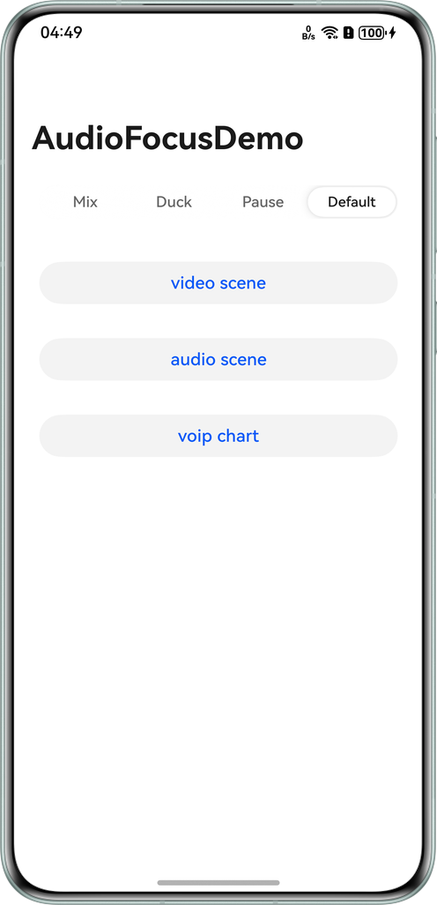
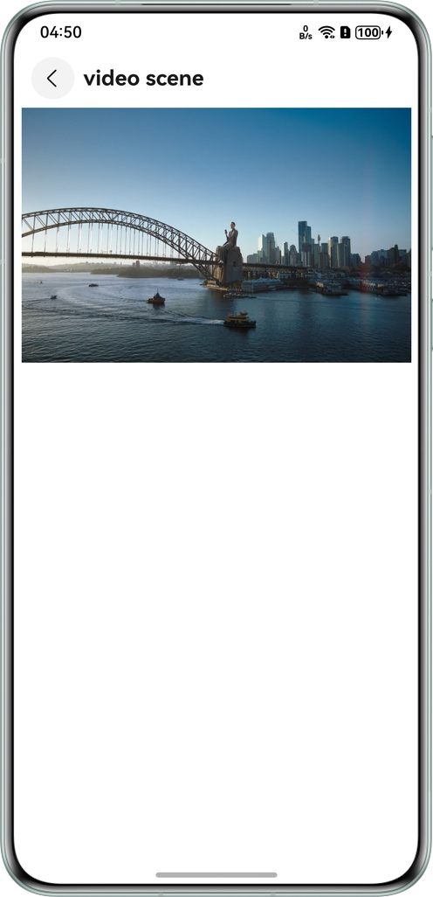
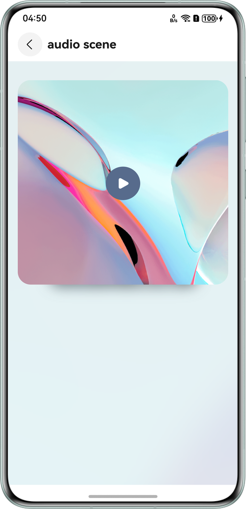
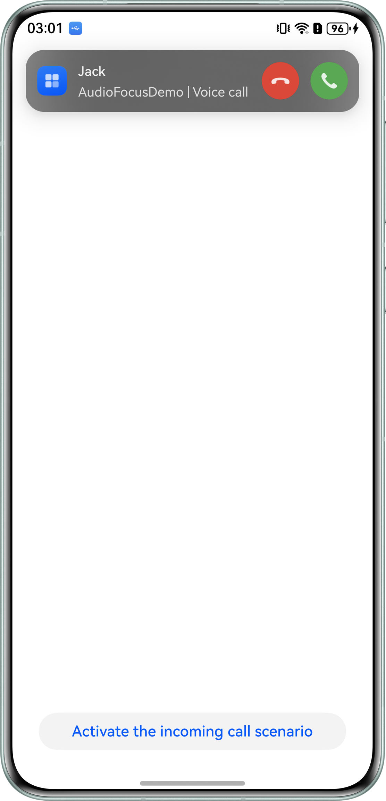
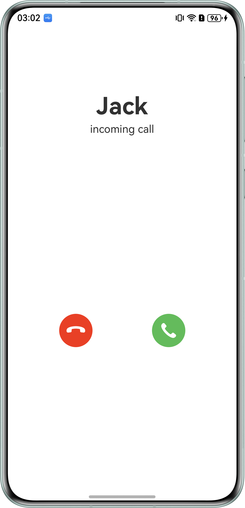
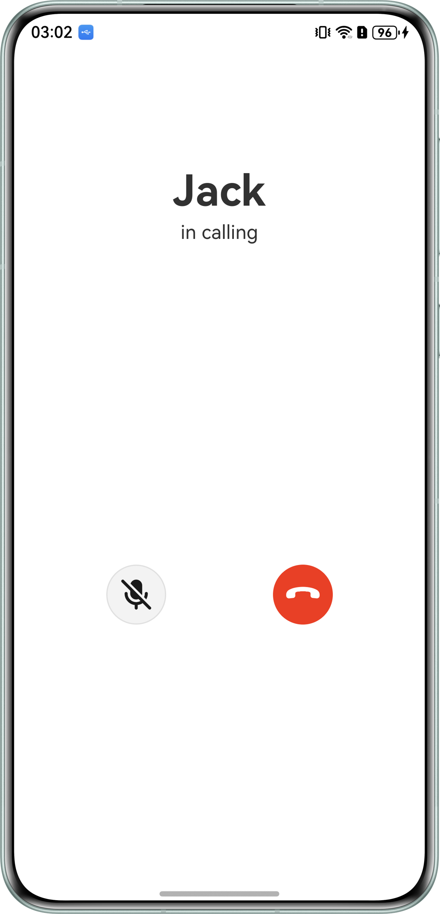

# Audio Focus Management

## Overview

This sample demonstrates video playback, music playback, and VoIP voice call based on capabilities such as **AudioRender**, **AudioCapturer**, **AVPlayer**, and **CallServiceKit**. These use cases highlight the audio stream type selection, audio focus interrupt event processing, **AudioSession** custom focus strategies, and **AVSession** background playback control. You can use other third-party audio applications on the device to experience the handling of audio conflicts between the applications and this sample.

## Preview

| Home Page                                                                                 | Video Playback Page                                              | Music Playback Page                                              |
|-------------------------------------------------------------------------------------------|----------------------------------------------------|----------------------------------------------------|
|                                           |  |  |
| 1. Select **audio** scene.<br>2. Select **AudioSession** to customize the focus strategy. | 1. Play local videos using the **AVPlayer**. <br>2. After a video is paused, touch the video screen to resume the playback.        | Play local music using **AudioRender**.                                |

| VoIP Call Dialing Page                                      | VoIP Call Incoming Page                                      | VoIP Call Page                                          |
|--------------------------------------------------|--------------------------------------------------|----------------------------------------------------|
|  |  |  |
| 1. Touch the button at the bottom of the page to make a voice call.<br>2. **CallServiceKit** displays incoming call banners.      | Touch the banner to go to the new **UIAbility** incoming call page.                            | VoIP call page.                                         |

## Project Directory

```
├───entry/src/main/ets 
│   ├───audioscene 
│   │   └───AudioScene.ets                  // Audio playback scene page 
│   ├───commonutils                           
│   │   ├───AudioCapturerController.ets     // Audio recording controller 
│   │   ├───AudioRenderController.ets       // Audio playback controller 
│   │   ├───AVPlayerController.ets          // AVPlayer controller 
│   │   ├───AVSessionController.ets         // Media Controller 
│   │   ├───Logger.ets       	            // Log utility 
│   │   └───MediaController.ets             // Media controller interface 
│   ├───customcomponent                                
│   │   └───CustomButton.ets                // Custom button 
│   ├───entryability                         
│   │   ├───EntryAbility.ets                // Entry ability lifecycle callbacks 
│   │   └───VoIPCallAbility.ets             // VoIP call ability lifecycle callbacks 
│   ├───entrybackupability                   
│   │   └───EntryBackupAbility.ets          // EntryBackupAbility lifecycle callbacks 
│   ├───pages                                
│   │   └───Index.ets                       // Home page 
│   ├───videoscene                                
│   │   └───VideoScene.ets                  // Video playback scenario page 
│   └───voipscene                                 
│       ├───VoIPCallPage.ets                // VoIP call page 
│       └───VoIPScene.ets                   // VoIP call activation page 
└───entry/src/main/resources                // Resources
```

## Required Permissions
1. **ohos.permission.KEEP_BACKGROUND_RUNNING**: Allows the application to run in the background.
2. **ohos.permission.MICROPHONE**: Allows the use of the microphone.
   
## Dependencies

N/A

## Constraints

1. This sample is only supported on Huawei phones running standard systems.
2. The HarmonyOS version must be HarmonyOS 5.0.5 Release or later.
3. The DevEco Studio version must be DevEco Studio 5.0.5 Release or later.
4. The HarmonyOS SDK version must be HarmonyOS 5.0.5 Release SDK or later.

