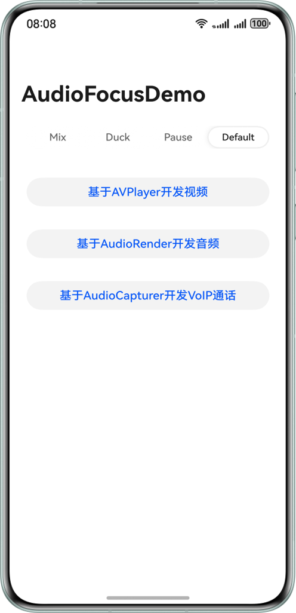
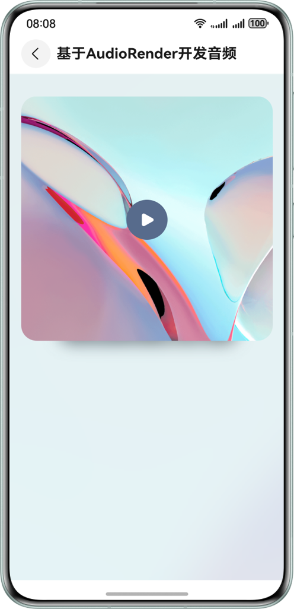
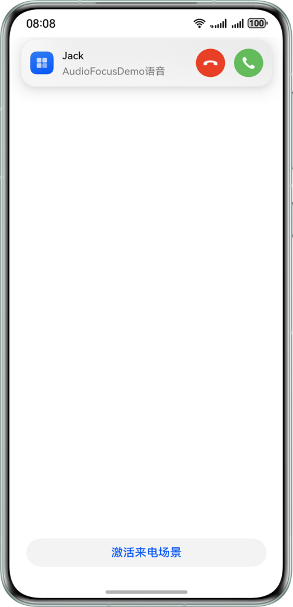
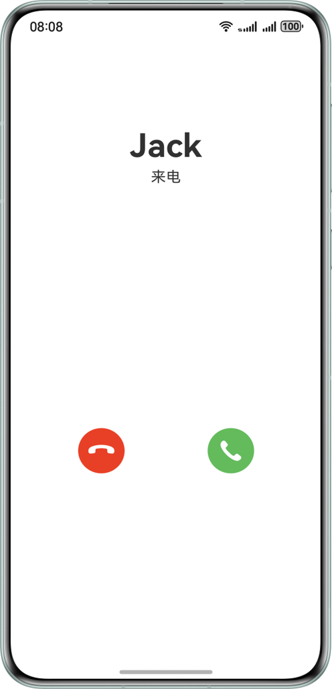
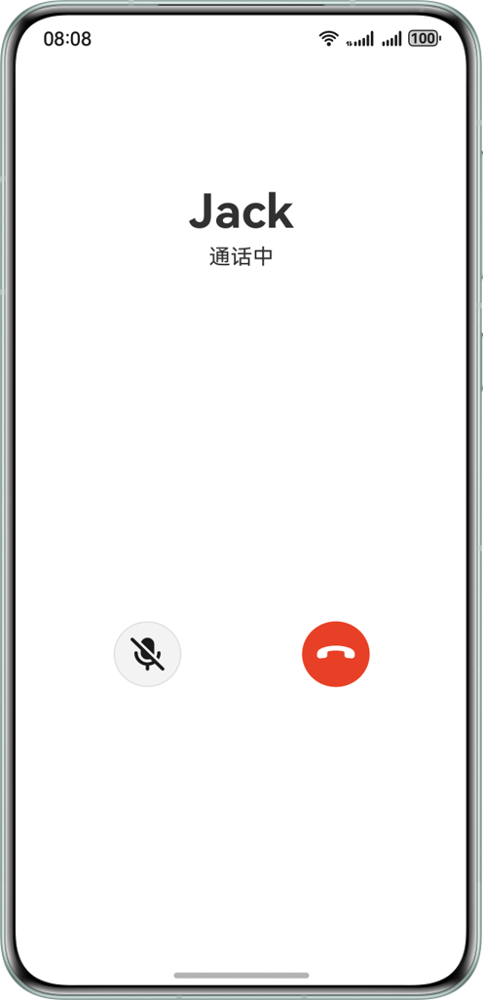

# 实现音频焦点管理功能

## 介绍

本示例基于AudioRender、AudioCapturer、AVPlayer以及CallServiceKit等能力，实现了视频播放、音乐播放以及VoIP语言通话场景。这些场景实现中重点突出了音频流类型选择、音频焦点中断事件处理、AudioSession自定义焦点策略以及AVSession后台播控。开发者可以使用设备上其它三方音频应用体验与本示例之间的音频冲突处理。

## 效果图预览

| 首页                                            | 视频播放页                                              | 音乐播放页                                              |
|-----------------------------------------------|----------------------------------------------------|----------------------------------------------------|
|  |  |  |
| 1、选择音频场景<br>2、选择AudioSession自定义焦点策略           | 1、通过AVPlayer播放本地视频<br>2、视频被暂停后，可以点击视频画面恢复播放        | 通过AudioRender播放本地音乐                                |

| VoIP语音通话拨打页                                      | VoIP语音通话来电页                                      | VoIP语音通话页                                          |
|--------------------------------------------------|--------------------------------------------------|----------------------------------------------------|
|  |  |  |
| 1、点击页面下方按钮，拨打语音通话<br>2、CallServiceKit展示来电横幅      | 点击横幅进入新的UIAbility来电页面                            | VoIP语音通话页面                                         |

## 工程结构&模块类型

```
├───entry/src/main/ets
│   ├───audioscene
│   │   └───AudioScene.ets                  // 音乐播放场景页
│   ├───commonutils                          
│   │   ├───AudioCapturerController.ets     // 音频录制控制器
│   │   ├───AudioRenderController.ets       // 音频播放控制器
│   │   ├───AVPlayerController.ets          // AVPlayer控制器
│   │   ├───AVSessionController.ets         // 播控中心控制器
│   │   ├───Logger.ets                      // 日志工具类
│   │   └───MediaController.ets      	    // 媒体控制器接口
│   ├───customcomponent                               
│   │   └───CustomButton.ets                // 自定义按钮
│   ├───entryability                        
│   │   ├───EntryAbility.ets                // Ability的生命周期回调内容
│   │   └───VoIPCallAbility.ets             // VoIP通话Ability的生命周期回调内容
│   ├───entrybackupability                  
│   │   └───EntryBackupAbility.ets          // Ability的生命周期回调内容
│   ├───pages                               
│   │   └───Index.ets                       // 首页
│   ├───videoscene                               
│   │   └───VideoScene.ets                  // 视频播放场景页
│   └───voipscene                                
│       ├───VoIPCallPage.ets                // VoIP语音通话场景页
│       └───VoIPScene.ets                   // VoIP语音通话激活页
└───entry/src/main/resources                // 资源目录          
```

## 相关权限

1. 后台任务权限：ohos.permission.KEEP_BACKGROUND_RUNNING

2. 麦克风使用权限：ohos.permission.MICROPHONE

## 模块依赖

不涉及

## 约束与限制

1. 本示例仅支持标准系统上运行，支持设备：华为手机。

2. HarmonyOS系统：HarmonyOS 5.0.5 Release及以上。

3. DevEco Studio版本：DevEco Studio 5.0.5 Release及以上。

4. HarmonyOS SDK版本：HarmonyOS 5.0.5 Release SDK及以上。