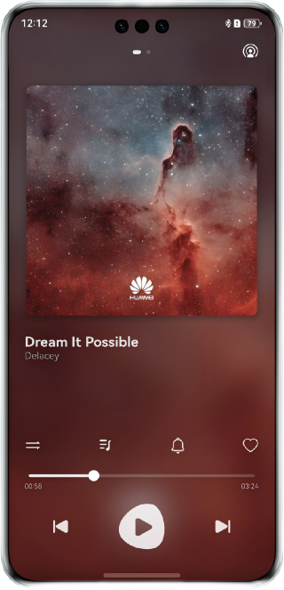
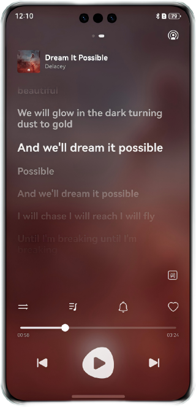

# Audio Playback Control Based on AudioRenderer

#### Overview

This sample demonstrates an audio app that implements audio playback control based on AudioRenderer. It provides the following features: background playback, interaction with the media controller, adaptation to different focus interruption policies, switching between routing sound devices, and switching between output devices.

#### Preview

| Home page                               | Lyrics page                              |
|-----------------------------------------|------------------------------------------|
|  |  |

#### Project Directory

```
├──entry/src/main/ets/
│  ├──common
│  │   ├──constants                     // Constants
│  │   └──utils                         // Utils
│  ├──components                        // Module components
│  │   ├──ControlAreaComponent.ets      // Components in the audio control area
│  │   ├──LyricsComponent.ets           // Lyrics components
│  │   ├──MusicInfoComponent.ets        // Music content components
│  │   ├──PlayerInfoComponent.ets       // Components in the playback control content area
│  │   └──TopAreaComponent.ets          // Top area components
│  ├──dataSource                        // Playlist data
│  │   ├──SongDataSource.ets            // Song data
│  │   └──SongListData.ets              // Song list data
│  ├──entryability
│  │   └──EntryAbility.ets              // Entry ability lifecycle callbacks
│  ├──entrybackupability
│  │   └──EntryBackupAbility.ets        // EntryBackupAbility lifecycle callbacks
│  ├──lyric                             // Lyrics
│  └──pages                             // Pages
├──MediaService/src/main/ets
│   ├──songDataController                // Song information
│   │   ├──PlayerData.ets                // Playback data
│   │   ├──SongData.ets                  // Song source data
│   │   └──SongItemBuilder.ets           // Song combination data
│   └──utils
│       ├──AudioRendererController.ets   // Audio playback control
│       ├──AVSessionController.ets       // AVSession control
│       ├──BackgroundUtil.ets            // Background playback
│       ├──Logger.ets                    // Log utility
│       ├──MediaTools.ets                // Media data conversion utility class
│       └──PreferencesUtil.ets           // Preferences storage
└──entry/src/main/resources              // Static resources
```

#### Required Permissions

**ohos.permission.KEEP_BACKGROUND_RUNNING**: allows an app to run in the background.

#### Dependencies

N/A

#### Constraints

1. The sample app is supported only on Huawei phones running the standard system.
2. The HarmonyOS version must be HarmonyOS NEXT Beta1 or later.
3. The DevEco Studio version must be DevEco Studio NEXT Beta1 or later.
4. The HarmonyOS SDK version must be HarmonyOS NEXT Beta1 or later.
