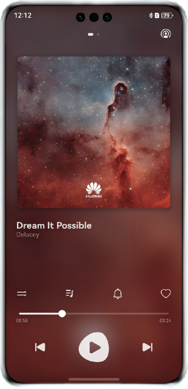
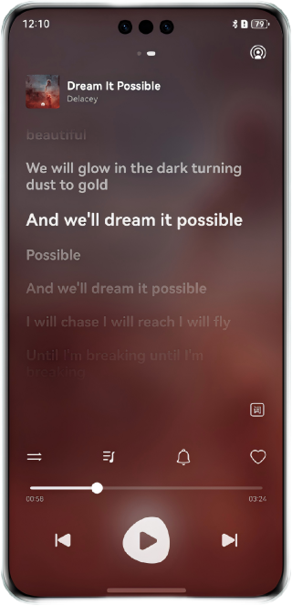

# 基于AudioRenderer的音频播控和多场景交互

#### 简介

本场景解决方案主要面向前台音频开发人员。指导开发者基于AudioRenderer开发音频播控功能，AudioRenderer用于播放PCM（Pulse Code Modulation）音频数据，播放其他格式的音频文件会产生杂音。功能包括后台播放、和播控中心的交互、适配不同类型的焦点打断策略、切换路由发声设备、切换输出设备等基础音频常见功能。

#### 效果图预览

| 主页面                                  | 歌词页                                   |
|--------------------------------------|---------------------------------------|
|  |  |

#### 工程主要模块结构

```
├──entry/src/main/ets/
│  ├──common
│  │   ├──constants                     // 常量
│  │   └──utils                         // 工具
│  ├──components                        // 各模块组件
│  │   ├──ControlAreaComponent.ets      // 音频操控区组件
│  │   ├──LyricsComponent.ets           // 歌词组件
│  │   ├──MusicInfoComponent.ets        // 音乐内容组件
│  │   ├──PlayerInfoComponent.ets       // 播控内容区组件
│  │   └──TopAreaComponent.ets          // 顶部区域组件
│  ├──dataSource                        // 歌单数据
│  │   ├──SongDataSource.ets            // 歌曲数据
│  │   └──SongListData.ets              // 歌曲列表数据
│  ├──entryability
│  │   └──EntryAbility.ets              // Ability的生命周期回调内容
│  ├──entrybackupability
│  │   └──EntryBackupAbility.ets        // EntryBackupAbility的生命周期回调内容
│  ├──lyric                             // 歌词功能
│  └──pages                             // 页面
├──MediaService/src/main/ets
│   ├──songDataController                // 歌曲信息数据
│   │   ├──PlayerData.ets                // 播放数据
│   │   ├──SongData.ets                  // 歌曲源数据
│   │   └──SongItemBuilder.ets           // 歌曲组合数据
│   └──utils
│       ├──AudioRendererController.ets   // 音频播放控制
│       ├──AVSessionController.ets       // 媒体会话控制
│       ├──BackgroundUtil.ets            // 后台播放功能
│       ├──Logger.ets                    // 日志功能
│       ├──MediaTools.ets                // 媒体数据转换工具类
│       └──PreferencesUtil.ets           // 首选项存储功能
└──entry/src/main/resources              // 应用静态资源目录
```

#### 相关权限

1. 后台任务权限：ohos.permission.KEEP_BACKGROUND_RUNNING。

#### 依赖

不涉及

#### 约束与限制

1. 本示例仅支持标准系统上运行，支持设备：华为手机。
2. HarmonyOS系统：HarmonyOS Beta1及以上。
3. DevEco Studio版本：DevEco Studio NEXT Beta1及以上。
4. HarmonyOS SDK版本：HarmonyOS NEXT Beta1 SDK及以上。


