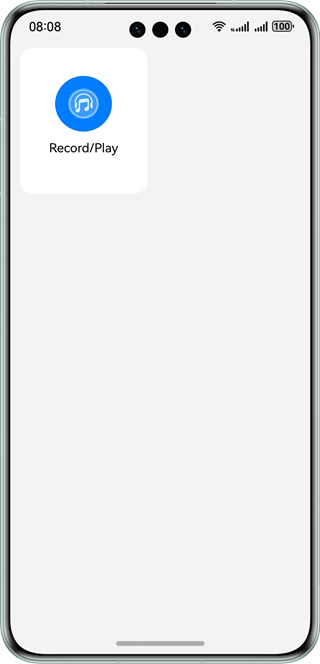
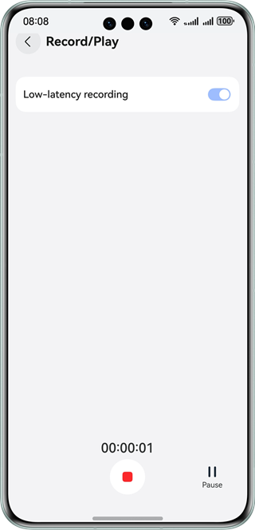
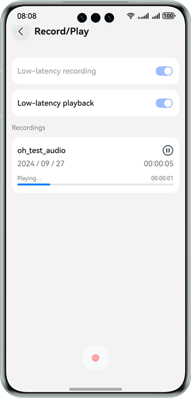

# Low-Latency Audio Recording and Playback

### Overview

This sample demonstrates functions related to low-latency audio recording and playback.

### Preview

| Home page                                 | Recording page                                          | Playback page                            |
|-------------------------------------------|---------------------------------------------------------|------------------------------------------|
|  |  |  |

### How to Use

1. When you open the sample, a dialog box is displayed, asking you to grant the microphone permission. Touch **Allow**.
   If you touch **Deny**, recording cannot be performed. If you want to use recording at a later time, you must grant
   the permission to the app on the system **Settings** page.
2. On the home page, touch **Record and play**. The audio recording page is displayed, with the low-latency recording
   switch disabled by default. To carry out low-latency recording, turn on the switch.
3. Touch the recording button to start recording. Once recording starts, the low-latency recording switch becomes
   unavailable, and the timer starts. The recording cannot be ended within 5s, and automatically ends after 30s.
4. Touch the pause button to pause the recording. The recording timer stops.
5. Touch the continue button to continue recording. The recording timer continues.
6. When the recording ends, a result is generated, and both a low-latency playback switch and an audio player are
   displayed. You can touch the player to play the recorded audio. However, once the playback starts, the low-latency
   playback switch becomes unavailable.
7. Touch the back button to return to the home page.

### Project Directory

```
├──entry/src/main/cpp/  
│  ├──types
│  │  └──libentry
│  │     ├──index.d.ts                              // APIs exported
│  │     └──oh-package.json5                        // Configuration management file
│  ├──AudioRecording.cpp                            // Native APIs
│  └──CMakeLists.txt                                // Compilation script
├──entry/src/main/ets/         
│  ├──constants
│  │  └──CommonConstants.ets                        // Common constants                    
│  ├──entryability
│  │  └──EntryAbility.ets                           // Entry ability
│  ├──pages
│  │  └──Index.ets                                  // Entry to the homepage
│  ├──utils
│  │  └──Logger.ets                                 // Log utility
│  └──view
│     └──AudioRecording.ets                         // Custom components for audio recording and playback
└──entry/src/main/resource                          // Static resources
```

### Required Permissions

Audio recording involves the following permission:

**ohos.permission.MICROPHONE**: allows an app to use the microphone.

### Dependencies

N/A

### Constraints

1. The sample app is supported only on Huawei phones running the standard system.

2. The HarmonyOS version must be HarmonyOS 5.0.5 Release or later.

3. The DevEco Studio version must be DevEco Studio 5.0.5 Release or later.

4. The HarmonyOS SDK version must be HarmonyOS 5.0.5 Release SDK or later.
