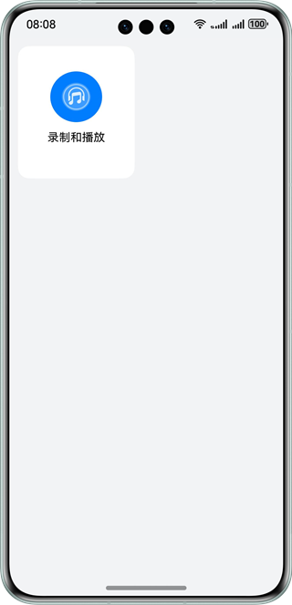
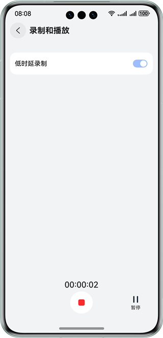
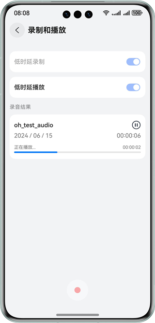

# 实现音频低时延录制与播放

### 介绍

本示例基于OH_Audio的能力，在Native侧实现了音频低时延录制和播放功能，其中录制使用了音频采集器AudioCapturer，播放使用音频渲染器AudioRenderer，参考本示例可学习OH_Audio的使用，帮助应用开发音频录制与播放场景。

### 效果预览

| 主页                                     | 录制页面                                                 | 播放页面                                  |
|----------------------------------------|------------------------------------------------------|---------------------------------------|
|  |  |  |

使用说明

1. 弹出麦克风权限访问提示框，点击“允许”，如果点击"禁止"则不可进行录制，需要用户去设置页面给应用授权后方可正常录制
2. 在主界面点击“录制和播放”，进入音频录制界面，音频录制界面默认是普通录制界面，打开低时延录制开关可进行低时延录制
3. 点击录制按钮，开始录制，开始录制后低时延录制开关变为不可点击状态，录音时间开始计时，5s内不允许结束，30s后会自动结束录制
4. 点击暂停按钮，暂停录制，录音时间也停止计时
5. 点击继续按钮，继续录制，录音时间继续计时
6. 停止录制后，会生成录制结果，界面上有一个低时延播放开关和录制成功的音频播放器，点击低时延播放开关可打开低时延播放功能，点击播放可听到录制的音频，播放未结束之前低时延播放开关为不可点击状态
7. 点击返回按按钮回到主页

### 工程目录

```
├──entry/src/main/cpp/  
│  ├──types
│  │  └──libentry
│  │     ├──index.d.ts                              // 接口导出
│  │     └──oh-package.json5                        // 配置管理文件
│  ├──AudioRecording.cpp                            // 调用native接口
│  └──CMakeLists.txt                                // 编译脚本
├──entry/src/main/ets/         
│  ├──constants
│  │  └──CommonConstants.ets                        // 常量类                     
│  ├──entryability
│  │  └──EntryAbility.ets                           // 程序入口类
│  ├──pages
│  │  └──Index.ets                                  // 主页入口
│  ├──utils
│  │  └──Logger.ets                                 // 日志类
│  └──view
│     └──AudioRecording.ets                         // 音频录制与播放自定义组件
└──entry/src/main/resource                          // 应用静态资源目录
```

### 相关权限

音频录制涉及的权限包括：

1.允许应用使用麦克风：ohos.permission.MICROPHONE

### 依赖

不涉及。

### 约束与限制
1.本示例仅支持标准系统上运行，支持设备：华为手机。

2.HarmonyOS系统：HarmonyOS 5.0.5 Release及以上。

3.DevEco Studio版本：DevEco Studio 5.0.5 Release及以上。

4.HarmonyOS SDK版本：HarmonyOS 5.0.5 Release SDK及以上。