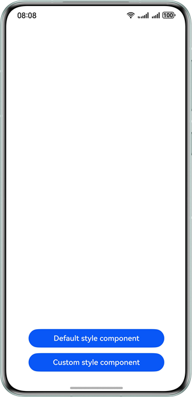
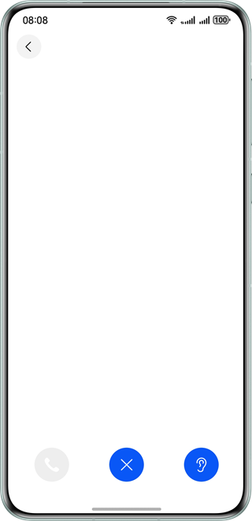
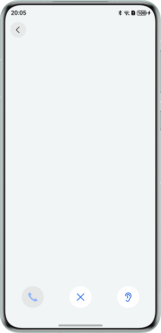

# Call Device Switching

### Overview

This sample uses the **AVCastPicker** component to implement the function of switching audio output devices during a
call and uses the **customPicker** parameter to customize icons for audio output devices.

### Preview

| Home page                                 | Default style page                       | Custom style page                       |
|-------------------------------------------|------------------------------------------|-----------------------------------------|
|  |  |  |

### How to Use

1. On the scenario selection page, touch **Default style component** or **Custom style component** to access the
   corresponding page.

2. The **Default Style component** page provides two buttons. You can touch the first button to play the audio of a
   simulated call. At the same time, a device switching button is displayed on the right, and you can touch it to switch
   the device. During the playback, you can touch the second button to end the playback.

3. The functions of the **Custom style component** page are the same as those of the **Default style component** page.
   However, the style and color of the audio output device icon are different.

### Project Directory

```             
├──entry/src/main/ets                    // Core code
│  ├──common                         
│  │  ├──constants                       
│  │  │  └──Contants.ets                   // Common constants
│  │  └──utils                       
│  │     └──Logger.ets                     // Log utility
│  ├──entryability                   
│  │  └──EntryAbility.ets                  // Entry ability
│  ├──entrybackupability                   
│  │  └──EntryBackupAbility.ets
│  ├──pages                   
│  │  └──Index.ets                         // Home page - scenario selection
│  ├──view
│  │  ├──CustomPickerComponent.ets         // Custom style component page        
│  │  └──DefaultPickerComponent.ets        // Default style component page       
│  └──viewmodel                         
│     └── AudioCapabilityManager.ets       // Audio capability manager
└──resources                               // Static resources
```

### How to Implement

- Home page: Use **Navigation** to implement redirection between the **Default style component** and **Custom style
  component** pages.
- **Default style component** page: Use audio components to simulate a call process and use **AVCastPicker** to
  implement the switching of audio output devices in the default style.
- **Custom style component** page: Based on the **Default style component** page, use the **CustomPicker** parameter to
  implement the switching of audio output devices in the custom style.

### Required Permissions

- N/A

### Dependencies

- N/A

### Constraints

1. The sample app is supported only on Huawei phones running the standard system.

2. The HarmonyOS version must be HarmonyOS 5.0.5 Release or later.

3. The DevEco Studio version must be DevEco Studio 5.0.5 Release or later.

4. The HarmonyOS SDK version must be HarmonyOS 5.0.5 Release SDK or later.    
