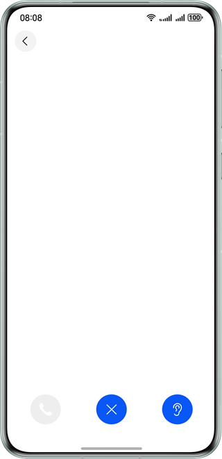

# 实现自定义通话设备图标样式

### 介绍

本示例基于AVCastPicker组件，实现通话过程中音频输出设备切换功能，并使用customPicker参数实现自定义音频输出设备图标。

### 效果预览

| 应用主界面                                  | 默认图标界面                                   | 自定义图标界面                                 |           
|----------------------------------------|------------------------------------------|-----------------------------------------|
|  |  |  |

##### 使用说明

1.进入应用为场景选择界面，有默认样式和自定义样式两个按钮，点击可分别进入相应界面。

2.默认样式组件界面初始有两个按钮，点击第一个可播放模拟通话的音频，同时出现最右侧的设备切换按钮可进行设备切换，播放时点击第二个按钮可结束播放。

3.自定义样式组件界面功能与默认样式组件界面一致，但可以看到音频输出设备图标的样式和颜色不同。

### 工程目录

```             
├──entry/src/main/ets                      // 代码区
│  ├──common                         
│  │  ├──constants                       
│  │  │  └──Contants.ets                   // 公共常量类
│  │  └──utils                       
│  │     └──Logger.ets                     // 日志类
│  ├──entryability                   
│  │  └──EntryAbility.ets                  // 程序入口类
│  ├──entrybackupability                   
│  │  └──EntryBackupAbility.ets
│  ├──pages                   
│  │  └──Index.ets                         // 首页-场景选择
│  ├──view
│  │  ├──CustomPickerComponent.ets         // 自定义样式页面组件         
│  │  └──DefaultPickerComponent.ets        // 系统默认样式页面组件        
│  └──viewmodel                         
│     └── AudioCapabilityManager.ets       // 音频能力管理类
└──resources                               // 应用静态资源目录
```

### 具体实现

- 首页：使用Navigation实现通话设备图标默认样式和自定义样式页面的跳转；
- 默认样式页面：使用Audio相关组件模拟通话过程，以及使用AVCastPicker实现默认样式的通话音频输出设备的切换；
- 自定义样式页面：在默认样式页面的基础上使用CustomPicker参数实现自定义样式的通话音频输出设备的切换。

### 相关权限

- 不涉及

### 依赖

- 不涉及

### 约束与限制

1.本示例仅支持标准系统上运行，支持设备：华为手机;

2.HarmonyOS系统：HarmonyOS 5.0.5 Release及以上;

3.DevEco Studio版本：DevEco Studio 5.0.5 Release及以上;

4.HarmonyOS SDK版本：HarmonyOS 5.0.5 Release SDK及以上。     