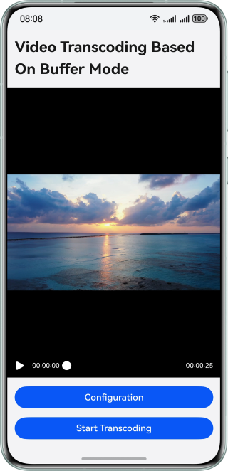

# Video Transcoding Based on Buffer Mode

### Overview
This sample demonstrates video transcoding in buffer mode based on the AVCodec capability. From this sample, you can learn the process of video decapsulation, decoding, encoding, to encapsulation by using the native encoder, decoder, as well as encapsulation and decapsulation functionalities. You can also understand the buffer mode and perform transcoding in this mode.

### Preview
| Home Page                                                     |
|------------------------------------------------------------|
|  |

### How to Use
1. Set video transcoding parameters on the home page.
2. Touch Start Transcoding to start. Wait until the transcoding is complete.
3. After the transcoding is complete, the next page is displayed for you to view the transcoded video.

### Project Directory

```       
├──entry/src/main/cpp                 // Native layer 
│  ├──capbilities                     // Capability APIs and implementation 
│  │  ├──include                      // Capability APIs 
│  │  ├──Demuxer.cpp                  // Demuxer implementation 
│  │  ├──Muxer.cpp                    // Muxer implementation 
│  │  ├──VideoDecoder.cpp             // Video decoder implementation 
│  │  └──VideoEncoder.cpp             // Video encoder implementation 
│  ├──common                          // Common modules 
│  │  ├──dfx                          // Logs 
│  │  ├──SampleCallback.cpp           // Codec callback implementation 
│  │  ├──SampleCallback.h             // Codec callback definition 
│  │  └──SampleInfo.h                 // Common classes for functionality implementation 
│  ├──sample                          // Native layer 
│  │  └──transcoding                  // Native layer transcoding APIs and implementation 
│  │     ├──Transcoding.cpp           // Native layer transcoding logic implementation 
│  │     ├──Transcoding.h             // Native layer transcoding logic APIs 
│  │     ├──TranscodingNative.cpp     // Native layer transcoding entry 
│  │     └──TranscodingNative.h          
│  ├──types                           // APIs exposed by the native layer 
│  │  └──libtranscoding               // APIs exposed by the transcoding module to the UI layer 
│  └──CMakeLists.txt                  // Compilation entry 
├──ets                                // UI layer 
│  ├──common                          // Common modules 
│  │  ├──utils                        // Common utilities 
│  │  │  ├──TimeUtils.ets             // Obtain the current time 
│  │  │  └──Logger.ets                // Log utilities 
│  │  └──CommonConstants.ets          // Common constants 
│  ├──entryability                    // Application entry 
│  │  └──EntryAbility.ets             
│  ├──entrybackupability             
│  │  └──EntryBackupAbility.ets    
│  ├──model             
│  │  └──VideoDataModel.ets           // Parameter data class 
│  └──pages                           // Pages contained in the EntryAbility 
│     ├──Index.ets                    // Home page/Video transcoding page 
│     └──VideoPlayer.ets              // Video playback page 
├──resources                          // Static resources of the application 
│  ├──base                            // Resource files in this directory are assigned unique IDs. 
│  │  ├──element                      // Fonts and colors 
│  │  ├──media                        // Images 
│  │  └──profile                      // Home page of the application entry 
│  ├──en_US                           // Resources in this directory are preferentially matched when the device language is American English. 
│  └──zh_CN                           // Resources in this directory are preferentially matched when the device language is simplified Chinese. 
└──module.json5                       // Module configuration
```

### How to Implement

#### UI Layer
1. There are two pages on the ArkTS side: home page and transcoded page.
2. The home page is the parameter configuration page. It uses the Video component to play the video to be transcoded and uses the showTextPickerDialog pop-up window to set transcoding parameters. Touch the Start Transcoding button to call the native transcoding API.
3. The video playback page uses the Video component to play the videos before and after transcoding.

#### Native Layer
1. Before transcoding, the environment needs to be initialized, including the decapsulation, encapsulation, encoder, and decoder. In addition, save the required context parameters.
2. Enable child thread decoding to decode video data. The child thread decoding includes input child threads and output child threads. In the decoding input child thread, you need to manually store the frame buffer and index to the input queue and instruct the decoder to decode the frame.
3. In the decoding output thread, the video data decoded by the decoder is copied. Save the copied data to the encoding input queue and release the encoding video address synchronously.
4. In the encoding output thread, the bufferInfo of the output queue is popped out, and the corresponding data is written to the video file through the encapsulation and encapsulation.

### Required Permissions

- None

### Dependencies

- N/A

### Constraints

1. The sample is only supported on Huawei phones running standard systems.
2. The HarmonyOS version must be HarmonyOS 5.1.0 Release or later.
3. The DevEco Studio version must be DevEco Studio 5.1.0 Release or later.
4. The HarmonyOS SDK version must be HarmonyOS 5.1.0 Release SDK or later.    