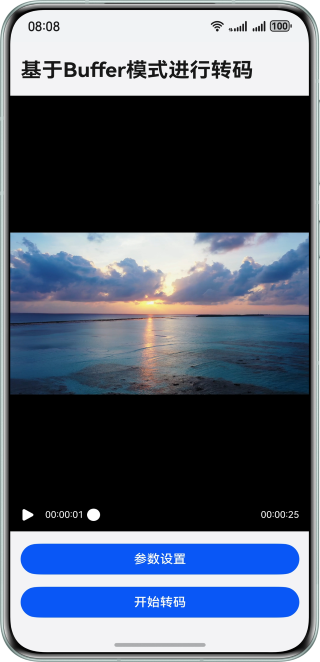

# 基于Buffer模式进行视频转码

### 介绍
本实例基于AVCodec能力，实现了Buffer模式下的视频转码功能。通过调用Native侧的编码器，解码器，以及封装和解封装功能，完成从视频解封装、解码、编码、封装的过程。基于本实例可以帮助开发者理解Buffer模式，并通过Buffer模式进行转码。

### 效果预览
| 应用主界面                                                      |
|------------------------------------------------------------|
|  |

### 使用说明
1. 进入首页后，配置视频转码的参数。
2. 点击开始转码后即可开始转码，等待转码完成。
3. 在转码完成后，跳转到下一个页面，可以查看转码完成的视频。

### 工程目录

```       
├──entry/src/main/cpp                 // Native层
│  ├──capbilities                     // 能力接口和实现
│  │  ├──include                      // 能力接口
│  │  ├──Demuxer.cpp                  // 解封装实现
│  │  ├──Muxer.cpp                    // 封装实现
│  │  ├──VideoDecoder.cpp             // 视频解码实现
│  │  └──VideoEncoder.cpp             // 视频编码实现
│  ├──common                          // 公共模块
│  │  ├──dfx                          // 日志
│  │  ├──SampleCallback.cpp           // 编解码回调实现   
│  │  ├──SampleCallback.h             // 编解码回调定义
│  │  └──SampleInfo.h                 // 功能实现公共类  
│  ├──sample                          // Native层
│  │  └──transcoding                  // Native层转码接口和实现
│  │     ├──Transcoding.cpp           // Native层转码功能调用逻辑的实现
│  │     ├──Transcoding.h             // Native层转码功能调用逻辑的接口
│  │     ├──TranscodingNative.cpp     // Native层转码的入口
│  │     └──TranscodingNative.h         
│  ├──types                           // Native层暴露上来的接口
│  │  └──libtranscoding               // 转码模块暴露给UI层的接口
│  └──CMakeLists.txt                  // 编译入口       
├──ets                                // UI层
│  ├──common                          // 公共模块
│  │  ├──utils                        // 共用的工具类
│  │  │  ├──TimeUtils.ets             // 获取当前时间
│  │  │  └──Logger.ets                // 日志工具
│  │  └──CommonConstants.ets          // 参数常量
│  ├──entryability                    // 应用的入口
│  │  └──EntryAbility.ets            
│  ├──entrybackupability            
│  │  └──EntryBackupAbility.ets   
│  ├──model            
│  │  └──VideoDataModel.ets           // 参数数据类  
│  └──pages                           // EntryAbility 包含的页面
│     ├──Index.ets                    // 首页/视频转码页面
│     └──VideoPlayer.ets              // 视频播放页面
├──resources                          // 用于存放应用所用到的资源文件
│  ├──base                            // 该目录下的资源文件会被赋予唯一的ID
│  │  ├──element                      // 用于存放字体和颜色 
│  │  ├──media                        // 用于存放图片
│  │  └──profile                      // 应用入口首页
│  ├──en_US                           // 设备语言是美式英文时，优先匹配此目录下资源
│  └──zh_CN                           // 设备语言是简体中文时，优先匹配此目录下资源
└──module.json5                       // 模块配置信息
```

### 具体实现

#### UI层
1. 在ArkTS侧包含两个页面，首页和转码完成的页面。
2. 首页是参数配置页面，调用了Video组件播放需要转码的视频，并调用showTextPickerDialog弹窗配置转码的参数。再点击转码的按钮后，调用Native转码的接口。
3. 视频播放页面通过Video组件播放转码前和转码后的视频。

#### Native层
1. 在开始转码前，需要对环境进行初始化，包括解封装器、封装器、编码器、解码器。同时，将需要用到的上下文参数进行保存。
2. 开启解码子线程，将视频数据进行解码，解码子线程包括输入子线程、输出子线程。在解码输入子线程中，用户需手动把帧buffer、index存入输入队列中，并通知解码其进行解码。
3. 在解码输出线程中，将解码器解码后的视频数据进行数据拷贝。将拷贝的数据存入编码的输入队列，并同步释放编码的视频地址。
4. 在编码输出线程中，将输出队列的bufferInfo进行出栈，并将对应的数据通过封装器写入到视频文件中。

### 相关权限

- 无

### 依赖

- 不涉及

### 约束与限制

1. 本示例仅支持标准系统上运行，支持设备：华为手机。
2. HarmonyOS系统：HarmonyOS 5.1.0 Release及以上。
3. DevEco Studio版本：DevEco Studio 5.1.0 Release及以上。
4. HarmonyOS SDK版本：HarmonyOS 5.1.0 Release SDK及以上。