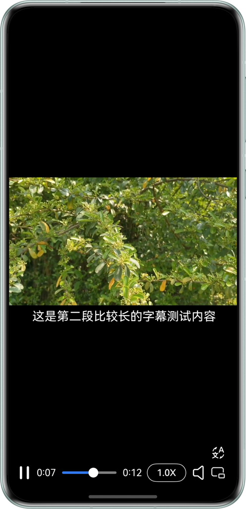
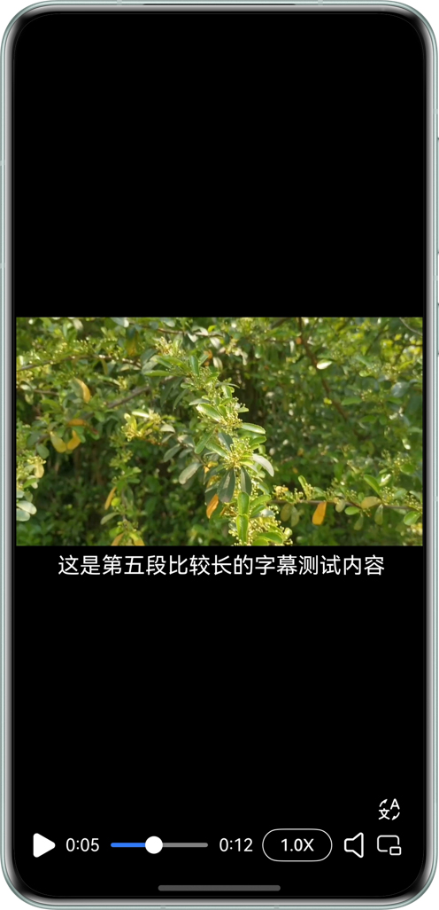
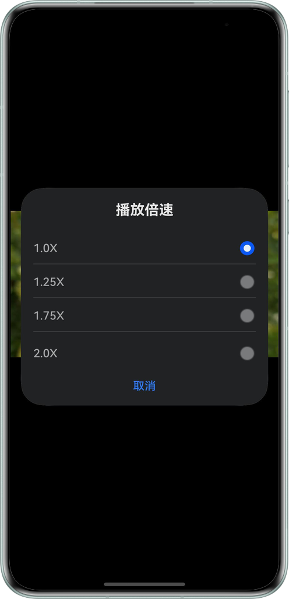
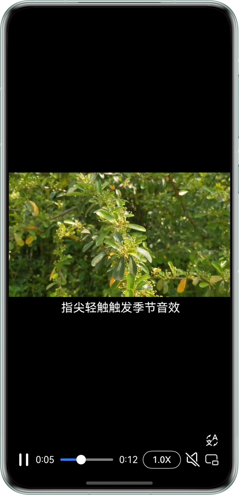
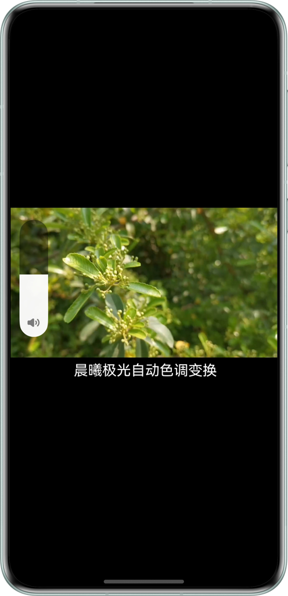

# 基于AVPlayer实现视频基础播控功能

## 项目简介

本示例主要展示了如何基于AVPlayer系统播放器实现播放本地视频相关功能，指导开发者实现视频加载、播放、暂停、退出；跳转播放；静音播放；循环播放；窗口缩放模式设置；倍速设置；音量设置；字幕挂载等开发场景。

## 效果预览

| 播放                                                              | 暂停                                       | 倍速弹窗                                               |
|-----------------------------------------------------------------|------------------------------------------|----------------------------------------------------|
|  |  | |

| 静音设置                                                 | 音量设置                                            | 窗口缩放模式设置                                           |
|------------------------------------------------------|-------------------------------------------------|----------------------------------------------------|
|  |  |  |

## 使用说明

1. 下载sample，编译运行；
2. 运行成功后，视频自动开始播放；
3. 点击视频界面，唤起视频操作面板，再次点击操作面板消失，如果不做任何操作操作界面会5s自动消失;
4. 点击暂停/播放按钮，控制视频暂停播放;
5. 滑动视频进度条，视频跳转到指定位置,在视频中间会出现时间进度方便用户查看视频进度;
6. 点击倍速，可以选择1.0、1.25、1.75、2.0进行倍速调节;
7. 点击静音按钮，可以设置静音模式播放;
8. 点击窗口缩放模式按钮，可以选择拉伸至与窗口等大、缩放至最短边填满窗口;
9. 长按屏幕，控制视频2.0倍速播放;
10. 上下滑动屏幕，可以设置视频播放音量；
11. 视频下方显示字幕，并可以点击语言切换按钮切换字幕;
12. 视频自动循环播放;
13. 点击左上角退出箭头，退出应用。

## 目录结构

```
├──entry/src/main/ets                             // 代码区
│  ├──common
│  │  ├──constants
│  │  │  └──CommonConstants.ets                   // 公共常量
│  │  └──utils
│  │     ├──GlobalContext.ets                     // 公共工具类
│  │     └──TimeUtils.ts                          // 视频时间帮助类
│  ├──views
│  │  ├──languageDialog.ets                       // 弹幕语言切换弹窗
│  │  ├──ScaleDialog.ets                          // 窗口缩放模式设置弹窗
│  │  ├──SetVolumn.ets                            // 设置音量组件
│  │  ├──SpeedDialog.ets                          // 播放倍速弹窗
│  │  └──VideoOperate.ets                         // 视频操作组件
│  ├──controller 
│  │  └──AvPlayerController.ets                   // avplayer公共控制类
│  ├──entryability
│  │  └──EntryAbility.ets                         // 应用入口Ability
│  ├──model
│  │  └──VideoData.ets                            // 视频数据类
│  └──pages
│     └──Index.ets                                // 首页视频界面
└──entry/src/main/resources                       // 应用资源目录
```

## 具体实现

+
视频倍速切换、暂停、播放、切换视频、视频跳转的功能接口都封装在AvPlayerController.ets,源码参考：[AvPlayerController.ets](entry/src/main/ets/controller/AvPlayerController.ets);
+ 使用media.createAVPlayer()来获取AVPlayer对象;
+ 倍速切换：选择不同倍速时调用avPlayer.setSpeed(speed: PlaybackSpeed);
+ 暂停、播放：点击暂停、播放按钮时调用avPlayer.pause()、avPlayer.play();
+ 视频跳转：在拖动滑动条时调用avPlayer.seek();
+ 静音播放：点击静音按钮时调用avPlayer.setMediaMuted();
+ 音量设置：为元素添加手势上下滑动监听PanGesture，滑动时时显示AVVolumePanel组件并根据滑动距离计算音量volume值;
+ 窗口缩放模式设置：选择不同的窗口缩放模式时设置avPlayer的videoScaleType属性值;
+ 长按倍速：为元素添加手势长按监听LongPressGesture，长按时调用avPlayer.setSpeed(speed: PlaybackSpeed);
+ 循环播放：在视频prepared状态下，设置avPlayer的loop属性值为true。
+ 字幕挂载：视频初始化时调用avPlayer.addSubtitleFromFd()设置外挂字幕资源。

## 相关权限

不涉及

## 约束与限制

1.本示例仅支持标准系统上运行，支持设备：华为手机。

2.HarmonyOS系统：HarmonyOS 5.1.0 Release及以上。

3.DevEco Studio版本：DevEco Studio 5.1.0 Release及以上。

4.HarmonyOS SDK版本：HarmonyOS 5.1.0 Release SDK及以上。
