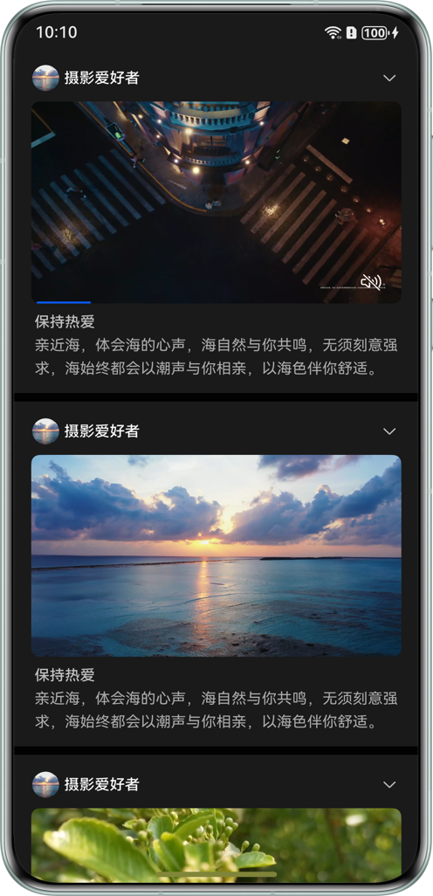

# 基于AVPlayer实现嵌入式短视频播放

## 项目简介

本示例适用于嵌入式短视频播放类应用的开发，通过[AVPlayer](https://developer.huawei.com/consumer/cn/doc/harmonyos-references/arkts-apis-media-avplayer)和[XComponent](https://developer.huawei.com/consumer/cn/doc/harmonyos-references/ts-basic-components-xcomponent)组件，使用[LazyForEach()](https://developer.huawei.com/consumer/cn/doc/harmonyos-references/ts-rendering-control-lazyforeach)方法进行数据懒加载，根据列表滑动自动切换播放，并在点击进入视频详情页面时继续播放。

## 效果预览



## 使用说明

1. 向下滑动列表，自动播放首个可见视频。

2. 点击视频跳转到视频详情页，继续播放当前视频。

## 工程目录

```
├──entry/src/main/ets
│  ├──common
│  │  ├──constants
│  │  │  └──Constants.ets               //公共常量
│  │  └──utils
│  │     ├──AppRouter.ets               //页面跳转方法定义
│  │     ├──GlobalContext.ets           //公共方法
│  │     ├──TimeUtils.ets               //时间工具
│  │     └──WindowUtil.ets              //系统处理工具
│  ├──component
│  │  ├──AVVolumePanelView.ets          //音量控制组件
│  │  ├──BulletCommentView.ets          //弹幕展示组件
│  │  ├──CaptionFontView.ets            //字幕字体设置组件
│  │  ├──LanguageDialog.ets             //字幕语言切换组件
│  │  ├──ScaleDialog.ets                //视频缩放组件
│  │  ├──ScreenBrightnessView.ets       //亮度控制组件
│  │  ├──SpeedDialog.ets                //倍速播放组件
│  │  ├──VideoDetail.ets                //无缝转场组件
│  │  └──VideoList.ets                  //视频列表组件
│  ├──controller
│  │  ├──AvPlayerController.ets         //avplayer公共控制类
│  │  └──PiPWindowController.ets        //画中画公共控制类
│  ├──model
│  │  ├──BulletComment.ets              //弹幕数据类型
│  │  ├──CaptionFont.ets                //字幕数据类型
│  │  ├──VideoData.ets                  //视频数据类
│  │  ├──VideoDataSource.ets            //视频列表数据源操作
│  │  ├──VideoInfo.ets                  //视频信息类型定义
│  │  ├──VideoItemData.ets              //模拟数据
│  │  └──VideoParams.ets                //页面传参类型定义
│  └──pages   
│     ├──DetailPage.ets                 //视频详情页面
│     └──PlayVideo.ets                  //视频列表页面
├──src/main/resources  
│  └──base/profile
│     └──route_map.json                 //页面路由配置
└──module.json5
```

## 具体实现

1. 使用LazyForEach懒加载视频列表，在XComponent组件上使用AVPlayer进行视频播放。

2. 根据视频的播放链接，使用fetchFrameByTime()方法获取视频的缩略图，显示到页面上。

3. 监听视频列表滚动停止事件，根据滚动偏移量，计算出第一个可见视频的索引值，切换播放此视频。

4. 点击视频时，保存当前播放状态和surfaceID，并在视频详情页面进行继续播放。

5. 点击返回时，根据保存的surfaceID继续此视频的播放。

## 相关权限

不涉及

## 约束与限制

1. 本示例仅支持标准系统上运行，支持设备：华为手机。

2. HarmonyOS系统：HarmonyOS 5.1.1 Release及以上。

3. DevEco Studio版本：DevEco Studio 5.1.1 Release及以上。

4. HarmonyOS SDK版本：HarmonyOS 5.1.1 Release SDK及以上。