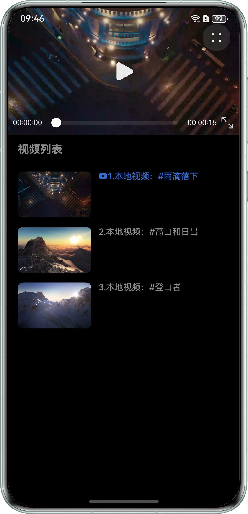
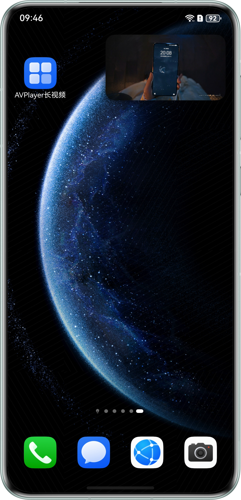
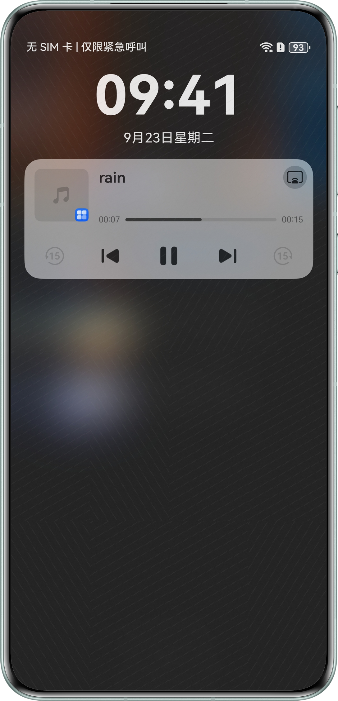
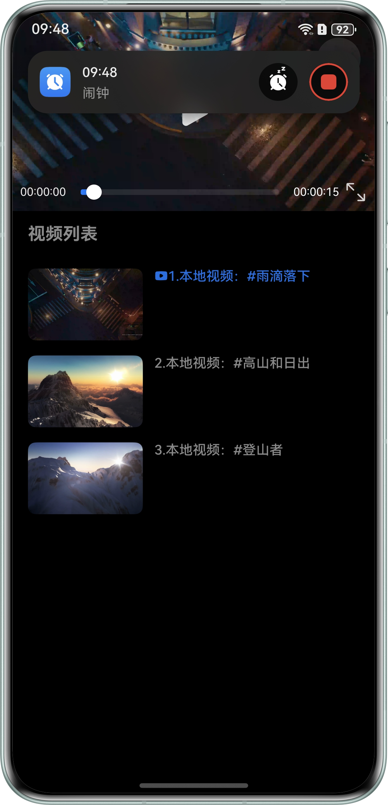
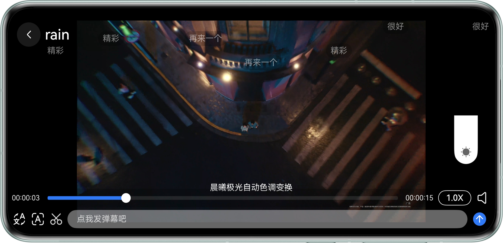
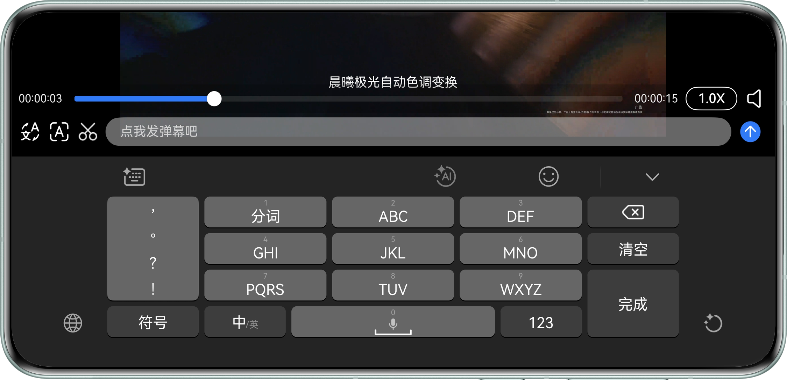
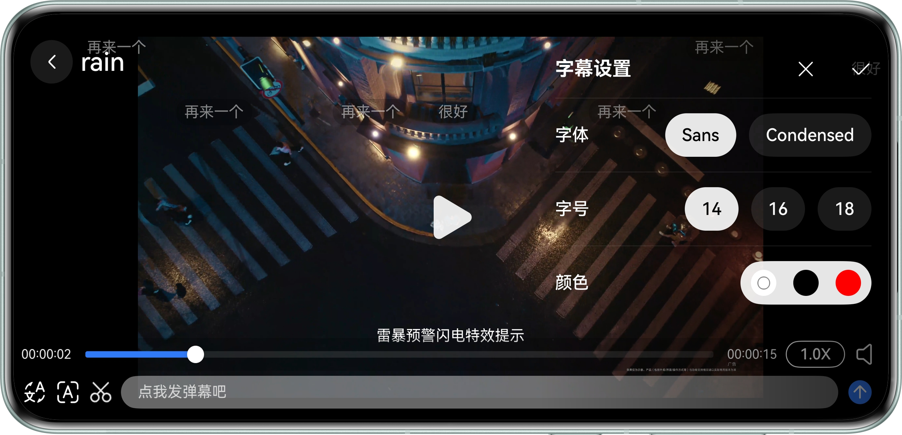
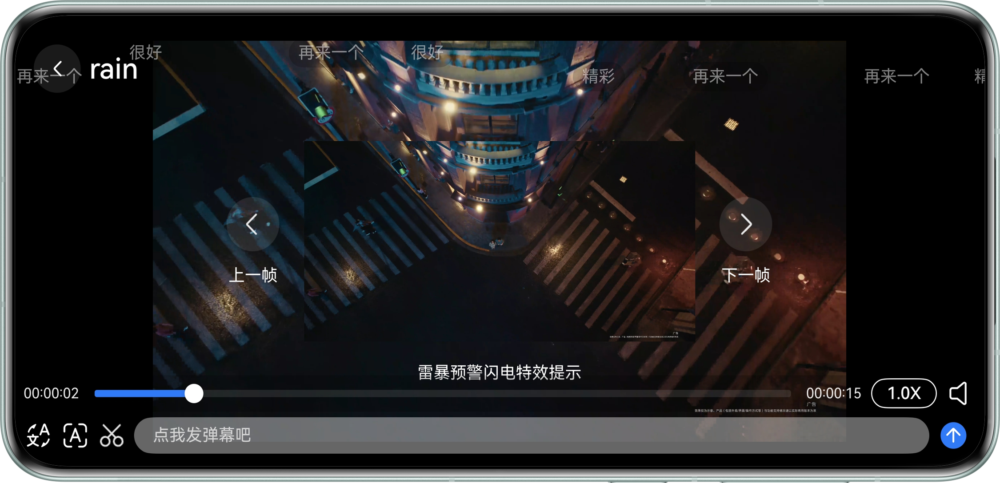

# 基于AVPlayer实现长视频播放

## 项目简介

本文介绍了如何基于AVPlayer系统播放器实现长视频播放应用。

本文指导开发者实现基本播控、亮度控制、焦点管理、前后台感知、弹幕发送与显示、字幕挂载、视频截图、画中画、视频首帧显示等开发场景。

## 效果预览

|                           应用首页                           |                         画中画                         |                            播控中心                             |                           闹铃打断                           |
|:--------------------------------------------------------:|:---------------------------------------------------:|:-----------------------------------------------------------:|:--------------------------------------------------------:|
|  |  |  |  |

|                           横屏页-亮度调节                           |                         横屏页-弹幕输入                          |
|:--------------------------------------------------------:|:---------------------------------------------------:|
|  |  |

|                        横屏页-字幕设置                         |                         横屏页-视频截图                         |
|:-------------------------------------------------------:|:--------------------------------------------------------:|
|  |  |


## 使用说明

1. 启动应用后显示视频播放列表及首个视频播放窗口，在播放列表和窗口中均显示相应视频的首帧图片。

2. 可通过按钮实现横竖屏切换，也可通过旋转手机自动感知切换横竖屏。

3. 来电或闹铃会自动中断视频播放，关闭后视频恢复播放。

4. 未开启画中画时，应用切换到后台后视频暂停播放，切回前台则继续播放。

5. 开启画中画时，应用切换到后台，继续以画中画形式播放。

6. 进入横屏模式后，在屏幕左侧上下滑动可调节音量，在屏幕右侧上下滑动可调节亮度，还可设置倍速播放和静音播放。

7. 进入横屏模式后，在屏幕上方显示弹幕，且在下方工具栏可输入并点击发送弹幕。

8. 进入横屏模式后，在屏幕下方显示外挂字幕；同时可点击下方工具栏字幕字体设置按钮，对字幕字体、大小、颜色进行设置。

9. 进入横屏模式后，点击下方工具栏截图按钮，可截取当前视频页面并展示在屏幕中间，同时还可点击上一帧/下一帧按钮进行微调。

10. 可通过播控中心控制视频的播放、暂停、进度拖动、上一首/下一首。

## 工程目录

```
├──entry/src/main/ets
│  ├──common
│  │  ├──constants
│  │  │  └──CommonConstants.ets         // 通用常量
│  │  └──utils
│  │     ├──BackgroundTaskManager.ets   // 后台任务相关工具类
│  │     ├──ImageUtil.ets               // 图片工具类
│  │     ├──Logger.ets                  // 日志工具类
│  │     ├──TimeUtils.ets               // 时间工具类
│  │     └──WindowUtil.ets              // 窗口工具类
│  ├──controller
│  │  ├──AvPlayerController.ets         // avplayer公共控制类
│  │  ├──AvSessionController.ets        // session公共控制类
│  │  └──PipWindowController.ets        // 画中画公共控制类
│  ├──entryability
│  │  └──EntryAbility.ets               // 程序入口
│  ├──model
│  │  ├──BulletCommentModel.ets         // 弹幕信息实体类
│  │  ├──CaptionFontModel.ets           // 字幕信息实体类
│  │  ├──VideoData.ets                  // 视频数据实体类
│  │  └──VideoSourceModel.ets           // 视频测试数据
│  ├──pages
│  │  └──IndexPage.ets                  // 首页
│  └──view
│     ├──AVPlayer.ets                   // 视频播放组件
│     ├──BulletCommentView.ets          // 弹幕展示组件
│     ├──CaptionFontView.ets            // 字幕字体设置组件
│     ├──LanguageDialog.ets             // 中英字幕切换组件
│     ├──SpeedDialog.ets                // 倍速播放组件
│     ├──VideoList.ets                  // 视频列表组件
│     ├──VideoSnapshotView.ets          // 视频截图组件
│     └──VolumeAndBrightnessView.ets    // 音量亮度调节组件
└──src/main/resources                   // 应用资源目录
```

## 具体实现

1. 基于AVPlayer实现了视频的基本播控功能，包含视频播放、跳转、倍速播放、字幕挂载等，主要功能封装在AvPlayerController。

2. 基于avSession和backgroundTaskManager实现了视频的后台播放以及播控中心控制，主要功能封装在AvSessionController和BackgroundTaskManager。

3. 基于PiPWindow实现了视频画中画播放功能，在应用返回桌面时可开启画中画保持继续播放，主要功能封装在PiPWindowController。

4. 视频首帧图获取、时间转换、窗口控制等功能均在对应的工具类中进行了封装。 

## 相关权限

1. 后台任务权限：ohos.permission.KEEP_BACKGROUND_RUNNING。

## 约束与限制

1. 本示例仅支持标准系统上运行，支持设备：华为手机。

2. HarmonyOS系统：HarmonyOS 5.1.0 Release及以上。

3. DevEco Studio版本：DevEco Studio 5.1.0 Release及以上。

4. HarmonyOS SDK版本：HarmonyOS 5.1.0 Release SDK及以上。
