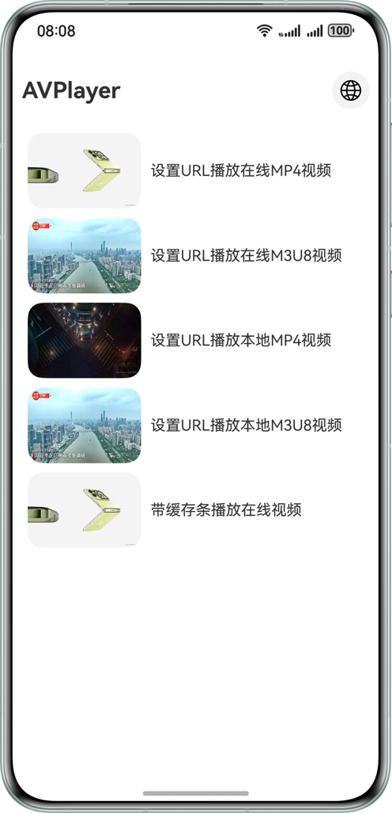
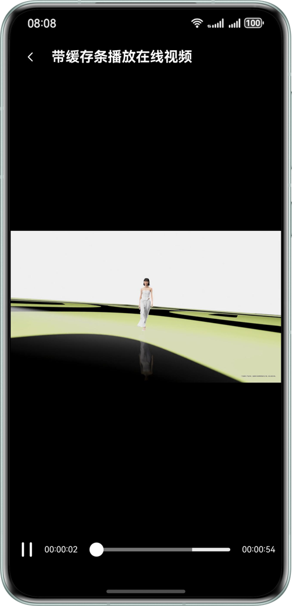

# 基于AVPlayer播放网络视频实践
## 项目简介    
 本示例主要展示了HarmonyOS中如何基于AVPlayer系统播放器实现网络视频播放，指导开发者实现以下开发场景
- 网络视频URL设置
- 基本播控
- 网络视频缓冲条
- 网络视频边缓冲边播放
## 效果预览
| 预设URL视频列表                            | 手动输入URL                              | URL视频播放                              | 带缓冲条网络视频播放                           |                         
|--------------------------------------|--------------------------------------|--------------------------------------|--------------------------------------|
|  |  |  |  |
## 使用说明
1. 下载sample，编译运行
2. 主页是个视频列表，视频列表的各项代表各场景，点击列表项，播放视频
3. 点击主页右上角按钮，可设置自定义视频URL，确认进行播放
4. 本示例中M3U8测试资源非公网测试资源，用户可自行修改为自备测试资源: 
   - entry/src/main/ets/model/VideoDataModel.ets:44
   - entry/src/main/resources/rawfile/test.m3u8

## 工程目录
```
├──entry/src/main/ets                           // entry模块
│  ├──common
│  │  ├──constants
│  │  │  └──CommonConstants.ets                 // 常量类
│  │  └──utils
│  │     ├──BackgroundTaskManager.ets           // 后台任务相关工具
│  │     ├──ImageUtil.ets                       // 图片工具
│  │     ├──Logger.ets                          // 日志工具
│  │     └──TimeUtils.ets                       // 时间工具
│  ├──components
│  │  ├──BulletCommentView.ets                  // 弹幕组件
│  │  ├──ExitVideo.ets                          // 退出应用组件
│  │  ├──LanguageDialog.ets                     // 字母语言切换
│  │  ├──ScaleDialog.ets                        // 窗口缩放模式设置弹窗
│  │  ├──SetBirghness.ets                       // 调节亮度组件
│  │  ├──SetVolumn.ets                          // 设置音量组件
│  │  ├──SpeedDialog.ets                        // 播放倍速弹窗
│  │  └──VideoOperate.ets                       // 视频操作组件
│  ├──controller
│  │  ├──AvPlayerController.ets                 // avplayer公共控制类
│  │  └──PipWindowController.ets                // 画中画控制类
│  ├──entryability
│  │  └──EntryAbility.ets                       // 程序入口
│  ├──entrybackupability
│  │  └──EntryBackupAbility.ets
│  ├──model
│  │  ├──BulletCommentModel.ets                 // 弹幕数据类
│  │  ├──VideoData.ets                          // 视频数据类
│  │  └──VideoDataModel.ets                     // 视频数据类实现
│  ├──pages
│  │  ├──BufferBarPlayer.ets                    // 带缓冲条播放页
│  │  ├──Index.ets                              // 主页，播放列表
│  │  └──UrlPlayer.ets                          // url资源播放页
│  └──view
│     ├──BasicVideoPlayer.ets                   // 基础播控
│     └──VideoItem.ets                          // 首页视频列表项
└──entry/src/main/resources                     // 资源目录
```
## 具体实现
- 网络视频URL设置
  - 通过给AVPlayer配置url属性值，实现AVPlayer播放URL视频资源
- 基本播控
  - 通过AVPlayer的play()、pause()、stop()实现视频基本播控
- 网络视频缓冲条
  - 通过绑定AVPlayer的bufferingUpdate事件处理函数，将缓冲预估播放时间和当前播放时间相加，并绑定到Slider的value属性，实现缓冲条
- 网络视频边缓冲边播放
  - 通过AVPlayer的setPlaybackStrategy()方法配置边缓冲边播放的相关参数配置
## 相关权限
本示例中部分图片使用了网络资源，因此本示例需要申请系统网络权限，配置如下

src/main/module.json5
```
{
  "module": {
    //...
    "requestPermissions": [
      {
        "name": "ohos.permission.INTERNET"
        // ...
      },
      {
        "name": "ohos.permission.GET_NETWORK_INFO",
        // ...
      }
    ]
  }
}
```
## 约束与限制

1.本示例仅支持标准系统上运行，支持设备：华为手机。

2.HarmonyOS系统：HarmonyOS 5.1.0 Release及以上。

3.DevEco Studio版本：DevEco Studio 5.1.0 Release及以上。

4.HarmonyOS SDK版本：HarmonyOS 5.1.0 Release SDK及以上。
