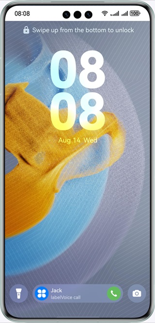
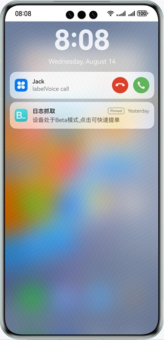

# Call Service Kit

### Introduction
This example shows how to use APIs of Call Service Kit, Push Kit, and Image Kit to subscribe to voipCallUiEvent, report incoming voice and video calls, and report call status changes.

### Related Concept
Call Service Kit is a collection of call-related APIs provided by Huawei for VoIP apps to manage VoIP calls and ensure consistent incoming call experience.

### Required Permissions
1. ohos.permission.MICROPHONE: used for microphone access in a voice call.
2. ohos.permission.CAMERA: used for camera access in a video call.

### Instructions for Use
This sample shows how an app performs relevant operations after receiving an incoming voice or video call message from the server. To simulate a server to send voice and video call requests, you need to have your own cloud server and send and receive voice and video call messages according to token-related content in Push Kit documentation.

### Preview
 

### Project Directory
```bash
├─entry/src/main/ets              // Code area.
│ ├─entryability
│ │ ├─EntryAbility.ets            // Entry point class.
│ │ └─VoipCallAbility.ets         // Event response.
│ └─model                         // Service logic and utility class.
│ | └─CallDataManager.ets         // Call service logic.
│ | └─TypeUtils.ets               // Utility class.
│ └─pages                         // Directory for storing app UI files.
│   └─Index.ets                   // Home page UI.
│   └─VoipCallPage.ets            // Call Page UI.
└─entry/src/main/resources        // App resource directory.
```

### Implementation
This sample shows how an app calls relevant APIs of Call Service Kit, including the following:
1. After receiving a voice or video call, the app subscribes to the voipCallUiEvent event. When a user answers or rejects an incoming call, the corresponding event is reported and the log "Voip call event" is recorded.
2. The app calls the reportIncomingCall API to report incoming call information.
3. After internally processing the call answering or rejection operation, the app calls the reportCallStateChange API to notify the system of the call status change.

### Constraints
1. The sample app is supported only on Huawei phones running the standard system.
2. HarmonyOS: HarmonyOS NEXT Developer Beta1 or later.
3. DevEco Studio: DevEco Studio NEXT Developer Beta1 or later.
4. HarmonyOS SDK: HarmonyOS NEXT Developer Beta1 SDK or later.