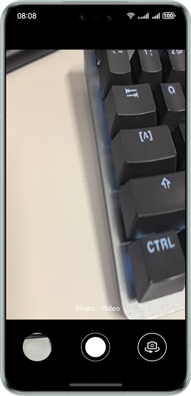

# Collecting and Saving Camera Data

### Overview

This sample shows how to use the libohcamera.so interface to implement a series of camera functions, including preview, photographing, recording, switching between front and rear cameras, as well as focus and exposure control.

### Preview

| Effect                                       |
|----------------------------------------------|
|  |

### How to Use
1. A message is displayed, asking you whether to allow CameraDataCollection to use the camera. Touch **Allow**.
2. A message is displayed, asking you whether to allow CameraDataCollection to use the microphone. Touch **Allow**.
3. A message is displayed, asking you whether to allow CameraDataCollection to access files. Touch **Allow**.
4. A message is displayed, asking you whether to allow CameraDataCollection to access images and videos. Touch **Allow**.
5. Access the preview screen. It is displayed normally. When you touch a blurry area on the preview image, the image becomes clear, with a noticeable focus effect.
6. Access the preview screen. It is displayed normally. When you slide up and down on the screen, the brightness of the scene in the viewfinder changes, with a noticeable exposure effect.
7. Access the preview screen. It is displayed normally. Touch **Photo**. A photo is taken, and a thumbnail appears in the lower left corner. Touch the thumbnail. Gallery is open, and you can view the photo just taken there.
8. Access the preview screen. It is displayed normally. Switch to the front camera and touch **Photo**. A photo is taken, and a thumbnail appears in the lower left corner. Touch the thumbnail. Gallery is open, and you can view the photo just taken there.
9. Access the preview screen. It is displayed normally. Switch to video mode and touch **Video**. Recording starts. Touch **Stop**. The recording stops, and a thumbnail appears in the lower left corner. Touch the thumbnail. Gallery is open, and you can view the video just recorded there.
10. Access the preview screen. It is displayed normally. Switch to the rear camera and touch **Video**. Recording starts. Touch **Stop**. The recording stops, and a thumbnail appears in the lower left corner. Touch the thumbnail. Gallery is open, and you can view the video just recorded there.

### Project Directory

```
├──entry/src/main/cpp
│  ├──types
│  │  └──libentry
│  │     ├──index.d.ts                  // Import NAPIs for calling at the JS side
│  │     └──oh-package.json5            // Interface registration configuration file
│  ├──camera_manager.cpp                // C++ implementation of the definition of basic camera function interfaces
│  ├──camera_manager.h                  // Definition of basic camera function interfaces
│  ├──CMakeLists.txt                    // CMake packaging configuration file, scripts for compiling the project's dynamic libraries, dependency header files, C++ code, and related dependencies
│  └──main.cpp                          // NAPIs for communication between JS and C++
├──entry/src/main/ets
│  ├──common
│  │  ├──utils
│  │  │  ├──Logger.ets                  // Log utility
│  │  │  └──MediaUtils.ets              // Media utility
│  │  ├──Constants.ets                  // Enumeration of basic parameters, including aspect ratio, device type, number of video frames
│  │  └──DisplayCalculator.ets          // Calculate the screen width and height
│  ├──entryability
│  │  └──EntryAbility.ets               // Entry ability lifecycle callbacks
│  ├──pages
│  │  └──Index.ets                      // App entry, that is, the home page of the camera app
│  └──views
│     ├──DividerPage.ets                // Divider UI layout
│     ├──FocusAreaPage.ets              // Focus area settings (focus and metering point) and exposure compensation settings with the gesture of one-finger vertical drag
│     ├──FocusPage.ets                  // Icon and value settings of focus, exposure, and scale
│     └──ModeSwitchPage.ets             // Camera mode switching between preview, photo, and video
└──entry/src/main/resources             // Static resources

```

### How to Implement
* Camera interfaces are implemented in **CameraManager.cpp**. For details about the source code, see [camera_manager.cpp](entry/src/main/cpp/camera_manager.cpp).
    * Camera initialization is implemented in the **NDKCamera** constructor. The process is as follows: Call **OH_Camera_GetCameraManager** to obtain CameraManager, call **OH_CameraManager_CreateCaptureSession** to create CaptureSession, call **CaptureSessionRegisterCallback** to register a callback for CaptureSession, call **GetSupportedCameras** to obtain supported cameras, call **GetSupportedOutputCapability** to obtain supported camera capabilities, call **CreatePreviewOutput** to create a preview output, call **CreateCameraInput** to create a camera input, call **CameraInputOpen** to open the camera input, call **CameraManagerRegisterCallback** to register a callback for CameraManager, and call **SessionFlowFn** to enable the session.
    * SessionFlowFn is an action for enabling preview. The process is as follows: Call **OH_CaptureSession_BeginConfig** to start configuration for a session, call **OH_CaptureSession_AddInput** to add a camera input to the session, call **OH_CaptureSession_AddPreviewOutput** to add a preview output to the session, call **OH_CaptureSession_CommitConfig** to commit the configuration, call **OH_CaptureSession_Start** to start the session, and call **IsFocusMode** to enable the focus mode when preview is enabled.
    * Camera release is initialized in the **NDKCamera** destructor. The process is as follows: Call **OH_CameraManager_DeleteSupportedCameras** to delete supported cameras, call **OH_CameraManager_DeleteSupportedCameraOutputCapability** to delete supported camera capabilities, and call **OH_Camera_DeleteCameraManager** to delete CameraManager.
    * Photographing interfaces are encapsulated in the **StartPhoto** interface. The process is as follows: Call **SessionStop** to close the session, call **SessionBegin** to perform a preset action for the session, call **CreatePhotoOutput** to create a camera output, call **OH_CaptureSession_AddPhotoOutput** to add a photo output to the session, call **SessionCommitConfig** to commit the session configuration, call **SessionStart** to start the session, and then call **TakePicture** to take a photo.
    * Recording interfaces are encapsulated in the **StartVideo** interface. The process is as follows: Call **SessionStop** to close the session, call **SessionBegin** to perform a preset action for the session, call **OH_CaptureSession_RemovePhotoOutput** to remove the photo output, call **CreatePhotoOutput** to create a camera output, call **AddPhotoOutput** to add the camera output to the session, call **CreateVideoOutput** to create a record output, call **AddVideoOutput** to add the record output to the session, call **SessionCommitConfig** to commit the session, call **SessionStart** to start the session, and call **VideoOutputRegisterCallback** to register a callback for the video output.
    * Exposure interfaces are encapsulated in the **IsExposureModeSupportedFn** interface. The process is as follows: Call **OH_CaptureSession_IsExposureModeSupported** to check whether a specified exposure mode is supported, call **OH_CaptureSession_SetExposureMode** to set the exposure mode, and call **OH_CaptureSession_GetExposureMode** to obtain the exposure mode in use. Exposure compensation interfaces are encapsulated in the **IsExposureBiasRange** interface. The process is as follows: Call **OH_CaptureSession_GetExposureBiasRange** to obtain the exposure compensation range, call **OH_CaptureSession_SetExposureBias** to set the exposure bias, and call **OH_CaptureSession_GetExposureBias** to obtain the exposure bias.
    * Focus interfaces are encapsulated in the **IsFocusMode** interface. The process is as follows: Call **OH_CaptureSession_IsFocusModeSupported** to check whether a specified focus mode is supported, call **OH_CaptureSession_SetFocusMode** to set the focus mode, and call **OH_CaptureSession_GetFocusMode** to obtain the focus mode in use.
    * Focus point interfaces are encapsulated in the **IsFocusPoint** interface. The process is as follows: Call **OH_CaptureSession_SetFocusPoint** to obtain the focus point delivered by the JS side, and call **OH_CaptureSession_GetFocusPoint** to obtain the configured focus point.
    * Video stabilization interfaces are encapsulated in the **IsVideoStabilizationModeSupportedFn** interface. The process is as follows: Call **OH_CaptureSession_IsVideoStabilizationModeSupported** to check whether a specified video stabilization mode is supported, call **OH_CaptureSession_SetVideoStabilizationMode** to set a video stabilization mode, and call **OH_CaptureSession_GetVideoStabilizationMode** to obtain the video stabilization mode in use.

    * Callback interface settings:
        * **CameraManagerRegisterCallback**: listens for the camera status. This callback is triggered when the camera is open, closed, or switched.
        * **CameraInputRegisterCallback**: triggered when a camera input error occurs.
        * **PhotoOutputRegisterCallback**: triggered when photographing starts.
        * **VideoOutputRegisterCallback**: triggered when recording starts.
        * **CaptureSessionRegisterCallback**: triggered when the session is abnormal or the focus mode is enabled.

* Camera preview, photographing, recording, and front/rear cameras switching are implemented in **tableIndex.ets**, **modeSwitchPage.ets**, and **main.cpp**. For details about the source code, see [Index.ets](entry/src/main/ets/pages/Index.ets), [ModeSwitchPage.ets](entry/src/main/ets/views/ModeSwitchPage.ets), and [main.cpp](entry/src/main/cpp/main.cpp).
    * Preview: enabled via the **onPageShow** interface in **Index.ets**. Call the **cameraDemo.initCamera** interface to pass in the preview surface ID, focus mode, and front/rear camera. Then call the **InitCamera** interface in **main.cpp** to convert the parameters obtained from the JS side and pass them into the constructor in **cameraManager.cpp**. This interface starts the camera, enables preview, and sets the focus mode.
    * Photographing and recording: enabled via the **isVideoPhotoFn** interface in **ModeSwitchPage.ets**. Determine whether the value of **modelBagCol** is **photo** or **video**. Then pass in the value of **modelBagCol**, video ID, and surface ID for photographing or recording to the **startPhotoOrVideo** interface. In photo mode, call the **getPhotoSurfaceID** interface in **modeSwitchPage.ets** to obtain the photo surface ID, call the **StartPhotoOrVideo** interface in **main.cpp** to convert the passed-in parameters, and then call the **StartPhoto** interface of the CameraManager object to start photographing. In video mode, call the **getVideoSurfaceID** interface in **modeSwitchPage.ets** to obtain the video surface ID, call the **StartPhotoOrVideo** interface in **main.cpp** to convert the passed-in parameters, and call the **StartVideo** interface of the CameraManager object to start recording.
    * Front/Rear cameras switching: implemented in **ModeSwitchPage.ets**. Switch **cameraDeviceIndex** to release the previous session configuration, call the **cameraDemo.releaseSession** interface (actually, the **ReleaseSession** interface in **main.cpp**), and call the **ReleaseSession** interface in **CameraMangaer.cpp**. Then, pass in the preview surface ID, focus mode, and **cameraDeviceIndex** to the **cameraDemo.initCamera** interface. The logic is the same as that for preview.

* The focus and exposure functions are implemented in **FocusAreaPage.ets**. For details about the source code, see [FocusAreaPage.ets](entry/src/main/ets/views/FocusAreaPage.ets).
    * Focus: implemented in **FocusAreaPage.ets**. Deliver the focus to the C++ side in build, call the **IsFocusMode** interface in the **SessionFlowFn** function of **CameraManager.cpp** to check whether the focus mode is supported, call **cameraDemo.isFocusPoint** to deliver the focus point to the **IsFocusPoint** interface on **main.cpp** through the onTouch callback, and finally call the **IsFocusPoint** interface in **CameraManager.cpp**. Call **OH_CaptureSession_SetFocusMode** to obtain the focus point to set the focus mode, and then call **OH_CaptureSession_GetFocusMode** to obtain the focus mode.
    * Exposure: implemented in **FocusAreaPage.ets**. Deliver the metering point to the C++ side in build, call the **cameraDemo.isFocusPoint** interface to deliver the focus point and metering point to the **isMeteringPoint** interface on **main.cpp** through the onTouch callback, and finally call the **IsMeteringPoint** interface in **CameraManager.cpp**. Setting exposure compensation is implemented through the gesture of one-finger vertical drag. Call the **cameraDemo.isExposureBiasRange** interface in the gesture to deliver the exposure value to **IsExposureBiasRange** in **main.cpp**, pass the NAPI converted value to the **IsExposureBiasRange** interface in **CameraManager.cpp**, send the value from the native side to the exposure compensation range, call **OH_CaptureSession_SetExposureBias** to set the exposure value, and call the **OH_CaptureSession_GetExposureBias** interface to obtain the exposure value.

### Required Permissions

* ohos.permission.CAMERA
* ohos.permission.MICROPHONE
* ohos.permission.READ_MEDIA
* ohos.permission.WRITE_MEDIA
* ohos.permission.READ_IMAGEVIDEO
* ohos.permission.WRITE_IMAGEVIDEO

### Dependencies

N/A

### Constraints

1. The sample app is supported only on Huawei phones running the standard system.
2. The HarmonyOS version must be HarmonyOS 5.0.5 Release or later.
3. The DevEco Studio version must be DevEco Studio 5.0.5 Release or later.
4. The HarmonyOS SDK version must be HarmonyOS 5.0.5 Release or later.
