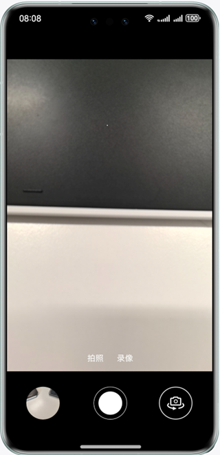

# 实现相机数据采集保存功能（C++）

### 介绍

本示例主要展示了相机的相关功能，使用libohcamera.so
接口实现相机的预览、拍照、录像、前后置摄像头切换进行拍照、录像，以及对焦、曝光等控制类功能。

### 效果预览

| 效果展示                                      |
|-------------------------------------------|
|  |

使用说明
1. 弹出是否允许“相机数据采集保存”使用相机？点击“允许”
2. 弹出是否允许“相机数据采集保存”使用麦克风？点击“允许”
3. 弹出是否允许“相机数据采集保存”修改你的图片和视频？点击“允许”
4. 进入预览界面，预览正常，点击画面模糊处，画面会变得清晰，对焦效果明显
5. 进入预览界面，预览正常，上下滑动屏幕，屏幕场景亮度发生变化，曝光效果明显
6. 进入预览界面，预览正常，进入拍照模式，点击拍照按钮，拍照正常，左下角会生成照片缩略图，点击左下角缩略图，能够跳转到图库，图片保存正常，打开图片显示正常
7. 进入预览界面，预览正常，切换到前置摄像头，点击拍照按钮，拍照正常，左下角生成照片缩略图，点击左下角缩略图，能够跳转到图库，图片保存正常，打开图片显示正常
8. 进入预览界面，预览正常，切换到录像模式，点击录像，开始录像，再点击停止录像按钮，录像成功，左下角会生成视频缩略图，点击左下角缩略图，能够跳转到图库，录像文件保存正常，播放录像文件正常
9. 进入预览界面，预览正常，切换到后置摄像头，点击录像，开始录像，再点击停止录像按钮，录像成功，左下角会生成视频缩略图，点击左下角缩略图，能够跳转到图库，录像文件保存正常，播放录像文件正常

### 工程目录

```
├──entry/src/main/cpp
│  ├──types
│  │  └──libentry
│  │     ├──index.d.ts                  // 导入NAPI接口供JS调用
│  │     └──oh-package.json5            // 接口注册配置文件
│  ├──camera_manager.cpp                // 相机基本功能接口定义cpp实现侧
│  ├──camera_manager.h                  // 相机基本功能接口定义
│  ├──CMakeLists.txt                    // Cmake打包配置文件，编译工程动态库脚本，依赖头文件、cpp以及相关依赖
│  └──main.cpp                          // NAPI实现JS与C++通信的接口
├──entry/src/main/ets
│  ├──common
│  │  ├──utils
│  │  │  ├──Logger.ets                  // 日志工具
│  │  │  └──MediaUtils.ets              // 媒体工具
│  │  ├──Constants.ets                  // 基本参数枚举：纵横比、设备类型、视频帧数...
│  │  └──DisplayCalculator.ets          // 计算界面宽高显示数值
│  ├──entryability
│  │  └──EntryAbility.ets               // Ability的生命周期回调内容
│  ├──pages
│  │  └──Index.ets                      // Ability实现的应用的入口页面，相机APP首页
│  └──views
│     ├──DividerPage.ets                // 分割线UI布局
│     ├──FocusAreaPage.ets              // 对焦区域设置（焦点、侧光点）、单指竖直方向拖动触发曝光补偿设置
│     ├──FocusPage.ets                  // 对焦、曝光、刻度的图标设置、值的设置
│     └──ModeSwitchPage.ets             // 相机功能模式切换，开启预览、拍照、录像
└──entry/src/main/resources             // 应用资源目录

```

### 具体实现
* 相机功能接口实现在CameraManager.cpp中，源码参考：[camera_manager.cpp](entry/src/main/cpp/camera_manager.cpp)
    * 在NDKCamera构造函数里完成一个相机生命周期初始化的过程，包括调用OH_Camera_GetCameraManager获取CameraManager，调用OH_CameraManager_CreateCaptureSession创建CaptureSession，调用CaptureSessionRegisterCallback创建CaptureSession注册回调，调用GetSupportedCameras获取支持的camera设备，调用GetSupportedOutputCapability获取支持的camera设备能力集，调用CreatePreviewOutput创建预览输出，调用CreateCameraInput创建相机输入，调用CameraInputOpen打开相机输入，调用CameraManagerRegisterCallback创建CameraManager注册回调，最后调用SessionFlowFn开启Session。
    * 其中SessionFlowFn是一个开启预览的动作，主要流程包括：调用OH_CaptureSession_BeginConfig开始配置会话，调用OH_CaptureSession_AddInput把CameraInput加入到会话，调用OH_CaptureSession_AddPreviewOutput把previewOutput加入到会话，调用OH_CaptureSession_CommitConfig提交配置信息，调用OH_CaptureSession_Start开始会话工作，还有一步是在开启预览的同时调用IsFocusMode启动对焦功能，这边后面会涉及到。
    * 在NDKCamera析构函数里完成对相机生命周期释放的过程，调用OH_CameraManager_DeleteSupportedCameras删除支持的camera设备，调用OH_CameraManager_DeleteSupportedCameraOutputCapability删除支持的camera设备能力集，调用OH_Camera_DeleteCameraManager删除camera manager。
    * 拍照功能相关接口封装在StartPhoto接口中，主要包含以下流程：调用SessionStop关闭session，调用SessionBegin做session的一个预置动作，调用CreatePhotoOutput创建相机输出，调用OH_CaptureSession_AddPhotoOutput将hotoOutput添加至session中，调用SessionCommitConfig提交session，在调用SessionStart开启session，最后调用TakePicture接口开启拍照动作。
    * 录像功能相关接口封装在StartVideo接口中，主要包含以下流程：调用SessionStop关闭session，调用SessionBegin做session的一个预置动作，调用OH_CaptureSession_RemovePhotoOutput移除相机拍照输出，再调用CreatePhotoOutput创建相机输出，调用AddPhotoOutput将相机输出添加至session中，调用CreateVideoOutput创建录像输出，调用AddVideoOutput将录像输出添加至session中，然后再调用SessionCommitConfig、SessionStart对session进行提交和开启，最后调用VideoOutputRegisterCallback对VideoOutput注册回调。
    * 曝光功能相关接口封装在IsExposureModeSupportedFn接口中，主要包含以下流程：调用OH_CaptureSession_IsExposureModeSupported判断是否支持曝光模式，然后调用OH_CaptureSession_SetExposureMode设置曝光模式，调用OH_CaptureSession_GetExposureMode获取设置后的曝光模式。调用IsExposureBiasRange接口获取曝光补偿，其中包含调用OH_CaptureSession_GetExposureBiasRange获取曝光补偿的范围，调用OH_CaptureSession_SetExposureBias设置曝光点，调用OH_CaptureSession_GetExposureBias获取曝光点。
    * 对焦功能相关接口封装在IsFocusMode接口中，主要包含以下流程：调用OH_CaptureSession_IsFocusModeSupported判断是否支持对焦模式，调用OH_CaptureSession_SetFocusMode设置对焦模式，调用OH_CaptureSession_GetFocusMode获取设置后的对焦模式。
    * 调用IsFocusPoint接口获取对焦点，其中包括调用OH_CaptureSession_SetFocusPoint获取JS侧下发来的对焦点位，然后调用OH_CaptureSession_GetFocusPoint获取设置后的对焦点位。
    * 视频防抖功能相关接口封装在IsVideoStabilizationModeSupportedFn接口中，主要包含以下流程：调用OH_CaptureSession_IsVideoStabilizationModeSupported接口查询是否支持指定的视频防抖模式，调用OH_CaptureSession_SetVideoStabilizationMode设置视频防抖，调用OH_CaptureSession_GetVideoStabilizationMode获取设置后的视频防抖模式。

    * 回调接口设置：
        * CameraManagerRegisterCallback：监听相机状态回调，在打开、退出相机，相机摄像头切换时会触发
        * CameraInputRegisterCallback：相机输入发生错误时触发回调
        * PhotoOutputRegisterCallback：开启拍照时触发回调
        * VideoOutputRegisterCallback：开启录像模式时触发回调
        * CaptureSessionRegisterCallback：session出现异常时以及开启对焦模式时触发回调

* 相机预览、拍照、录像功能、前后置切换功能实现调用侧位于tableIndex.ets，modeSwitchPage.ets，main.cpp中，源码参考：[Index.ets](entry/src/main/ets/pages/Index.ets)，[ModeSwitchPage.ets](entry/src/main/ets/views/ModeSwitchPage.ets)，[main.cpp](entry/src/main/cpp/main.cpp)
    * 预览：开启预览位于Index.ets下的onPageShow接口，其中调用cameraDemo.initCamera接口，将预览的surfaceId，对焦模式的值，以及是前置还是后置摄像头设备作为入参啊传下去，实际调用的是main.cpp下的InitCamera接口，InitCamera接口将JS侧拿到的参数进行转换再传入cameraManager.cpp中的构造函数里去，完成开启相机的操作，开启预览并设置好对焦模式。
    * 拍照和录像：开启拍照位于ModeSwitchPage.ets下的isVideoPhotoFn接口，通过判断modelBagCol的值是photo还是video，将modelBagCol的值，videoId，拍照的surfaceID或者录像的surfaceId传入接口startPhotoOrVideo。如果是拍照模式，则通过modeSwitchPage.ets下的getPhotoSurfaceID接口获取photo surfaceId，跳转到main.cpp中的StartPhotoOrVideo接口，将传下来的参数进行格式转换，再调用CameraManager对象下的StartPhoto接口开启拍照操作；如果是录像模式，则通过modeSwitchPage.ets下的getVideoSurfaceID接口获取video surfaceId，跳转到main.cpp中的StartPhotoOrVideo接口，将传下来的参数进行格式转换，再调用CameraManager对象下的StartVideo接口开启录像操作
    * 前后置切换：前后置摄像头切换接口位于ModeSwitchPage.ets，切换cameraDeviceIndex，将先前的session配置释放，调用cameraDemo.releaseSession接口，实际上是main.cpp下的ReleaseSession接口，最终调用到CameraMangaer.cpp下的ReleaseSession接口。然后将预览的surfaceId，对焦模式的值以及cameraDeviceIndex传入cameraDemo.initCamera接口中，逻辑和预览一致。

* 相机对焦、曝光功能实现调用侧位于FocusAreaPage.ets中，源码参考：[FocusAreaPage.ets](entry/src/main/ets/views/FocusAreaPage.ets)
    * 对焦：对焦功能位于FocusAreaPage.ets，通过在build中将对焦焦点下发到cpp侧，在CameraManager.cpp文件中的SessionFlowFn函数中，会调用IsFocusMode接口来判断是否支持对焦模式，然后通过onTouch的方式将对焦点位通过cameraDemo.isFocusPoint接口下发到main.cpp侧的IsFocusPoint接口，最终调到CameraManager.cpp中的IsFocusPoint接口。以及调用OH_CaptureSession_SetFocusMode拿到对焦点位来设置对焦模式，最后调用OH_CaptureSession_GetFocusMode来获取对焦模式，完成对焦功能实现。
    * 曝光：曝光功能位于FocusAreaPage.ets，通过在build中将侧光点位下发到cpp侧，然后通过onTouch的方式将对焦点位以及侧光点位通过cameraDemo.isFocusPoint接口下发到main.cpp侧的isMeteringPoint接口，最终调到CameraManager.cpp中的IsMeteringPoint接口。然后设置曝光补偿，单指竖直方向拖动触发该手势事件，调用gesture中的cameraDemo.isExposureBiasRange接口将曝光值下发到main.cpp中的IsExposureBiasRange，然后经过napi转换后将值传到CameraManager.cpp中的IsExposureBiasRange接口，之后从native侧发到曝光补偿的范围，再调用OH_CaptureSession_SetExposureBias设置曝光值，最后调用OH_CaptureSession_GetExposureBias接口获取曝光值，完成曝光功能。

### 相关权限

* ohos.permission.CAMERA
* ohos.permission.MICROPHONE
* ohos.permission.WRITE_IMAGEVIDEO

### 依赖

不涉及

### 约束与限制

1. 本示例仅支持标准系统上运行，支持设备：华为手机。
2. HarmonyOS系统：HarmonyOS 5.0.5 Release及以上。
3. DevEco Studio版本：DevEco Studio 5.0.5 Release及以上。
4. HarmonyOS SDK版本：HarmonyOS 5.0.5 Release SDK及以上。