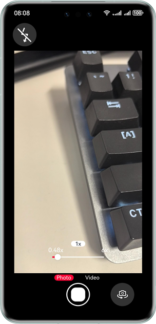

# Collecting and Saving Camera Data

### Overview

This sample demonstrates
the preview and photographing functions of a camera app.

### Preview

| Preview                                        |
|------------------------------------------------|
|  |

### How to Use
1. A message is displayed, asking you whether to allow Camera to use the camera. Touch **Allow**.
2. A message is displayed, asking you whether to allow Camera to use the microphone. Touch **Allow**.
3. Access the preview screen. It is displayed normally. After you touch **Photo**, the photo preview screen is displayed, showing the photo just taken.
4. Access the preview screen. It is displayed normally. After you touch **Photo**, the photo preview screen is displayed, showing the photo just taken. Exit the app and access Gallery. The first photo in Gallery is the photo just taken.
5. Touch the back button in the upper left corner of the photo preview screen to access the preview screen again. The preview is normal.
6. Access the preview screen. It is displayed normally. When you slide the zoom bar, a zoom value is displayed above the zoom bar, and the preview screen is zoomed in or out as you slide.
7. Access the preview screen. It is displayed normally. When you touch anywhere in the viewfinder, a focus area is displayed.
8. Access the preview screen. It is displayed normally. Touch **Video** to switch from photo mode to video mode. The preview is normal. Touch the video button to start recording, and video recording is normal. Touch the video button to stop recording. The video preview screen is displayed. Touch the video playback button. The video is played normally.

### Project Directory

```
├──entry/src/main/ets
│  ├──common
│  │  ├──utils
│  │  │  ├──Logger.ets                  // Log utility
│  │  │  └──DateTimeUtil.ets            // Date utility
│  │  │  └──GlobalContext.ets           // Global context utility
│  │  └──Constants.ets                  // Enumeration of basic parameters, including the resolution, icon size, and button margin
│  ├──entryability
│  │  └──EntryAbility.ets               // Entry ability lifecycle callbacks
│  ├──pages
│  │  ├──Index.ets                      // App entry, that is, the home page of the camera app
│  │  └──EditPage.ets                   // Photo preview and edit page
│  ├──mode
│  │  └──CameraService.ets              // Camera initialization, resolution selection, opening the camera, and focal length adjustment
│  └──views
│     ├──ModeComponent.ets              // Photographing and recording components
│     ├──FlashingLightComponent.ets     // Flashlight components
│     ├──FocusAreaComponent.ets         // Focus area logic calculation components
│     ├──FocusComponent.ets             // Focus frame components
│     └──SlideComponent.ets             // Zoom slider component, which can be used to change the focal length of the preview screen
└──entry/src/main/resources             // Static resources

```

### How to Implement
* The camera functional interfaces are implemented in **CameraService.ets**. For details about the source code, see [CameraService.ets](entry/src/main/ets/mode/CameraService.ets).
    * Camera initialization is implemented in the **initCamera** function of **CameraService**. The process is as follows: Call **getCameraManager** to obtain a camera manager, call **getSupportedCameras** to obtain the supported camera devices, call **getSupportedOutputCapability** to obtain the supported camera capabilities, call **createPreviewOutput** to create a preview output, call **createCameraInput** to create a camera input, call **open** of **CameraInput** to open the camera input, call **onCameraStatusChange** to register a callback for the camera manager, and call **sessionFlowFn** to create and start a session.
    * **sessionFlowFn** is an action for starting a session and enabling preview. The process is as follows: Call **createSession** to create a session, call **beginConfig** to start session configuration, call **addInput** to add a camera input to the session, call **addPreviewOutput** to add a preview output to the session, call **commitConfig** to commit the configuration, and call **start** to start the session.
    * Camera release is initialized in the **releaseCamera** function of **CameraService**. The process is as follows: Call **release** of **output** to release the stream, call **close** of **CameraInput** to close the camera, and call **release** of **session** to release the session.

    * Callback interface settings:
        * **onCameraStatusChange**: listens for the camera status. This callback is triggered when the camera is open, closed, or switched.
        * **onCameraInputChange**: triggered when a camera input error occurs.
        * **photoOutputCallBack**: triggered when photographing starts.
        * **previewOutputCallBack**: triggered when preview starts.
        * **onCaptureSessionErrorChange**: triggered when an exception occurs in the session.

* Camera preview, photographing, and recording are implemented in **Index.ets** and **ModeComponent.ets**. For details about the source code, see [Index.ets](entry/src/main/ets/pages/Index.ets) and [ModeComponent.ets](entry/src/main/ets/views/ModeComponent.ets).
    * Preview: enabled in the **onLoad** callback of the **XComponent** in **Index.ets**. In this callback, the **CameraService.initCamera** method is called to pass in the preview surface ID and camera device to start the camera and preview.
    * Photographing: enabled in the **onClick** callback of the **Photo** button in **ModeComponent.ets**. In this callback, the **takePicture** method in the **CameraManager** object is called to implement the photographing operation.

* Camera zoom is implemented in **SlideComponent.ets**. For details about the source code, see [SlideComponent.ets](entry/src/main/ets/views/SlideComponent.ets).
    * Zoom: enabled in the **onChange** callback of the **Slider** component in **SlideComponent.ets**. In this callback, the **CameraService.setZoomRatioFn** method is used to adjust the zoom ratio.

* Camera focus is implemented in **FocusAreaComponent.ets** and **FocusComponent.ets**. For details about the source code, see [FocusAreaComponent.ets](entry/src/main/ets/views/FocusAreaComponent.ets) and [FocusComponent.ets](entry/src/main/ets/views/FocusComponent.ets).
    * Focus: enabled in the **onTouch** callback of the **FocusAreaComponent** in **FocusAreaComponent.ets**. In this callback, the **CameraService.setFocusPoint** method is used to adjust the focused image of the preview screen.


### Required Permissions

* ohos.permission.CAMERA
* ohos.permission.MICROPHONE

### Dependencies

N/A

### Constraints

1. The sample app is supported only on Huawei phones running the standard system.
2. The HarmonyOS version must be HarmonyOS 5.0.5 Release or later.
3. The DevEco Studio version must be DevEco Studio 5.0.5 Release or later.
4. The HarmonyOS SDK version must be HarmonyOS 5.0.5 Release or later.
