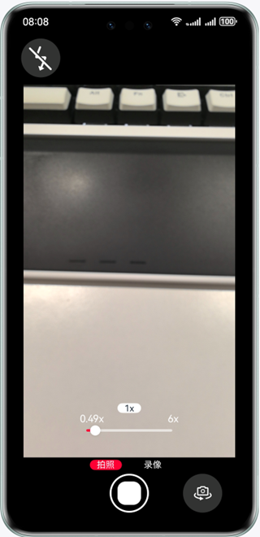

# 实现相机数据采集保存功能

### 介绍

本示例主要展示了相机的相关功能接口，实现相机的预览拍照功能。帮助开发者在相机相关场景开发中，实现相机的预览、拍照、录像、变焦、对焦等功能。

### 效果预览

| 效果展示                                        |
|---------------------------------------------|
|  |

使用说明
1. 弹出是否允许“Camera”使用相机？点击“允许”
2. 弹出是否允许“Camera”使用麦克风？点击“允许”
3. 进入预览界面，预览正常，点击拍照按钮，跳转到图片预览页面，跳转正常，图片预览页面显示当前所拍照的图片，显示正常
4. 进入预览界面，预览正常，点击拍照按钮，跳转到图片预览页面，跳转正常，图片预览页面显示当前所拍照的图片，显示正常，退出应用并进入图库应用，第一张图片显示为刚刚拍照的图片，拍照正常
5. 点击图片预览页面的左上角返回按钮，重新进入预览页面，预览正常
6. 进入预览界面，预览正常，滑动变焦条，变焦条上方显示变焦值，显示正常，并且预览界面随着变焦条的滑动放大或缩小，预览正常
7. 进入预览界面，预览正常，点击预览显示区域进行对焦，对焦正常
8. 进入预览界面，预览正常，点击“拍照”旁边的“录像”切换到录像模式，预览正常，点击录像按钮，开始录像，录像正常，点击停止录像按钮，跳转到录像预览界面，跳转正常，点击视频播放按钮，播放正常

### 工程目录

```
├──entry/src/main/ets
│  ├──common
│  │  ├──utils
│  │  │  ├──Logger.ets                  // 日志工具
│  │  │  └──DateTimeUtil.ets            // 日期工具
│  │  │  └──GlobalContext.ets           // 全局上下文工具
│  │  └──Constants.ets                  // 基本参数枚举：分辨率、icon大小、按钮边距...
│  ├──entryability
│  │  └──EntryAbility.ets               // Ability的生命周期回调内容
│  ├──pages
│  │  ├──Index.ets                      // Ability实现的应用的入口页面，相机APP首页
│  │  └──EditPage.ets                   // 提供拍照后图片预览和编辑页面
│  ├──mode
│  │  └──CameraService.ets              // 相机初始化、选择分辨率、打开摄像头、调整焦距等功能
│  └──views
│     ├──ModeComponent.ets              // 拍照录制组件
│     ├──FlashingLightComponent.ets     // 闪光灯组件
│     ├──FocusAreaComponent.ets         // 对焦区域逻辑计算组件
│     ├──FocusComponent.ets             // 对焦框组件
│     └──SlideComponent.ets             // 变焦滑动条组件，可以对预览画面焦距进行改变
└──entry/src/main/resources             // 应用资源目录

```

### 具体实现
* 相机功能接口实现在CameraService.ets，源码参考：[CameraService.ets](entry/src/main/ets/mode/CameraService.ets)
    * 在CameraService的initCamera函数里完成一个相机生命周期初始化的过程，包括调用getCameraManager获取CameraManager，调用getSupportedCameras获取支持的camera设备，调用getSupportedOutputCapability获取支持的camera设备能力集，调用createPreviewOutput创建预览输出，调用createCameraInput创建相机输入，调用CameraInput的open打开相机输入，调用onCameraStatusChange创建CameraManager注册回调，最后调用sessionFlowFn创建并开启Session。
    * 其中sessionFlowFn是一个创建session并开启预览的动作，主要流程包括：调用createSession创建Session，调用beginConfig开始配置会话，调用addInput把CameraInput加入到会话，调用addPreviewOutput把previewOutput加入到会话，调用commitConfig提交配置信息，调用start开始会话工作。
    * 在CameraService的releaseCamera函数里完成对相机生命周期释放的过程，调用output的release方法释放流，调用CameraInput的close方法关闭相机，再调用session的release释放当前会话。

    * 回调接口设置：
        * onCameraStatusChange：监听相机状态回调，在打开、退出相机，相机摄像头切换时会触发
        * onCameraInputChange：相机输入发生错误时触发回调
        * photoOutputCallBack：开启拍照时触发回调
        * previewOutputCallBack：开启预览时触发回调
        * onCaptureSessionErrorChange：session出现异常时触发回调

* 相机预览、拍照，录像功能实现调用侧位于Index.ets，ModeComponent.ets中，源码参考：[Index.ets](entry/src/main/ets/pages/Index.ets)，[ModeComponent.ets](entry/src/main/ets/views/ModeComponent.ets)
    * 预览：开启预览位于Index.ets下的XComponent组件的onLoad接口中，其中调用CameraService.initCamera方法，将预览的surfaceId，摄像头设备作为入参传下去，完成开启相机的操作，开启预览。
    * 拍照：开启拍照位于ModeComponent.ets下的拍照按钮的onClick接口，调用CameraManager对象下的takePicture方法开启拍照操作。

* 相机变焦功能实现调用侧位于SlideComponent.ets中，源码参考：[SlideComponent.ets](entry/src/main/ets/views/SlideComponent.ets)
    * 变焦：变焦功能位于SlideComponent.ets，通过Slider组件的onChange接口将变焦率通过CameraService.setZoomRatioFn方法调整预览显示的画面。

* 相机对焦功能实现调用侧位于FocusAreaComponent.ets，FocusComponent.ets中，源码参考：[FocusAreaComponent.ets](entry/src/main/ets/views/FocusAreaComponent.ets)，[FocusComponent.ets](entry/src/main/ets/views/FocusComponent.ets)
    * 对焦：对焦功能位于FocusAreaComponent.ets，通过FocusAreaComponent组件的onTouch接口将归一化焦点通过CameraService.setFocusPoint方法调整预览显示的对焦画面。


### 相关权限

* ohos.permission.CAMERA
* ohos.permission.MICROPHONE

### 依赖

不涉及

### 约束与限制

1. 本示例仅支持标准系统上运行，支持设备：华为手机。
2. HarmonyOS系统：HarmonyOS 5.0.5 Release及以上。
3. DevEco Studio版本：DevEco Studio 5.0.5 Release及以上。
4. HarmonyOS SDK版本：HarmonyOS 5.0.5 Release SDK及以上。