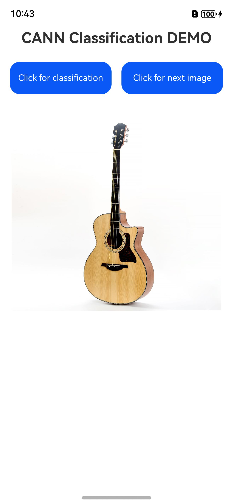
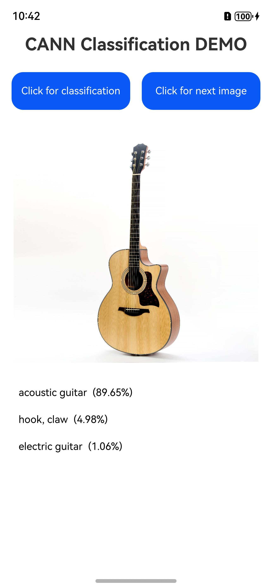

# CANN -- Model Inference

## Introduction

This sample code demonstrates how to call CANN APIs to perform model inference.

The demo is developed to identify and classify objects in images.

It depends on **libhiai_foundation.so**, a dynamic library of CANN, and **libneural_network_core.so**, a public dynamic library in the AI domain.

## Preview

|         **Home screen**         |          **Image classification**         |          **Next image**         |
|:------------------------:|:------------------------:|--------------------------|
|  |  |  |

Instructions:

1. Touch "cannDemo" on the phone home screen to start the demo, and the model will be automatically loaded.
2. Touch **Click for classification**, and the demo will perform model inference to classify the current image. After the inference is complete, the three most possible classification results are displayed under the image.
3. Touch **Click for next image** to display the next image.
4. When you exit the demo, the model is automatically uninstalled.

## Project Directory
```
└── entry/src/main                      // Code area
    ├── cpp
    │    ├── types/libentry
    │    │     └── index.d.ts           // API registration file at the native layer
    │    ├── Classification.cpp         // Functions of APIs at the native layer
    │    ├── CMakeLists.txt             // Compilation configurations at the native layer
    │    ├── HIAIModelManager.cpp       // Implementation of the model management class
    │    ├── HIAIModelManager.h         // Definition of the model management class
    ├── ets
    │    ├── entryability 
    │    │     └── EntryAbility.ets      //  Entry point class
    │    ├── pages 
    │    │     └── Index.ets            // Home screen display class
    └── resources
    │    ├── base/media                 // Image resources
    │    │   ├── cup.jpg
    │    │   └── guitar.jpg
    │    ├── rawfile 
    │    │    ├── hiai.om               // Model file
    │    │    └── labels_caffe.txt      // Model output label file
```

## Implementation Details

**Starting from API12**, the sample code uses the following APIs defined in CANN and NNCore:

* OH_NN_ReturnCode HMS_HiAIOptions_SetBandMode(OH_NNCompilation* compilation, HiAI_BandMode bandMode)
* HiAI_BandMode HMS_HiAIOptions_GetBandMode(const OH_NNCompilation* compilation)
* OH_NN_ReturnCode HMS_HiAIOptions_SetModelDeviceOrder(OH_NNCompilation* compilation, HiAI_ExecuteDevice* executeDevices, size_t deviceCount);
* HiAI_Compatibility HMS_HiAICompatibility_CheckFromBuffer(const void* data, size_t size);
* OH_NN_ReturnCode OH_NNDevice_GetAllDevicesID(const size_t **allDevicesID, uint32_t *deviceCount);
* OH_NN_ReturnCode OH_NNDevice_GetName(size_t deviceID, const char **name);
* void *OH_NNTensor_GetDataBuffer(const NN_Tensor *tensor);
* OH_NN_ReturnCode OH_NNTensor_GetSize(const NN_Tensor *tensor, size_t *size);
* OH_NN_ReturnCode OH_NNTensor_Destroy(NN_Tensor **tensor);
* OH_NNCompilation *OH_NNCompilation_ConstructWithOfflineModelBuffer(const void *modelBuffer, size_t modelSize);
* void OH_NNCompilation_Destroy(OH_NNCompilation **compilation);
* OH_NN_ReturnCode OH_NNCompilation_SetDevice(OH_NNCompilation *compilation, size_t deviceID);
* void OH_NNCompilation_Destroy(OH_NNCompilation **compilation);
* OH_NN_ReturnCode OH_NNCompilation_Build(OH_NNCompilation *compilation);
* OH_NNExecutor *OH_NNExecutor_Construct(OH_NNCompilation *compilation);
* OH_NN_ReturnCode OH_NNExecutor_GetInputCount(const OH_NNExecutor *executor, size_t *inputCount);
* NN_TensorDesc *OH_NNExecutor_CreateInputTensorDesc(const OH_NNExecutor *executor, size_t index);
* NN_Tensor *OH_NNTensor_Create(size_t deviceID, NN_TensorDesc *tensorDesc);
* OH_NN_ReturnCode OH_NNTensorDesc_Destroy(NN_TensorDesc **tensorDesc);
* OH_NN_ReturnCode OH_NNExecutor_GetOutputCount(const OH_NNExecutor *executor, size_t *outputCount);
* NN_TensorDesc *OH_NNExecutor_CreateOutputTensorDesc(const OH_NNExecutor *executor, size_t index);
* OH_NN_ReturnCode OH_NNExecutor_RunSync(OH_NNExecutor *executor, NN_Tensor *inputTensor[], size_t inputCount, NN_Tensor *outputTensor[], size_t outputCount);
* void OH_NNExecutor_Destroy(OH_NNExecutor **executor);

Call APIs such as **OH_NNExecutor_RunSync**, pass the image to be classified, and wait for the classification result to display. Then check the logs. See **entry/src/main/ets/pages/Index.ets** for reference.

## Debugging and Optimization
Call the HMS_HiAIOptions_SetOmOptions API as required to enable maintenance and debugging. The following command can be used to save the prof and csv files generated by the maintenance and debugging function to a local folder.
hdc file recv /mnt/hmdfs/100/account/device_view/local/files/Docs/Download/com.huawei.canndemo local
<br>**Starting from API18, the debugging and optimization function is supported.**
## Required Permissions

N/A

## Dependency

N/A

## Constraints

1. This example can run only on standard systems. Supported devices: Huawei phones, tablets, 2in1 and TV.
2. HarmonyOS: HarmonyOS 5.1.0 Release or later
3. DevEco Studio: DevEco Studio 6.0.0 Release or later
4. HarmonyOS SDK: HarmonyOS 6.0.0 Release SDK or later
